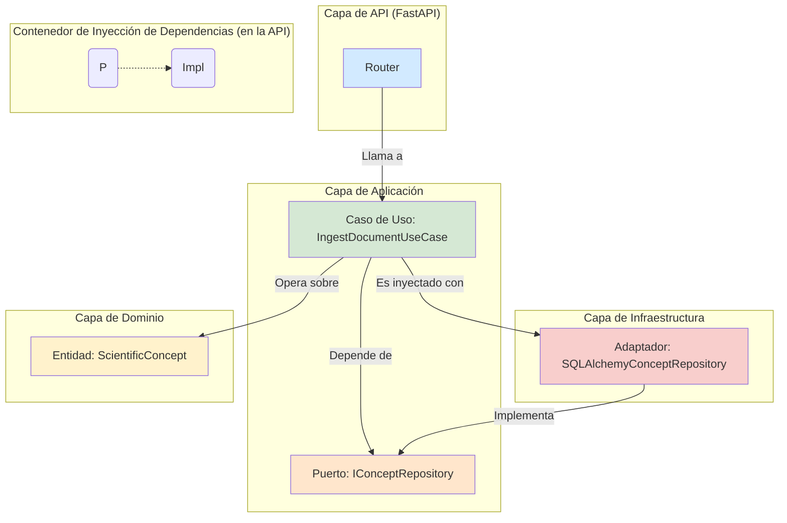

# Módulo Aletheia v3: Núcleo de Descubrimiento

Este directorio contiene la implementación central de la plataforma Aletheia, un sistema de **Modelado, Descubrimiento y Comprensión (MDU)**. Este módulo es el corazón de la plataforma, encapsulando la API, la lógica de aplicación (casos de uso), el núcleo de dominio y la infraestructura necesaria para ejecutar los flujos de trabajo de conocimiento.

Para una visión completa del proyecto, su fundamentación teórica y las instrucciones de despliegue, por favor consulte el **[README principal del proyecto](../../README.md)**.

## Arquitectura del Módulo: Puertos y Adaptadores

El módulo `Aletheia_v3` está diseñado siguiendo una variación de la **Arquitectura Limpia (Clean Architecture)**, utilizando un patrón de Puertos y Adaptadores para desacoplar la lógica de negocio de los detalles de la infraestructura.

-   **Dominio (`core/`)**: Contiene la lógica y las entidades de negocio más puras. Es el centro del sistema.
-   **Aplicación (`application/`)**: Orquesta los flujos de datos. Define los **Puertos** (interfaces) que el dominio necesita para comunicarse con el exterior (ej. `ConceptRepositoryPort`).
-   **Infraestructura (`infrastructure/`)**: Proporciona las implementaciones concretas (**Adaptadores**) de los puertos. Por ejemplo, `SQLAlchemyConceptRepository` implementa `ConceptRepositoryPort` para una base de datos PostgreSQL.
-   **API (`api/`)**: Actúa como un adaptador de entrada, exponiendo los casos de uso de la capa de aplicación a través de una interfaz RESTful.

El siguiente diagrama ilustra esta interacción:

## Estructura de Directorios

-   **`api/`**: Implementación del servidor FastAPI. Define los endpoints, los schemas de Pydantic y gestiona la inyección de dependencias para los casos de uso.
-   **`application/`**: Contiene los casos de uso (`use_cases.py`) que definen los flujos de negocio y los puertos (`ports.py`) que establecen los contratos con la capa de infraestructura.
-   **`core/`**: Lógica de dominio central. Incluye las entidades (`domain_models.py`), los servicios de dominio que encapsulan lógica compleja (`domain_services.py`) y los modelos conceptuales como el Cubo MDU.
-   **`infrastructure/`**: Implementaciones concretas de los puertos y otros componentes externos.
    -   `sqlalchemy_repositories.py`: Repositorios basados en SQLAlchemy.
    -   `in_memory_repositories.py`: Repositorios en memoria para pruebas o desarrollo.
    -   `models.py`: Modelos de la base de datos (tablas SQLAlchemy).
    -   `celery_worker.py`, `queues.py`: Configuración para procesamiento asíncrono.
-   **`dashboard/`**: Aplicaciones de UI con Streamlit para la visualización de datos y la interacción con el sistema.
-   **`alembic/`**: Scripts de migración de base de datos para gestionar la evolución del esquema de PostgreSQL.
-   **`tests/`**: Pruebas unitarias, de integración y de extremo a extremo, estructuradas para reflejar la arquitectura del módulo.
-   `docker-compose.yml` y `Dockerfile`: Definen el entorno de ejecución contenerizado para todos los servicios del módulo.

## Funcionalidades Clave

-   **API RESTful Completa**: Expone las funcionalidades de los Ejes X (Análisis) e Y (Síntesis).
-   **Grafo de Conocimiento Persistente**: Almacena conceptos científicos y sus relaciones en PostgreSQL.
-   **Pipeline de Ingesta (Eje X)**: Ingesta documentos y extrae Unidades Conceptuales Mínimas (UCMs).
-   **Pipeline de Síntesis (Eje Y)**: Implementa una jerarquía de abstracción desde UCMs hasta modelos teóricos unificados.
-   **Dashboard Interactivo**: Permite la exploración visual del grafo de conocimiento.
-   **Procesamiento Asíncrono**: Utiliza Celery y Redis para tareas computacionalmente intensivas.
-   **Seguimiento de Experimentos**: Integrado con MLflow para registrar y comparar resultados de investigación.
