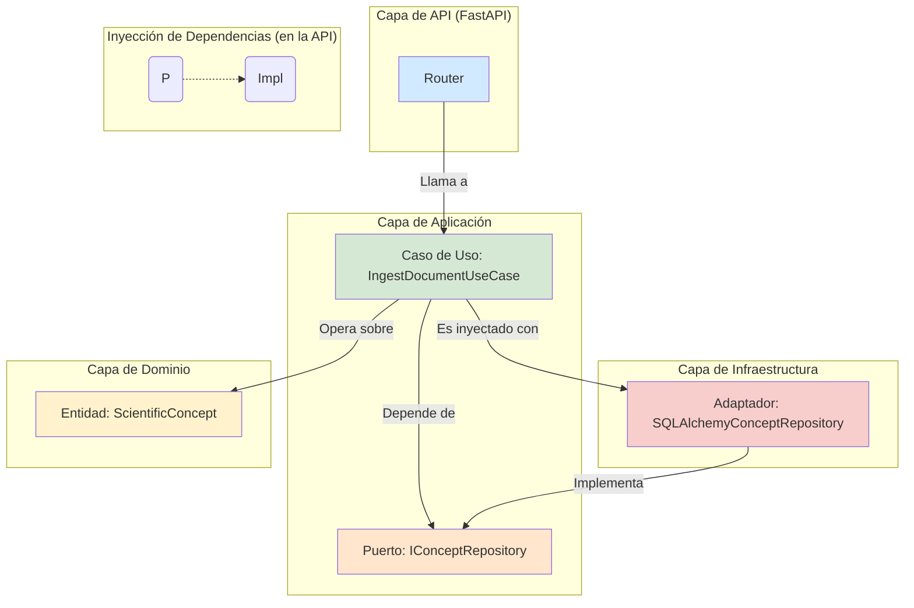

# Módulo `Aletheia_v3`: El Núcleo del Ecosistema

Este directorio contiene `Aletheia_v3`, el módulo central y corazón operativo del ecosistema Aletheia. Implementa la lógica de negocio principal para el **Modelado, Descubrimiento y Comprensión (MDU)**, encapsulando la API principal, los casos de uso, el dominio del grafo de conocimiento y la infraestructura de soporte.

Para una visión completa del proyecto, su fundamentación teórica y las interacciones con otros módulos, por favor consulte el **[README principal del proyecto](../../README.md)**.

## Arquitectura del Módulo: Puertos y Adaptadores

`Aletheia_v3` está diseñado siguiendo una variación de la **Arquitectura Limpia (Clean Architecture)**, utilizando un patrón de Puertos y Adaptadores para desacoplar la lógica de negocio de los detalles de la infraestructura.

-   **Dominio (`core/`)**: Contiene la lógica y las entidades de negocio más puras (ej. `ScientificConcept`). Es el centro del sistema.
-   **Aplicación (`application/`)**: Orquesta los flujos de datos y define los **Puertos** (interfaces) que el dominio necesita (ej. `ConceptRepositoryPort`).
-   **Infraestructura (`infrastructure/`)**: Proporciona las implementaciones concretas (**Adaptadores**) de los puertos (ej. `SQLAlchemyConceptRepository`).
-   **API (`api/`)**: Actúa como un adaptador de entrada, exponiendo los casos de uso a través de una interfaz RESTful.

## Estructura de Directorios

-   **`api/`**: Implementación del servidor FastAPI. Define los endpoints, los schemas de Pydantic y gestiona la inyección de dependencias.
-   **`application/`**: Contiene los casos de uso (`use_cases.py`) que definen los flujos de negocio y los puertos (`ports.py`).
-   **`core/`**: Lógica de dominio central, incluyendo las entidades (`domain_models.py`) y los servicios de dominio (`domain_services.py`).
-   **`infrastructure/`**: Implementaciones concretas: repositorios (`sqlalchemy_repositories.py`), modelos de BD (`models.py`), configuración de Celery (`celery_worker.py`) y la integración con MLflow (`trackers.py`).
-   **`dashboard/`**: Aplicaciones de UI con Streamlit.
-   **`alembic/`**: Scripts de migración de base de datos Alembic.
-   **`tests/`**: Pruebas unitarias, de integración y E2E para el módulo.
-   `docker-compose.yml` y `Dockerfile`: Definen el entorno de ejecución contenerizado para los servicios del núcleo.

## Funcionalidades Clave del Módulo

-   **API RESTful Completa**: Expone las funcionalidades de los Ejes X (Análisis) e Y (Síntesis).
-   **Grafo de Conocimiento Persistente**: Almacena conceptos científicos y sus relaciones en PostgreSQL.
-   **Pipeline de Ingesta (Eje X)**: Permite la ingesta de documentos y la extracción de Unidades Conceptuales Mínimas (UCMs).
-   **Pipeline de Síntesis de Conocimiento (Eje Y)**: Implementa una jerarquía de abstracción desde UCMs hasta modelos teóricos unificados.
-   **Dashboard Interactivo**: Permite la exploración visual del grafo de conocimiento.
-   **Orquestación de Análisis MDU**: Incluye el `AnalysisUseCase` y `CubicAnalysisPipeline` para flujos de análisis complejos.
-   **Procesamiento Asíncrono**: Uso de Celery y Redis para tareas computacionalmente intensivas.
-   **Seguimiento de Experimentos**: Integración con MLflow.
