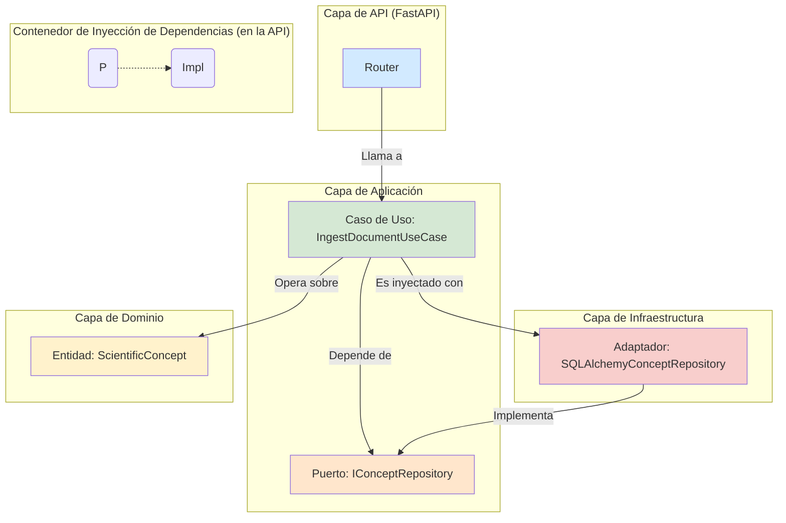

# Módulo Aletheia v3

Este es el módulo principal de la plataforma Aletheia, donde reside la implementación central del sistema de Modelado, Descubrimiento y Comprensión (MDU). Este módulo encapsula la API, la lógica de aplicación (casos de uso), el núcleo de dominio y la infraestructura necesaria para la ingesta de conocimiento, su síntesis jerárquica, persistencia y visualización.

Para la documentación completa del proyecto Aletheia, incluyendo la arquitectura general, la configuración para ejecutar la plataforma, detalles de migración de base de datos, y más, por favor consulte el **[README principal del proyecto](../../README.md)**.

## Arquitectura del Módulo: Puertos y Adaptadores

El módulo `Aletheia_v3` está diseñado siguiendo una variación de la **Arquitectura Limpia (Clean Architecture)**, utilizando un patrón de Puertos y Adaptadores para desacoplar la lógica de negocio de los detalles de la infraestructura.

-   **Dominio (`core/`)**: Contiene la lógica y las entidades de negocio más puras. Es el centro del sistema.
-   **Aplicación (`application/`)**: Orquesta los flujos de datos. Define los **Puertos** (interfaces) que el dominio necesita para comunicarse con el exterior (ej. `ConceptRepositoryPort`).
-   **Infraestructura (`infrastructure/`)**: Proporciona las implementaciones concretas (**Adaptadores**) de los puertos. Por ejemplo, `SQLAlchemyConceptRepository` implementa `ConceptRepositoryPort` para una base de datos PostgreSQL.
-   **API (`api/`)**: Actúa como un adaptador de entrada, exponiendo los casos de uso de la capa de aplicación a través de una interfaz RESTful.

El siguiente diagrama ilustra esta interacción:

Arquitectura del Módulo: Puertos y Adaptadores

## Estructura y Componentes del Módulo `Aletheia_v3`

Este directorio (`Aletheia_v3`) contiene los componentes centrales de la aplicación, organizados de la siguiente manera:

-   **`api/`**: Implementación del servidor FastAPI. Define los endpoints de la API, los schemas de datos (Pydantic) para las solicitudes/respuestas, la lógica de autenticación/autorización, y la inyección de dependencias para los casos de uso. Incluye routers para:
    -   Gestión de Ontología y Conocimiento (Eje X: ingesta, vinculación).
    -   Síntesis de Conocimiento (Eje Y: extracción UCM, clustering, proposiciones, teorías, modelos).
    -   Análisis MDU (flujo original de búsqueda inteligente para la conjetura ABC).
    -   Autenticación y gestión de usuarios/investigadores.
    -   Meta información y salud del sistema.
-   **`application/`**: Capa de aplicación que contiene los casos de uso. Estos orquestan la lógica de negocio y actúan como intermediarios entre la API y el dominio/infraestructura. Define los puertos (interfaces) para los repositorios.
    -   Casos de Uso del Eje X: `IngestDocumentUseCase`, `LinkConceptsUseCase`.
    -   Casos de Uso del Eje Y: `ExtractUCMsUseCase`, `FormClustersUseCase`, `DerivePropositionsUseCase`, `MiniTheoryConstructionUseCase`, `ComprehensiveTheoriesUseCase`, `UnifiedModelsUseCase`.
    -   Casos de Uso MDU: `AnalysisUseCase`, `CubicAnalysisPipeline`, `ApplicationServiceFacade`.
-   **`core/`**: Lógica de dominio central. Incluye:
    -   Modelos de entidad del dominio (`ScientificConcept`, `DirectedRelationship`, `ConceptType`, `UnifiedTheory`, etc.).
    -   Servicios de dominio (`DomainService`, `TheoryBuilder`) que encapsulan la lógica de negocio y síntesis de conocimiento.
    -   Modelos para el Cubo MDU y el sistema de Colmena (`CuboMDU`, `HoneycombGrid`, etc.).
-   **`dashboard/`**: Aplicaciones de interfaz de usuario construidas con Streamlit.
    -   `dashboard.py`: Dashboard original para la búsqueda inteligente de la conjetura ABC.
    -   `mdu_dashboard.py`: Nuevo dashboard interactivo para visualizar y explorar el grafo de conocimiento (conceptos, relaciones, jerarquías de síntesis, estadísticas).
-   **`infrastructure/`**: Implementaciones concretas de los puertos de la capa de aplicación y otros componentes de infraestructura.
    -   `models.py`: Modelos de base de datos SQLAlchemy (`ScientificConceptDB`, `DirectedRelationshipDB`, `ResearcherDB`, etc.).
    -   `sqlalchemy_repositories.py`: Implementaciones de repositorios usando SQLAlchemy para persistir entidades de dominio.
    -   `in_memory_repositories.py`: Implementaciones en memoria de repositorios (usadas para componentes aún no migrados o para pruebas).
    -   `database.py`: Configuración de la sesión de base de datos SQLAlchemy.
    -   `celery_worker.py`, `queues.py`: Configuración de Celery para tareas asíncronas.
    -   `trackers.py`: Integración con MLflow.
-   **`tests/`**: Pruebas unitarias, de integración y de API para el módulo `Aletheia_v3`, cubriendo las capas de dominio, aplicación, infraestructura y API.
-   **`alembic/`**: Configuraciones y scripts de migración de base de datos Alembic para gestionar el esquema de PostgreSQL.
-   `docker-compose.yml`: Define los servicios (API, worker, dashboards, base de datos, Redis, MLflow) para ejecutar la plataforma completa en un entorno Docker.
-   `Dockerfile`: Utilizado para construir la imagen Docker de los servicios principales de Aletheia (API, worker, dashboards).

## Funcionalidades Clave del Módulo

-   **API RESTful Completa**: Expone todas las funcionalidades del sistema, incluyendo ingesta, síntesis, visualización, y la búsqueda ABC.
-   **Autenticación y Autorización**: Basada en JWT y roles (investigador, admin).
-   **Grafo de Conocimiento Persistente**: Los conceptos científicos y sus relaciones se almacenan en una base de datos PostgreSQL, gestionada por SQLAlchemy y Alembic.
-   **Pipeline de Ingesta (Eje X)**: Permite la ingesta de documentos, extracción de Unidades Conceptuales Mínimas (UCMs) mediante análisis de texto simple (regex, stopwords), y la vinculación manual de conceptos.
-   **Pipeline de Síntesis de Conocimiento (Eje Y)**: Implementa una jerarquía de casos de uso para:
    -   Formar clústeres de UCMs basados en palabras clave.
    -   Derivar proposiciones a partir de estos clústeres.
    -   Construir mini-teorías a partir de proposiciones.
    -   Agregar mini-teorías en teorías comprehensivas.
    -   Sintetizar modelos unificados a partir de teorías comprehensivas.
-   **Dashboard Interactivo del Grafo de Conocimiento**: Permite la exploración visual del grafo, filtrado por tipo de concepto, visualización de detalles de nodos, y vista de jerarquías de síntesis y estadísticas.
-   **Orquestación de Análisis MDU**: Incluye el `AnalysisUseCase` y `CubicAnalysisPipeline` para flujos de análisis más complejos (como el del Cubo MDU).
-   **Procesamiento Asíncrono**: Uso de Celery para tareas de fondo (ej. búsqueda ABC).
-   **Seguimiento de Experimentos**: Integración con MLflow.
