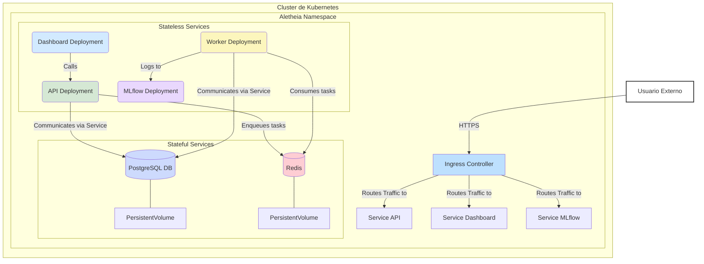

# Despliegue de Aletheia en Kubernetes

Este directorio contiene los manifiestos de Kubernetes (`.yaml`) para desplegar la plataforma Aletheia en un clúster. Esta configuración está diseñada para entornos de producción o *staging*, proporcionando escalabilidad, resiliencia y gestión declarativa.

## Arquitectura del Despliegue

El siguiente diagrama ilustra la topología de los componentes de Aletheia dentro de un clúster de Kubernetes. Muestra cómo los servicios se comunican entre sí y cómo se exponen al exterior a través de un Ingress Controller.



### Componentes Clave:
-   **Ingress Controller**: Punto de entrada único que enruta el tráfico HTTP/S a los servicios internos correspondientes (`API`, `Dashboard`, `MLflow`).
-   **Deployments (Stateless)**:
    -   `api-deployment.yaml`: El servidor FastAPI. Puede ser escalado horizontalmente.
    -   `worker-deployment.yaml`: Los workers de Celery que procesan tareas en segundo plano. Escalar este componente aumenta la capacidad de procesamiento.
    -   `dashboard-deployment.yaml`: La interfaz de usuario de Streamlit.
    -   `mlflow-deployment.yaml`: El servidor de MLflow para el seguimiento de experimentos.
-   **StatefulSets (Stateful)**:
    -   `db-statefulset.yaml`: La base de datos PostgreSQL. Utiliza un `PersistentVolume` para garantizar que los datos sobrevivan a los reinicios de los pods.
    -   `redis-statefulset.yaml`: El broker de mensajes Redis. También utiliza un `PersistentVolume`.
-   **Services**: Proporcionan un endpoint de red estable para que los pods se comuniquen entre sí (ej. `ServiceAPI` permite a `Dashboard` encontrar siempre los pods de la `API`).
-   **PersistentVolumes (PV)**: Abstracciones del almacenamiento físico (ej. un disco en la nube) que se montan en los pods de los `StatefulSets`.

## Requisitos Previos

-   Un clúster de Kubernetes funcional.
-   `kubectl` configurado.
-   Un **Ingress Controller** (como NGINX o Traefik) instalado en el clúster.
-   Un **StorageClass** configurado para la provisión dinámica de `PersistentVolume`.

## Instrucciones de Despliegue

1.  **Crear un Namespace (Recomendado)**:
    ```bash
    kubectl create namespace aletheia
    ```

2.  **Gestionar Secretos**:
    Los secretos (contraseñas, claves API) **no deben** guardarse en texto plano. Créelos de forma segura en el clúster:
    ```bash
    # Ejemplo para la contraseña de la base de datos
    kubectl create secret generic postgres-secret --from-literal=POSTGRES_PASSWORD=mysecretpassword -n aletheia
    ```
    Asegúrese de que los manifiestos YAML referencian estos secretos.

3.  **Aplicar los Manifiestos**:
    Aplique los manifiestos en el namespace correcto. Es buena práctica empezar por los servicios con estado.
    ```bash
    # Aplicar todo el directorio en el namespace 'aletheia'
    kubectl apply -f . -n aletheia
    ```
    O aplicarlos individualmente si se requiere un orden específico:
    ```bash
    kubectl apply -f db-statefulset.yaml -n aletheia
    kubectl apply -f redis-statefulset.yaml -n aletheia
    # Esperar a que los pods de la BD y Redis estén listos...
    kubectl wait --for=condition=ready pod -l app=postgres -n aletheia --timeout=300s
    kubectl apply -f . -n aletheia # Aplicar el resto
    ```

4.  **Verificar el Despliegue**:
    ```bash
    # Ver todos los pods en el namespace
    kubectl get pods -n aletheia

    # Ver los servicios y sus IPs
    kubectl get services -n aletheia

    # Ver la configuración del Ingress
    kubectl get ingress -n aletheia

    # Revisar los logs de un pod si hay errores
    kubectl logs deployment/api-deployment -n aletheia
    ```

## Consideraciones Adicionales

-   **Imágenes Docker**: Los manifiestos asumen que las imágenes Docker de Aletheia están disponibles en un registro de contenedores accesible para el clúster. Deberá actualizar los campos `image` en los archivos YAML.
-   **Helm/Kustomize**: Para una gestión más avanzada, especialmente en múltiples entornos, se recomienda parametrizar estos manifiestos utilizando herramientas como [Helm](https://helm.sh/) o [Kustomize](https://kustomize.io/).
-   **Actualizaciones**: Para actualizar un servicio, cambie la etiqueta de la imagen en su `Deployment` y aplique el cambio. Kubernetes realizará una actualización progresiva (rolling update) para evitar tiempo de inactividad.
    ```bash
    kubectl set image deployment/api-deployment api=your-repo/aletheia-api:v4.1 -n aletheia
    ```
