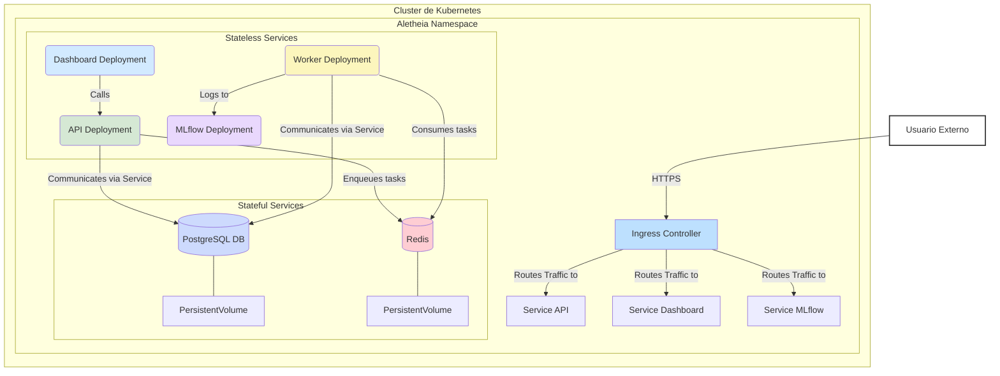

# Despliegue de Aletheia en Kubernetes

Este directorio contiene los manifiestos de Kubernetes (`.yaml`) para desplegar la plataforma Aletheia en un clúster. Esta configuración está diseñada para entornos de producción o *staging*, proporcionando escalabilidad, resiliencia y gestión declarativa.

## Arquitectura del Despliegue

El siguiente diagrama ilustra la topología de los componentes de Aletheia dentro de un clúster de Kubernetes. Muestra cómo los servicios se comunican entre sí y cómo se exponen al exterior a través de un Ingress Controller.



### Componentes Clave:
-   **Ingress Controller**: Punto de entrada único que enruta el tráfico HTTP/S a los servicios internos correspondientes (`API`, `Dashboard`, `MLflow`).
-   **Deployments (Stateless)**:
    -   `api-deployment.yaml`: El servidor FastAPI. Puede ser escalado horizontalmente.
    -   `worker-deployment.yaml`: Los workers de Celery que procesan tareas en segundo plano. Escalar este componente aumenta la capacidad de procesamiento.
    -   `dashboard-deployment.yaml`: La interfaz de usuario de Streamlit.
    -   `mlflow-deployment.yaml`: El servidor de MLflow para el seguimiento de experimentos.
-   **StatefulSets (Stateful)**:
    -   `db-statefulset.yaml`: La base de datos PostgreSQL. Utiliza un `PersistentVolume` para garantizar que los datos sobrevivan a los reinicios de los pods.
    -   `redis-statefulset.yaml`: El broker de mensajes Redis. También utiliza un `PersistentVolume`.
-   **Services**: Proporcionan un endpoint de red estable para que los pods se comuniquen entre sí (ej. `ServiceAPI` permite a `Dashboard` encontrar siempre los pods de la `API`).
-   **PersistentVolumes (PV)**: Abstracciones del almacenamiento físico (ej. un disco en la nube) que se montan en los pods de los `StatefulSets`.

## Propósito

Este directorio contiene los archivos de manifiesto de Kubernetes (`.yaml`) para desplegar los diversos servicios del módulo `Aletheia_v3` (y sus dependencias como bases de datos, colas de mensajes, etc.) en un clúster de Kubernetes.

El objetivo es proporcionar una forma declarativa y escalable de gestionar la plataforma Aletheia en entornos de producción o staging.

## Estructura del Directorio

-   `api-deployment.yaml`: Despliegue para el servicio API de Aletheia.
-   `dashboard-deployment.yaml`: Despliegue para el servicio de Dashboard Streamlit.
-   `db-statefulset.yaml`: StatefulSet para la base de datos PostgreSQL (asegura persistencia de datos).
-   `ingress.yaml`: (Conceptual) Ejemplo de cómo se podrían exponer los servicios externamente usando un Ingress Controller.
-   `mlflow-deployment.yaml`: Despliegue para el servidor de MLflow.
-   `redis-statefulset.yaml`: StatefulSet para Redis (usado como broker de Celery y para caching).
-   `worker-deployment.yaml`: Despliegue para los Celery workers.
-   *(Podrían existir otros archivos como `ConfigMap`s, `Secret`s (aunque los secretos reales no deberían estar en git), `Service`s para cada despliegue, `PersistentVolumeClaim`s, etc.)*

## Requisitos Previos

-   Un clúster de Kubernetes funcional.
-   `kubectl` configurado para comunicarse con su clúster.
-   Un Ingress Controller instalado en el clúster si se va a usar `ingress.yaml` (ej. NGINX Ingress, Traefik).
-   Un proveedor de almacenamiento persistente configurado en el clúster para los `PersistentVolumeClaim`s que usarán `db-statefulset.yaml` y `redis-statefulset.yaml`.
-   Las imágenes Docker de los servicios de Aletheia (api, worker, dashboard) deben estar construidas y disponibles en un registro de contenedores accesible por el clúster Kubernetes (ej. Docker Hub, GCR, ECR). Los archivos YAML deberán ser actualizados para apuntar a estas imágenes.

## Despliegue

1.  **Configuración (Secrets y ConfigMaps)**:
    *   Antes de aplicar los manifiestos, asegúrese de que cualquier `ConfigMap` necesario esté creado y que los `Secret`s (para contraseñas de base de datos, claves JWT, etc.) estén creados de forma segura en el clúster. **No almacene secretos directamente en estos archivos YAML en texto plano.** Utilice herramientas como Kubernetes Secrets, HashiCorp Vault, o Sealed Secrets.
    *   Actualice los manifiestos para referenciar los `ConfigMap`s y `Secret`s correctos.
    *   Actualice los nombres de imagen y las etiquetas en los archivos de despliegue (`*-deployment.yaml`, `*-statefulset.yaml`) para que coincidan con las imágenes publicadas en su registro de contenedores.

2.  **Aplicar los Manifiestos**:
    Aplique los archivos YAML al clúster. El orden puede ser importante, generalmente empezando por las dependencias como bases de datos y luego los servicios de la aplicación.
    ```bash
    kubectl apply -f db-statefulset.yaml
    kubectl apply -f redis-statefulset.yaml
    # Esperar a que los pods de db y redis estén listos y corriendo...
    # kubectl get pods -w

    kubectl apply -f api-deployment.yaml
    kubectl apply -f worker-deployment.yaml
    kubectl apply -f mlflow-deployment.yaml
    kubectl apply -f dashboard-deployment.yaml
    ```
    Si se han definido `Service`s para cada uno (lo cual es práctica común y necesaria para la comunicación interna y exposición externa), aplíquelos también.

3.  **Exponer Servicios (Ingress)**:
    Si tiene un Ingress Controller y ha configurado `ingress.yaml` (o un archivo similar) para sus necesidades:
    ```bash
    kubectl apply -f ingress.yaml
    ```

4.  **Verificar el Despliegue**:
    ```bash
    kubectl get pods
    kubectl get services
    kubectl get ingress
    # Revise los logs de los pods si hay problemas
    # kubectl logs <nombre-del-pod>
    ```

## Consideraciones

-   **Gestión de Secretos**: Es crucial manejar los secretos de forma segura. Los archivos en este directorio pueden servir como plantillas, pero los valores sensibles deben ser gestionados fuera de Git.
-   **Variables de Entorno**: Muchos despliegues dependen de variables de entorno pasadas a través de `ConfigMap`s o `Secret`s. Asegúrese de que estas estén correctamente definidas y mapeadas.
-   **Persistencia de Datos**: Los `StatefulSet`s para la base de datos y Redis están configurados para usar `PersistentVolumeClaim`s. Asegúrese de que su clúster pueda proveer almacenamiento persistente.
-   **Namespaces**: Es una buena práctica desplegar aplicaciones en sus propios namespaces en Kubernetes para aislamiento y organización. Estos manifiestos pueden necesitar ser adaptados o aplicados dentro de un namespace específico (`kubectl apply -f <file.yaml> -n <your-namespace>`).
-   **Actualizaciones**: Para actualizar una aplicación, típicamente se actualiza la etiqueta de la imagen en el archivo de Despliegue y se vuelve a aplicar (`kubectl apply -f ...`). Kubernetes gestionará una actualización progresiva (rolling update) por defecto.
-   **Helm/Kustomize**: Para despliegues más complejos o gestionables, considere usar herramientas como Helm o Kustomize para empaquetar y configurar estos manifiestos.

Este README proporciona una guía general. La configuración específica puede variar significativamente dependiendo del entorno del clúster Kubernetes y los requisitos de la aplicación.
```
