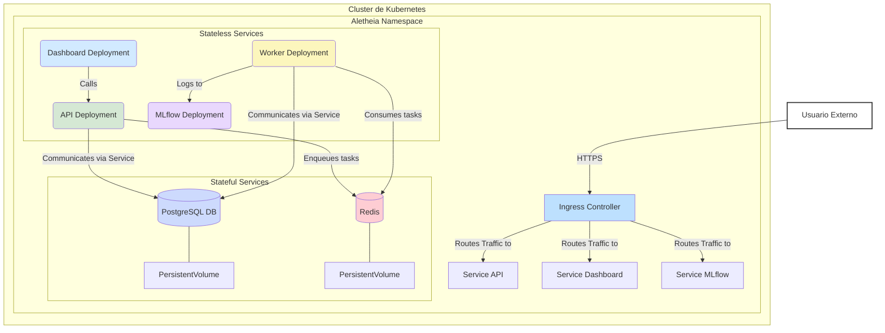

# Despliegue de Aletheia en Kubernetes

Este directorio contiene los manifiestos de Kubernetes (`.yaml`) para desplegar la plataforma Aletheia en un clúster. Esta configuración está diseñada para entornos de producción o *staging*, proporcionando escalabilidad, resiliencia y gestión declarativa.

## Arquitectura del Despliegue

El siguiente diagrama ilustra la topología de los componentes de Aletheia dentro de un clúster de Kubernetes. Muestra cómo los servicios se comunican entre sí y cómo se exponen al exterior a través de un Ingress Controller.

### Componentes Clave:
-   **Ingress Controller**: Punto de entrada único que enruta el tráfico HTTP/S a los servicios internos.
-   **Deployments (Stateless)**: `api`, `worker`, `dashboard`, `mlflow`. Son escalables horizontalmente.
-   **StatefulSets (Stateful)**: `db-statefulset` (PostgreSQL) y `redis-statefulset` (Redis). Usan `PersistentVolumes` para garantizar la persistencia de datos.
-   **Services**: Proporcionan endpoints de red estables para la comunicación entre pods.

## Estructura del Directorio
-   `api-deployment.yaml`: Despliegue para el servicio API de Aletheia.
-   `dashboard-deployment.yaml`: Despliegue para el servicio de Dashboard Streamlit.
-   `db-statefulset.yaml`: StatefulSet para la base de datos PostgreSQL.
-   `ingress.yaml`: Ejemplo de cómo exponer los servicios externamente.
-   `mlflow-deployment.yaml`: Despliegue para el servidor de MLflow.
-   `redis-statefulset.yaml`: StatefulSet para Redis.
-   `worker-deployment.yaml`: Despliegue para los Celery workers.

## Guía de Despliegue

### Requisitos Previos
-   Un clúster de Kubernetes funcional con `kubectl` configurado.
-   Un **Ingress Controller** (ej. NGINX) y un **StorageClass** para `PersistentVolumes` deben estar instalados.
-   Las imágenes Docker de Aletheia deben estar en un registro accesible por el clúster.

### Pasos
1.  **Namespace (Recomendado)**:
    `kubectl create namespace aletheia`
2.  **Secretos**:
    Cree los secretos necesarios (contraseñas de BD, claves JWT) de forma segura. **No los guarde en texto plano en los manifiestos.**
    `kubectl create secret generic postgres-secret --from-literal=POSTGRES_PASSWORD=mysecretpassword -n aletheia`
3.  **Aplicar Manifiestos**:
    Aplique los manifiestos en el namespace correcto. Es una buena práctica aplicar primero los `StatefulSets`.
    `kubectl apply -f . -n aletheia`
4.  **Verificar**:
    `kubectl get all -n aletheia` para ver todos los recursos.
    `kubectl logs -f <pod-name> -n aletheia` para revisar los logs.

## Consideraciones Avanzadas
-   **Gestión de Secretos**: Utilice herramientas como HashiCorp Vault o Sealed Secrets para una gestión segura en producción.
-   **Helm/Kustomize**: Para despliegues complejos, considere parametrizar estos manifiestos con Helm o Kustomize.
-   **Actualizaciones**: Para actualizar un servicio, cambie la etiqueta de la imagen en su `Deployment` y vuelva a aplicar el manifiesto. Kubernetes gestionará una actualización progresiva (`rolling update`).
    `kubectl set image deployment/api-deployment api=your-repo/aletheia-api:v4.1 -n aletheia`
