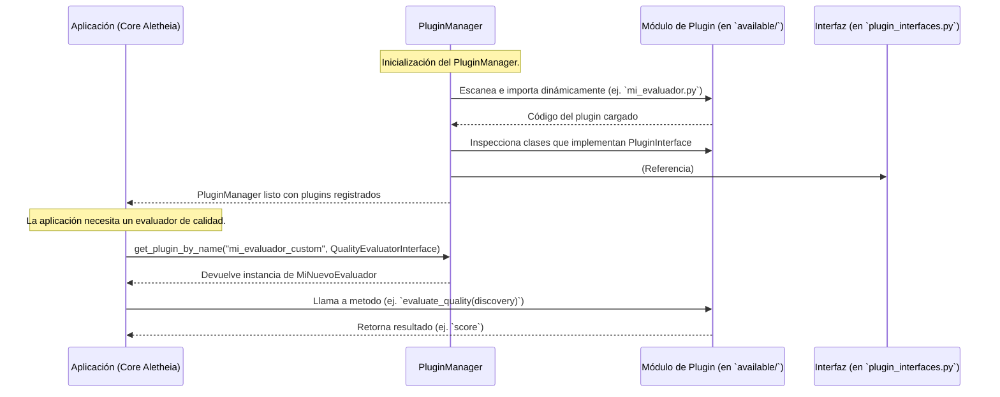

# Sistema de Plugins de Aletheia v3

Este directorio (`Aletheia_v3/plugins/`) alberga el sistema de plugins de la plataforma Aletheia. Su diseño permite extender y personalizar las funcionalidades de Aletheia sin modificar el núcleo del sistema, promoviendo un desarrollo modular y flexible.

## Propósito

El sistema de plugins facilita:
-   La introducción de nuevas **estrategias de búsqueda** o algoritmos de descubrimiento.
-   La definición de **evaluadores de calidad** personalizados para los artefactos generados.
-   La adición de pasos de **post-procesamiento de datos** o transformación.
-   La integración de **herramientas o librerías externas** de forma encapsulada.

## Arquitectura y Flujo de Trabajo

El sistema se basa en tres componentes principales:
1.  **Interfaces de Plugin (`plugin_interfaces.py`)**: Contratos abstractos (clases base abstractas) que definen cómo deben comportarse los plugins.
2.  **Plugins Concretos (`available/`)**: Módulos Python individuales que implementan una o más de estas interfaces.
3.  **Gestor de Plugins (`manager.py`)**: Responsable de descubrir, cargar, registrar y proporcionar acceso a los plugins.

El siguiente diagrama de secuencia ilustra la interacción típica durante la carga y uso de un plugin:



## Estructura del Directorio

-   **`plugin_interfaces.py`**: Define las interfaces abstractas (ej. `SearchStrategyInterface`, `QualityEvaluatorInterface`) utilizando `abc.ABC`. Estas establecen el contrato que los plugins deben cumplir.
-   **`manager.py`**: Contiene la clase `PluginManager`, encargada de descubrir (ej. en `available/`), cargar, registrar y gestionar los plugins.
-   **`available/`**: Subdirectorio donde se colocan los módulos de Python que implementan los plugins.
    -   Cada `.py` (o subdirectorio-paquete) puede contener una o más clases que implementen las interfaces.
    -   `example_quality_evaluator.py`: Un ejemplo práctico de implementación.
-   **`README.md`**: Este archivo.

## Desarrollar un Nuevo Plugin

1.  **Identificar/Crear Interfaz**: Verifique `plugin_interfaces.py`. Si es necesario, discuta la creación de una nueva interfaz.
2.  **Crear Archivo del Plugin**: En `Aletheia_v3/plugins/available/`, cree `mi_plugin.py` o un subdirectorio-paquete.
3.  **Implementar Interfaz**:
    ```python
    # En Aletheia_v3/plugins/available/mi_nuevo_evaluador.py
    from Aletheia_v3.plugins.plugin_interfaces import QualityEvaluatorInterface
    from Aletheia_v3.core.domain import Discovery # Entidad de ejemplo

    class MiNuevoEvaluador(QualityEvaluatorInterface):
        def evaluate_quality(self, discovery: Discovery) -> float:
            # Lógica de evaluación personalizada
            score = 0.0
            # ... su implementación ...
            return score

        def get_name(self) -> str:
            return "mi_evaluador_custom"
    ```
4.  **Registro Automático**: El `PluginManager` generalmente descubre los plugins en `available/` de forma automática al inicio o en tiempo de ejecución.
5.  **Pruebas**: Añada pruebas unitarias y de integración en el directorio de tests de `Aletheia_v3`.

## Consideraciones

-   **Dependencias**: Añada cualquier nueva dependencia al `requirements.txt` de `Aletheia_v3/`.
-   **Seguridad**: Los plugins son código ejecutado. Asegúrese de que provengan de fuentes confiables.
-   **Gestión de Errores**: Los plugins deben ser robustos y manejar sus errores internamente, sin afectar la estabilidad de la aplicación principal.

Consulte `example_quality_evaluator.py` para una implementación de referencia.
