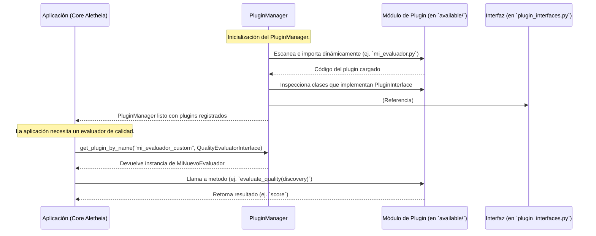

# Plugin System for Aletheia v3

## Propósito

Este directorio (`Aletheia_v3/plugins/`) contiene la implementación del sistema de plugins para la plataforma Aletheia. El sistema de plugins está diseñado para permitir la extensibilidad de la plataforma, facilitando la adición de nuevas funcionalidades o la modificación de comportamientos existentes sin alterar el código central (`core`).

El objetivo es proporcionar un mecanismo flexible para que los desarrolladores o investigadores puedan:
-   Introducir nuevas estrategias de búsqueda.
-   Definir evaluadores de calidad personalizados para los descubrimientos.
-   Añadir pasos de post-procesamiento de datos.
-   Integrar otras herramientas o algoritmos de forma modular.

## Arquitectura y Flujo de Trabajo

El sistema se basa en tres componentes principales:
1.  **Interfaces de Plugin (`plugin_interfaces.py`)**: Contratos abstractos (clases base abstractas) que definen cómo deben comportarse los plugins.
2.  **Plugins Concretos (`available/`)**: Módulos Python individuales que implementan una o más de estas interfaces.
3.  **Gestor de Plugins (`manager.py`)**: Responsable de descubrir, cargar, registrar y proporcionar acceso a los plugins.

El siguiente diagrama de secuencia ilustra la interacción típica durante la carga y uso de un plugin:



## Estructura del Directorio

-   **`plugin_interfaces.py`**:
    Define las interfaces abstractas (usando `abc.ABC` y `abc.abstractmethod`) que los plugins deben implementar. Por ejemplo, `SearchStrategyInterface`, `QualityEvaluatorInterface`, `DataPostprocessorInterface`. Estas interfaces establecen el contrato que los plugins deben seguir.

-   **`manager.py`**:
    Contiene el `PluginManager`. Esta clase es responsable de:
    *   Descubrir los plugins disponibles (ej. buscando módulos en el directorio `available/`).
    *   Cargar los plugins.
    *   Registrar los plugins para que puedan ser utilizados por el sistema principal.
    *   Proporcionar métodos para acceder a los plugins cargados por tipo o por nombre.

-   **`available/`**:
    Este subdirectorio es donde se deben colocar los módulos de Python que implementan los plugins concretos.
    *   Cada archivo `.py` (o subdirectorio que sea un paquete Python) en `available/` puede contener una o más clases de plugins que implementen las interfaces definidas en `plugin_interfaces.py`.
    *   **`__init__.py`**: Puede ser necesario en `available/` y en subdirectorios de plugins para que Python los reconozca como paquetes.
    *   **`example_quality_evaluator.py`**: Un ejemplo de cómo implementar un plugin de evaluación de calidad. Sirve como plantilla y demostración.

-   **`README.md`**: Este archivo.

## Cómo Funciona

1.  **Definición de Interfaces**: Los desarrolladores definen primero una interfaz abstracta en `plugin_interfaces.py` para un nuevo tipo de extensibilidad.
2.  **Implementación de Plugins**: Otros desarrolladores (o el mismo) crean nuevos archivos Python en el directorio `available/`. En estos archivos, definen clases que heredan de las interfaces de `plugin_interfaces.py` e implementan los métodos abstractos requeridos.
3.  **Descubrimiento y Carga**: El `PluginManager` en `manager.py` escanea el directorio `available/` en tiempo de ejecución (o al inicio de la aplicación). Utiliza mecanismos como `importlib` para cargar dinámicamente los módulos de plugin.
4.  **Registro**: A medida que los plugins se cargan, se registran en el `PluginManager`, usualmente categorizados por el tipo de interfaz que implementan.
5.  **Uso en la Aplicación**: El código central de Aletheia (ej. en `core/use_cases.py`) interactúa con el `PluginManager` para obtener y utilizar los plugins apropiados en los puntos de extensión designados. Por ejemplo, un caso de uso de búsqueda podría solicitar al `PluginManager` todas las `SearchStrategyInterface` disponibles o una específica por nombre.

## Desarrollar un Nuevo Plugin

1.  **Identificar o Crear una Interfaz**:
    *   Verifique si ya existe una interfaz adecuada en `plugin_interfaces.py` para el tipo de funcionalidad que desea agregar.
    *   Si no, discuta la adición de una nueva interfaz con el equipo de desarrollo principal.

2.  **Crear el Archivo del Plugin**:
    *   Cree un nuevo archivo Python (ej. `mi_nuevo_plugin.py`) dentro del directorio `Aletheia_v3/plugins/available/`.
    *   Si su plugin es complejo y consta de múltiples archivos, puede crear un subdirectorio (ej. `Aletheia_v3/plugins/available/mi_plugin_complejo/`) y asegúrese de que sea un paquete Python (conteniendo un `__init__.py`).

3.  **Implementar la Interfaz**:
    *   En su archivo de plugin, importe la interfaz relevante desde `plugin_interfaces.py`.
    *   Cree una clase que herede de esa interfaz.
    *   Implemente todos los métodos abstractos definidos por la interfaz.

    ```python
    # En Aletheia_v3/plugins/available/mi_nuevo_evaluador.py
    from Aletheia_v3.plugins.plugin_interfaces import QualityEvaluatorInterface
    from Aletheia_v3.core.domain import Discovery # Asumiendo que Discovery es una entidad relevante

    class MiNuevoEvaluador(QualityEvaluatorInterface):
        def evaluate_quality(self, discovery: Discovery) -> float:
            # Lógica personalizada para evaluar la calidad
            score = 0.0
            # ... su implementación aquí ...
            return score

        def get_name(self) -> str:
            return "mi_evaluador_custom"
    ```

4.  **Registro (Automático)**:
    No se necesita un paso de registro manual explícito si el `PluginManager` está configurado para escanear el directorio `available/`. El `PluginManager` debería descubrir su nuevo plugin automáticamente. (La forma exacta de descubrimiento puede variar, ej. buscar clases que hereden de ciertas interfaces).

5.  **Pruebas**:
    *   Escriba pruebas unitarias para su plugin en el directorio de pruebas del módulo `Aletheia_v3` (ej. `Aletheia_v3/tests/`).
    *   Considere añadir pruebas de integración que verifiquen que su plugin se carga correctamente y funciona como se espera dentro del sistema.

## Consideraciones

-   **Dependencias**: Si su plugin introduce nuevas dependencias externas, estas deben añadirse al `requirements.txt` principal de `Aletheia_v3/`.
-   **Convenciones de Nomenclatura**: Siga las convenciones de nomenclatura del proyecto.
-   **Seguridad**: Tenga cuidado al cargar código dinámicamente. Asegúrese de que los plugins provengan de fuentes confiables.
-   **Gestión de Errores**: Los plugins deben manejar sus propios errores de forma robusta y no hacer caer la aplicación principal. Las interfaces pueden definir excepciones específicas que los plugins pueden lanzar.

Este sistema de plugins es una herramienta poderosa para adaptar y extender Aletheia. Consulte `example_quality_evaluator.py` para un ejemplo práctico.
```
