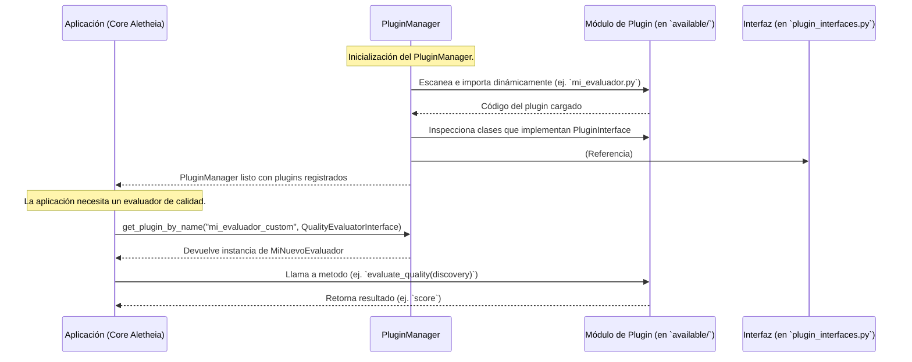

# Sistema de Plugins de Aletheia

Este directorio contiene el sistema de plugins, diseñado para la extensibilidad modular de Aletheia. Permite añadir nuevas funcionalidades o modificar comportamientos existentes sin alterar el código del núcleo.

## Arquitectura y Flujo de Trabajo

El sistema se basa en tres componentes principales:
1.  **Interfaces de Plugin (`plugin_interfaces.py`)**: Contratos abstractos que definen el comportamiento de los plugins.
2.  **Plugins Concretos (`available/`)**: Módulos Python que implementan una o más de estas interfaces.
3.  **Gestor de Plugins (`manager.py`)**: Descubre, carga y proporciona acceso a los plugins.

El siguiente diagrama de secuencia ilustra la interacción típica:



## Desarrollo de un Nuevo Plugin

1.  **Identificar/Crear Interfaz**: Verifique `plugin_interfaces.py`. Si no existe una interfaz adecuada, proponga una nueva.
2.  **Crear Archivo del Plugin**: En `Aletheia_v3/plugins/available/`, cree `mi_plugin.py`.
3.  **Implementar la Interfaz**:
    ```python
    # En Aletheia_v3/plugins/available/mi_nuevo_evaluador.py
    from Aletheia_v3.plugins.plugin_interfaces import QualityEvaluatorInterface
    from Aletheia_v3.core.domain import Discovery

    class MiNuevoEvaluador(QualityEvaluatorInterface):
        def evaluate_quality(self, discovery: Discovery) -> float:
            # Lógica de evaluación personalizada
            score = 0.0
            # ... su implementación ...
            return score

        def get_name(self) -> str:
            return "mi_evaluador_custom"
    ```
4.  **Registro y Pruebas**: El `PluginManager` descubre los plugins automáticamente. Añada pruebas unitarias y de integración en el directorio de tests de `Aletheia_v3`.

## Consideraciones
-   **Dependencias**: Añada cualquier nueva dependencia al `requirements.txt` de `Aletheia_v3/`.
-   **Seguridad**: Los plugins son código ejecutado. Asegúrese de que provengan de fuentes confiables.
-   **Gestión de Errores**: Los plugins deben ser robustos y manejar sus errores internamente.

Consulte `example_quality_evaluator.py` para una implementación de referencia.
