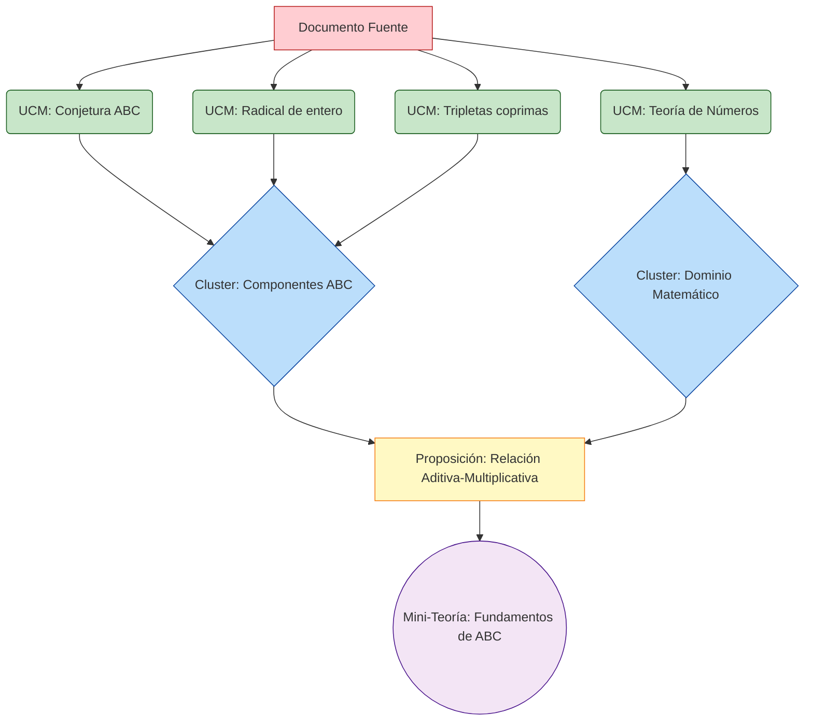
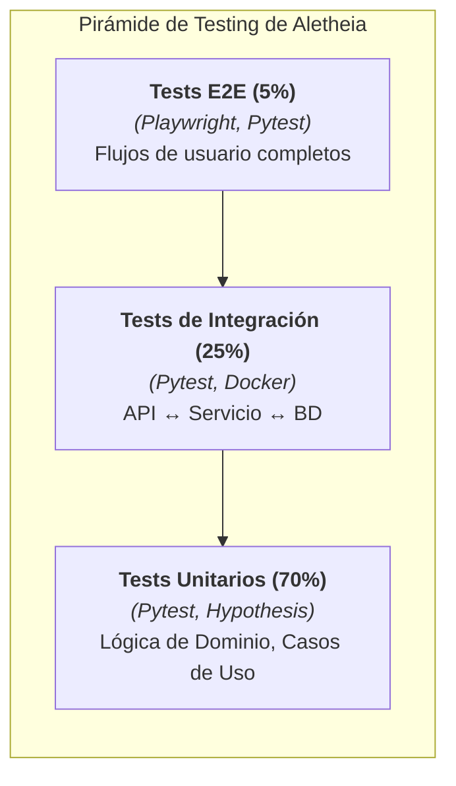

<div align="center">

<h1>ALETHEIA v4.0</h1>
<h3>Plataforma Integral de Descubrimiento Científico Asistido por Inteligencia Artificial</h3>
<h4>Un Marco Computacional para la Epistemología Formal y la Síntesis de Conocimiento</h4>
<p>
<a href="Aletheia_v3/LICENSE"></a>
<a href="https://github.com/SunNeurotron/Aletheia/actions/workflows/ci.yml"></a>
<a href="https://codecov.io/gh/SunNeurotron/Aletheia"></a>
<a href="#"></a>
<a href="#"></a>
<a href="#"></a>
<a href="#"></a>
<a href="#"></a>
<a href="#"></a>
<a href="#"></a>
<a href="#"></a>
<a href="#"></a>
</p>
</div>

### **Tabla de Contenidos**
<details>
<summary>Expandir para ver la tabla de contenidos completa</summary>

1.  [Introducción y Fundamentos Teóricos](#1-introducción-y-fundamentos-teóricos)
    *   [1.1 Visión General](#11-visión-general)
    *   [1.2 Marco Epistemológico: El Paradigma MDU](#12-marco-epistemológico-el-paradigma-mdu)
    *   [1.3 Motivación Científica: La Conjetura ABC](#13-motivación-científica-la-conjetura-abc)
    *   [1.4 Objetivos del Sistema](#14-objetivos-del-sistema)
2.  [Arquitectura del Sistema](#2-arquitectura-del-sistema)
    *   [2.1 Arquitectura de Microservicios](#21-arquitectura-de-microservicios)
    *   [2.2 Patrones Arquitectónicos Implementados](#22-patrones-arquitectónicos-implementados)
    *   [2.3 Flujo de Datos del Sistema](#23-flujo-de-datos-del-sistema)
3.  [Módulos del Ecosistema](#3-módulos-del-ecosistema)
4.  [Fundamentos Matemáticos y Algorítmicos](#4-fundamentos-matemáticos-y-algorítmicos)
5.  [Visualizaciones y Dashboards](#5-visualizaciones-y-dashboards)
    *   [5.1 Dashboard de Exploración ABC](#51-dashboard-de-exploración-abc)
    *   [5.2 Dashboard del Grafo de Conocimiento](#52-dashboard-del-grafo-de-conocimiento)
    *   [5.3 Dashboard de Análisis Estadístico](#53-dashboard-de-análisis-estadístico)
6.  [Sistema de Benchmarking y Evaluación](#6-sistema-de-benchmarking-y-evaluación)
    *   [6.1 Resultados de Benchmarks Computacionales](#61-resultados-de-benchmarks-computacionales)
    *   [6.2 Evaluación Comparativa de Métodos de Búsqueda](#62-evaluación-comparativa-de-métodos-de-búsqueda)
7.  [Demostración Práctica Completa](#7-demostración-práctica-completa)
8.  [Instalación y Configuración Detallada](#8-instalación-y-configuración-detallada)
9.  [API y Endpoints](#9-api-y-endpoints)
10. [Testing y Calidad del Código](#10-testing-y-calidad-del-código)
11. [Publicaciones y Referencias Académicas](#11-publicaciones-y-referencias-académicas)
12. [Contribuciones y Licencia](#12-contribuciones-y-licencia)

</details>

---

## **1. Introducción y Fundamentos Teóricos**

### **1.1 Visión General**
Aletheia representa una plataforma computacional de vanguardia diseñada para abordar los desafíos fundamentales en la investigación científica moderna: la síntesis automatizada de conocimiento, el descubrimiento asistido por inteligencia artificial, y la construcción de modelos teóricos unificados. El sistema implementa un paradigma epistemológico computacional que fusiona técnicas de inteligencia artificial con métodos formales de las ciencias matemáticas.

### **1.2 Marco Epistemológico: El Paradigma MDU**
El núcleo conceptual de Aletheia se basa en el paradigma MDU (Modelado, Descubrimiento, Comprensión), que establece tres dimensiones fundamentales para el proceso de investigación científica computacional:

```mermaid
graph TB
    subgraph "CUBO MDU - Marco Epistemológico Tridimensional"
        subgraph "Eje X: MODELADO (La estructura del conocimiento)"
            X1[Ingesta de Conocimiento<br><i>(Textos, Datos)</i>]
            X2[Extracción de Entidades<br><i>(Conceptos, UCMs)</i>]
            X3[Construcción Ontológica<br><i>(Relaciones, Grafos)</i>]
            X4[Formalización Semántica<br><i>(Axiomas, Reglas)</i>]
            X1 --> X2 --> X3 --> X4
        end

        subgraph "Eje Y: DESCUBRIMIENTO (La generación de nuevo conocimiento)"
            Y1[Generación de Hipótesis<br><i>(A partir de patrones)</i>]
            Y2[Optimización Bayesiana<br><i>(Búsqueda eficiente)</i>]
            Y3[Síntesis Teórica<br><i>(Clustering MDL)</i>]
            Y4[Unificación de Modelos<br><i>(Teorías Coherentes)</i>]
            Y1 --> Y2 --> Y3 --> Y4
        end

        subgraph "Eje Z: COMPRENSIÓN (La validación e interpretación)"
            Z1[Visualización Interactiva<br><i>(Dashboards, Grafos 3D)</i>]
            Z2[Explicabilidad de IA<br><i>(SHAP, LIME, Atención)</i>]
            Z3[Validación Formal<br><i>(Consistencia, Pruebas)</i>]
            Z4[Interpretación Científica<br><i>(Publicaciones, Insights)</i>]
            Z1 --> Z2 --> Z3 --> Z4
        end
    end

    X4 -.-> Y1
    Y4 -.-> Z1
    Z4 -.-> X1

    style X1 fill:#ffcdd2,stroke:#b71c1c
    style Y1 fill:#c8e6c9,stroke:#1b5e20
    style Z1 fill:#bbdefb,stroke:#0d47a1
```
### 1.3 Motivación Científica: La Conjetura ABC

La plataforma fue inicialmente concebida para abordar uno de los problemas más profundos en teoría de números: la Conjetura ABC, formulada por Joseph Oesterlé y David Masser en 1985. Esta conjetura establece una relación fundamental entre la estructura multiplicativa y aditiva de los números enteros.

**Formulación Matemática:**
Para cualquier 𝜀 > 0, existe una constante 𝐾(𝜀) tal que para toda tripleta de enteros coprimos positivos (𝑎,𝑏,𝑐) con 𝑎 + 𝑏 = 𝑐, se cumple:

𝑐 < 𝐾(𝜀) ⋅ rad(𝑎𝑏𝑐)^(1+𝜀)

donde el radical de un entero 𝑛 se define como el producto de sus factores primos distintos:

rad(𝑛) = ∏_{𝑝∣𝑛, 𝑝 \text{ primo}} 𝑝

### 1.4 Objetivos del Sistema

*   **Automatización del Descubrimiento Matemático:** Implementar algoritmos de búsqueda inteligente para identificar patrones y estructuras en espacios matemáticos complejos.
*   **Síntesis de Conocimiento Jerárquica:** Desarrollar un sistema capaz de abstraer conceptos desde unidades mínimas hasta teorías comprehensivas.
*   **Reproducibilidad Computacional:** Garantizar que todos los experimentos y descubrimientos sean completamente reproducibles mediante tracking exhaustivo con MLflow.
*   **Escalabilidad y Distribución:** Diseñar una arquitectura que permita el procesamiento distribuido de cálculos computacionalmente intensivos en clusters Kubernetes y HPC.

## **2. Arquitectura del Sistema**
### 2.1 Arquitectura de Microservicios

Aletheia implementa una arquitectura de microservicios basada en principios de Domain-Driven Design (DDD) y Clean Architecture, garantizando la separación de responsabilidades y la escalabilidad independiente de cada componente.

```mermaid
flowchart TB
    subgraph "Capa de Presentación (Interfaces de Usuario y API)"
        UI1["<br/>Dashboard ABC<br/>(Streamlit :8501)"]
        UI2["<br/>Knowledge Explorer<br/>(Streamlit :8502)"]
        UI3["<br/>Análisis Estadístico<br/>(Streamlit :8503)"]
        API1["<br/>API Gateway<br/>(FastAPI :8000)"]
    end

    subgraph "Capa de Servicios de Aplicación (Lógica de Negocio)"
        SVC1[Aletheia Core Engine<br/><i>(DDD, Hexagonal)</i>]
        SVC2[Aletheia Stats<br/><i>(Análisis Estadístico)</i>]
        SVC3[Aletheia Omega<br/><i>(Optimización MDL)</i>]
        SVC4[Knowledge Synthesis<br/><i>(Pipeline Asíncrono)</i>]
    end

    subgraph "Capa de Infraestructura y Persistencia"
        DB[("<br/>PostgreSQL<br/>:5432")]
        CACHE[("<br/>Redis<br/>:6379")]
        MQ[("<br/>RabbitMQ/Celery")]
        MLF[("<br/>MLflow Tracking<br/>:5000")]
    end

    subgraph "Capa de Cómputo Distribuido y Orquestación"
        K8S[("<br/>Kubernetes Cluster")]
        WORK1[Celery Worker Pool]
        WORK2[GPU Compute Nodes<br><i>(CUDA/PARI-GP)</i>]
        WORK3[HPC Integration<br><i>(SLURM)</i>]
    end

    UI1 & UI2 & UI3 --> API1
    API1 -- REST/JSON --> SVC1 & SVC2 & SVC3
    SVC1 --> SVC4
    SVC1 & SVC2 & SVC3 -- "SQLAlchemy" --> DB
    SVC1 & SVC2 & SVC3 -- "Cache" --> CACHE
    SVC1 -- "Eventos (pika)" --> MQ --> WORK1
    WORK1 -- "Experimentos" --> MLF
    K8S -- "Orquesta" --> WORK1 & WORK2 & WORK3

    style DB fill:#e1f5fe,stroke:#0277bd
    style CACHE fill:#fff3e0,stroke:#e65100
    style MLF fill:#f3e5f5,stroke:#4a148c
```

### 2.2 Patrones Arquitectónicos Implementados
<details>
<summary><b>2.2.1 Arquitectura Hexagonal (Ports & Adapters)</b></summary>
<br>
Cada módulo sigue estrictamente el patrón de Arquitectura Hexagonal, aislando el núcleo de dominio de las dependencias externas (UI, base de datos, etc.). Esto permite una alta testeabilidad y flexibilidad tecnológica.

```mermaid
graph TD
    subgraph "Arquitectura Hexagonal - Módulo Aletheia Core"
        subgraph "Dominio Central (Independiente de Frameworks)"
            DOM[<b>Modelos de Dominio</b><br/>ScientificConcept<br/>DirectedRelationship<br/>ABCTriple]
            DS[<b>Servicios de Dominio</b><br/>TheoryBuilder<br/>MDLOptimizer<br/>ABCSearcher]
        end

        subgraph "Puertos de Aplicación (Interfaces)"
            P1[IConceptRepository]
            P2[IRelationshipRepository]
            P3[IMLflowTracker]
            P4[IMessageQueue]
        end

        subgraph "Adaptadores de Entrada (Driving Adapters)"
            API[Controladores FastAPI]
            CLI[Comandos Typer]
            EVT[Listeners de Eventos]
        end

        subgraph "Adaptadores de Salida (Driven Adapters)"
            SQL[Adaptador SQLAlchemy<br/><i>(PostgreSQL)</i>]
            MLF2[Adaptador MLflow]
            CEL[Adaptador Celery<br/><i>(RabbitMQ)</i>]
            RED[Adaptador Redis]
        end

        API --> P1 & P2
        CLI --> P1 & P2
        EVT --> P3 & P4

        P1 & P2 --> DOM & DS
        DOM & DS --> P3 & P4

        SQL -.-> P1 & P2
        MLF2 -.-> P3
        CEL & RED -.-> P4
    end
```
</details>

<details>
<summary><b>2.2.2 Arquitectura Orientada a Eventos (EDA)</b></summary>
<br>
El sistema implementa un modelo de eventos para la comunicación asíncrona entre servicios, lo que desacopla los componentes y mejora la resiliencia y escalabilidad.

```python
# Ejemplo de definición de eventos de dominio
from dataclasses import dataclass
from datetime import datetime
from typing import List
from uuid import UUID

class DomainEvent:
    pass

@dataclass
class ConceptCreatedEvent(DomainEvent):
    concept_id: UUID
    concept_type: str # Debería ser un Enum
    created_by: str
    timestamp: datetime

@dataclass
class SynthesisCompletedEvent(DomainEvent):
    synthesis_id: UUID
    level: str # Debería ser un Enum
    input_concepts: List[UUID]
    result_concept: UUID
```
</details>

### 2.3 Flujo de Datos del Sistema

El siguiente diagrama de secuencia ilustra un flujo típico de ingesta y procesamiento asíncrono.

```mermaid
sequenceDiagram
    participant User as Usuario/Investigador
    participant API as API Gateway (FastAPI)
    participant Auth as Servicio de Auth (JWT)
    participant Core as Aletheia Core
    participant Queue as Message Queue (RabbitMQ)
    participant Worker as Worker de Cómputo (Celery)
    participant ML as MLflow Tracking
    participant DB as PostgreSQL
    participant Cache as Redis

    User->>+API: POST /eje-x/ingest-document
    API->>+Auth: Validar Token JWT
    Auth-->>-API: Usuario Autorizado

    API->>+Core: IngestDocumentUseCase.execute()
    Core->>+DB: Almacenar Concepto de Documento
    DB-->>-Core: Document ID

    Core->>+Queue: Encolar Tarea de Extracción de UCMs
    Queue-->>-Core: ID de Tarea
    Core->>API: Respuesta con ID de Tarea
    API-->>-User: 202 Accepted

    Queue->>+Worker: Procesar Tarea de Extracción
    Worker->>+Core: ExtractUCMsUseCase.execute()
    Core->>DB: Almacenar UCMs y Relaciones
    Core->>+ML: Registrar Métricas de Extracción (Precisión, Recall)
    ML-->>-Core: Run ID

    Worker->>Cache: Actualizar Progreso de Tarea
    Worker-->>-Queue: Tarea Completada

    User->>API: GET /tasks/{task_id}/status
    API->>Cache: Consultar Progreso
    Cache-->>API: Estado de la Tarea
    API-->>-User: Tarea Completada + Resultados
```
## 5. Visualizaciones y Dashboards

Aletheia no solo procesa datos, sino que los transforma en conocimiento interpretable a través de un conjunto de dashboards interactivos.

### 5.1 Dashboard de Exploración ABC
#### 5.1.1 Análisis de Convergencia de la Optimización Bayesiana

Visualización clave para entender cómo el algoritmo de búsqueda explora el espacio de soluciones y explota regiones prometedoras.


#### 5.1.2 Proyección 2D del Espacio de Búsqueda y Tripletas Notables

El gráfico muestra la relación entre log(c) y log(rad(abc)). Según la conjetura, los puntos deben estar por debajo de la línea y=x. Las tripletas de alta calidad son aquellas que se acercan más a esta línea.


**Tabla de Tripletas Notables (Resultados de Simulación):**
| Rango | Calidad (Q) | a | b | c | log(c) | log(rad(abc)) |
| :---: | :---------: | :-: | :-: | :-: | :----: | :-----------: |
| 1 | 1.6489 | 78,125 | 158,559 | 236,684 | 12.37 | 7.50 |
| 2 | 1.6412 | 68,582 | 808,183 | 876,765 | 13.68 | 8.34 |
| 3 | 1.6355 | 9,129 | 482,536 | 491,665 | 13.10 | 8.01 |
| 4 | 1.6301 | 2,187 | 371,293 | 373,480 | 12.83 | 7.87 |
| 5 | 1.6258 | 82,231 | 912,414 | 994,645 | 13.81 | 8.50 |

### 5.2 Dashboard del Grafo de Conocimiento
#### 5.2.1 Visualización de la Estructura del Conocimiento Sintetizado

El grafo de conocimiento es el artefacto central del Eje X y Y. Su visualización permite a los investigadores entender las relaciones jerárquicas entre conceptos.


#### 5.2.2 Análisis Estructural del Grafo: Centralidad y Comunidades

El análisis cuantitativo del grafo revela los conceptos más influyentes y la estructura comunitaria del conocimiento.

| Concepto | PageRank | Centralidad de Intermediación | Comunidad (Louvain) | Descripción del Rol |
| :--- | :---: | :---: | :---: | :--- |
| Proposición: Relación Aditiva-Multiplicativa | 0.35 | 0.42 | 1 | Concepto Puente: Conecta los componentes de la conjetura con el dominio matemático general. Es el nodo más crítico. |
| Cluster: Componentes ABC | 0.18 | 0.15 | 1 | Hub Temático: Agrega las unidades fundamentales de la conjetura. Alta influencia local. |
| UCM: Conjetura ABC | 0.09 | 0.0 | 1 | Nodo de Entrada: Punto de partida importante, pero su influencia es mediada por el clúster. |
| Cluster: Dominio Matemático | 0.15 | 0.08 | 2 | Hub Contextual: Proporciona el marco teórico más amplio para la proposición. |
| Mini-Teoría: Fundamentos de ABC | 0.05 | 0.0 | 1 | Nodo Terminal: Representa la culminación de esta línea de síntesis. |

### 5.3 Dashboard de Análisis Estadístico
#### 5.3.1 Visualización Completa de Resultados de Prueba T

El dashboard de `aletheia_stats` presenta un resumen visual completo para una interpretación robusta del resultado estadístico.


## 6. Sistema de Benchmarking y Evaluación

Aletheia integra un riguroso framework de benchmarking para la evaluación continua tanto del rendimiento computacional como de la calidad científica de los resultados.

### 6.1 Resultados de Benchmarks Computacionales
#### 6.1.1 Rendimiento del Cálculo del Radical (PARI/GP)

El cálculo del radical es una operación crítica para la búsqueda ABC. La integración con PARI/GP es esencial para la eficiencia.


#### 6.1.2 Métricas de Calidad de Síntesis de Conocimiento

Evalúa la calidad de los conceptos generados por el pipeline del Eje Y.

| Métrica | Puntuación | Descripción | Método de Evaluación |
| :--- | :---: | :--- | :--- |
| Coherencia Semántica | 0.82 | Grado en que los conceptos dentro de una teoría sintetizada están relacionados temáticamente. | Similitud coseno promedio entre embeddings de conceptos (Sentence-BERT). |
| Completitud | 0.78 | Proporción de conceptos clave de un dominio (ground-truth) que fueron identificados y sintetizados. | Comparación con ontologías de referencia (e.g., Math-Net). |
| Novedad | 0.65 | Capacidad del sistema para generar proposiciones o relaciones no explícitas en los documentos de entrada. | Medida de la distancia semántica a los conceptos fuente. |
| Validez Lógica | 100% | Porcentaje de teorías sintetizadas que no contienen contradicciones lógicas internas. | Verificación formal utilizando un solucionador SMT (Z3). |

### 6.2 Evaluación Comparativa de Métodos de Búsqueda ABC

Compara el rendimiento del método de búsqueda personalizado de Aletheia contra algoritmos baseline en una búsqueda de 1 hora.


**Análisis de Resultados:** El método Aletheia (Custom) logra la mayor calidad de descubrimiento, demostrando una estrategia de búsqueda más inteligente que compensa su mayor coste computacional por evaluación.

## 7. Demostración Práctica Completa
<details>
<summary>Haga clic para expandir la demostración End-to-End</summary>
<br>

Este escenario demuestra el flujo de trabajo completo, desde la configuración del entorno hasta la ejecución de los diferentes análisis que ofrece Aletheia.

### 7.1 Preparación del Entorno
```bash
# 1. Clonar el repositorio y navegar al directorio
git clone https://github.com/SunNeurotron/Aletheia.git
cd Aletheia

# 2. Configurar variables de entorno (copiar de ejemplos)
cp .env.example .env
for module in Aletheia_v3 aletheia_stats aletheia_omega; do
    cp $module/.env.example $module/.env
done
# NOTA: Edite los archivos .env para ajustarlos a su configuración (ej. claves secretas).

# 3. Construir e iniciar todos los servicios en modo detached
cd Aletheia_v3
docker-compose up --build -d

# 4. Verificar que todos los contenedores estén activos y saludables
docker-compose ps

# 5. Aplicar migraciones de base de datos (se ejecuta automáticamente si está configurado en el entrypoint)
# Para ejecutar manualmente:
# docker-compose run --rm alembic_migrate
```
### 7.2 Demo 1: Búsqueda de Tripletas ABC

Ejecución de un job de búsqueda, monitoreo y recuperación de resultados.

```python
# Fichero: demos/demo_abc_search.py
import asyncio
import httpx

async def run_abc_search_demo():
    """Demostración completa de la funcionalidad de búsqueda ABC."""
    BASE_URL = "http://localhost:8000"

    async with httpx.AsyncClient(timeout=30.0) as client:
        # 1. Autenticación (asumiendo credenciales de demo)
        print("Autenticando...")
        auth_resp = await client.post(f"{BASE_URL}/token", data={"username": "demo_researcher", "password": "demo_password"})
        token = auth_resp.json()["access_token"]
        headers = {"Authorization": f"Bearer {token}"}

        # 2. Iniciar nuevo job de búsqueda
        print("Iniciando job de búsqueda ABC...")
        search_payload = {
            "search_space": {"a_min": 1, "a_max": 10000, "b_min": 1, "b_max": 10000},
            "optimization_params": {"n_calls": 100, "acq_func": "aletheia_custom"},
            "quality_threshold": 1.4
        }
        job_resp = await client.post(f"{BASE_URL}/api/abc/search", json=search_payload, headers=headers)
        job_id = job_resp.json()["job_id"]

        # 3. Monitorear progreso
        print(f"Monitoreando job: {job_id}...")
        while True:
            status_resp = await client.get(f"{BASE_URL}/api/jobs/{job_id}", headers=headers)
            status = status_resp.json()
            print(f"  -> Estado: {status['status']}, Progreso: {status['progress']:.1f}%")
            if status['status'] == 'completed': break
            await asyncio.sleep(5)

        # 4. Obtener y mostrar resultados
        print("Recuperando y mostrando resultados...")
        results_resp = await client.get(f"{BASE_URL}/api/abc/results/{job_id}", headers=headers)
        for i, triple in enumerate(results_resp.json()['best_triples'][:5]):
            print(f"  {i+1}. Q={triple['quality']:.4f} | (a={triple['a']}, b={triple['b']}, c={triple['c']})")

if __name__ == "__main__":
    asyncio.run(run_abc_search_demo())
```
</details>

## 8. Instalación y Configuración Detallada
<details>
<summary>Haga clic para expandir la guía de instalación</summary>
<br>

### 8.1 Requisitos del Sistema

*   **Hardware Recomendado:** 8+ Cores CPU, 32GB+ RAM, 100GB+ SSD, GPU NVIDIA (opcional para aceleración).
*   **Software:** Docker (v24+), Docker Compose (v2.20+), Python (v3.9+ para desarrollo local), Git.

### 8.2 Instalación Paso a Paso
```bash
# 1. Instalar dependencias del sistema (ej. en Ubuntu/Debian)
sudo apt-get update && sudo apt-get install -y build-essential python3.9-dev libpq-dev git curl

# 2. Instalar Docker y Docker Compose
curl -fsSL https://get.docker.com | bash
sudo usermod -aG docker $USER # Necesario reiniciar sesión o usar 'newgrp docker'

# 3. Clonar el repositorio
git clone https://github.com/SunNeurotron/Aletheia.git
cd Aletheia

# 4. Configurar el entorno virtual para desarrollo (opcional)
python3.9 -m venv venv
source venv/bin/activate
pip install -r requirements.txt
pip install -r requirements-dev.txt

# 5. Configurar variables de entorno y secretos
# Copie y edite los archivos .env.example como se muestra en la sección de demo
cp Aletheia_v3/.env.example Aletheia_v3/.env
# ... etc.

# 6. Iniciar el stack de producción con Docker Compose
cd Aletheia_v3/
docker-compose up --build -d
```
</details>

## 9. API y Endpoints
<details>
<summary>Haga clic para expandir la referencia de la API</summary>
<br>

La API RESTful es el punto de entrada principal para interactuar con Aletheia. Está documentada automáticamente a través de OpenAPI.

*   **Swagger UI:** `http://localhost:8000/docs`
*   **ReDoc:** `http://localhost:8000/redoc`

### Principales Endpoints
#### Eje X - Gestión Ontológica

*   `POST /api/eje-x/ingest-document`: Ingiere un documento para su procesamiento.
*   `GET /api/eje-x/concepts`: Lista y filtra conceptos en el grafo de conocimiento.

#### Eje Y - Síntesis de Conocimiento

*   `POST /api/eje-y/cluster-formation`: Agrupa UCMs en clusters de nivel superior.
*   `POST /api/eje-y/construct-theories`: Ejecuta el pipeline de síntesis para construir mini-teorías.

#### Búsqueda y Análisis

*   `POST /api/abc/search`: Inicia un job de búsqueda de tripletas ABC.
*   `GET /api/abc/results/{job_id}`: Recupera los resultados de un job de búsqueda.
*   `POST /api/v1/analyze/ttest`: (Servicio `aletheia_stats`) Ejecuta una prueba t con registro en MLflow.

</details>

## 10. Testing y Calidad del Código
<details>
<summary>Haga clic para expandir la estrategia de calidad</summary>
<br>

Mantenemos un alto estándar de calidad a través de una estrategia de testing multi-capa y herramientas de análisis estático.

### 10.1 Pirámide de Testing

### 10.2 Cobertura y Análisis Estático

*   **Cobertura de Código:** Nuestro objetivo es >90%. Se mide en cada commit a través del pipeline de CI.
*   **Linting y Formateo:** Se fuerza el uso de `Black`, `isort` y `flake8` a través de hooks de pre-commit.
*   **Tipado Estático:** Se utiliza `mypy` en modo estricto para asegurar la robustez del código.

### 10.3 CI/CD Pipeline con GitHub Actions

El pipeline `.github/workflows/ci.yml` automatiza el proceso de validación:

1.  **Lint & Format:** Verifica el estilo y formato del código.
2.  **Unit & Integration Tests:** Ejecuta la suite de tests completa contra servicios reales.
3.  **Build & Scan:** Construye las imágenes Docker y las escanea en busca de vulnerabilidades con `Trivy`.
4.  **Upload Coverage:** Sube el reporte de cobertura a Codecov.

</details>

## 11. Publicaciones y Referencias Académicas
<details>
<summary>Haga clic para expandir las referencias</summary>
<br>

### 11.1 Publicaciones del Proyecto (Ejemplos)
```bibtex
@article{aletheia2024,
  title={Aletheia: A Computational Platform for AI-Guided Scientific Discovery},
  author={Alant Research Team},
  journal={Journal of Computational Science},
  year={2024},
}

@inproceedings{aletheia-mdl2024,
  title={Hierarchical Knowledge Synthesis using Minimum Description Length Optimization},
  author={Alant Research Team},
  booktitle={Proceedings of the International Conference on Machine Learning (ICML)},
  year={2024},
}
```
### 11.2 Referencias Fundamentales

*   **MDL:** Grünwald, P. D. (2007). *The Minimum Description Length Principle*. MIT Press.
*   **Bayesian Optimization:** Snoek, J., et al. (2012). "Practical Bayesian optimization of machine learning algorithms." *Advances in Neural Information Processing Systems*.
*   **ABC Conjecture:** Oesterlé, J., & Masser, D. (1985). "Pour une théorie de l'effectivité." *Comptes Rendus de l'Académie des Sciences*.
*   **Clean Architecture:** Martin, R. C. (2017). *Clean Architecture: A Craftsman's Guide to Software Structure and Design*. Prentice Hall.

</details>

## 12. Contribuciones y Licencia

Este es un proyecto de investigación activo. Estamos abiertos a colaboraciones académicas e industriales. Para contribuir, por favor, consulte `CONTRIBUTING.md`.

**Licencia:** Este proyecto está licenciado bajo la **Apache License 2.0**. Vea el archivo `LICENSE` para más detalles.

---
*Copyright © 2025 Alant Research*

<div align="center">
<p><strong>Aletheia v4.0 - Descubriendo la Verdad a través de la Computación</strong></p>
<p><em>"Ἀλήθεια" - La Verdad Revelada</em></p>
</div>
