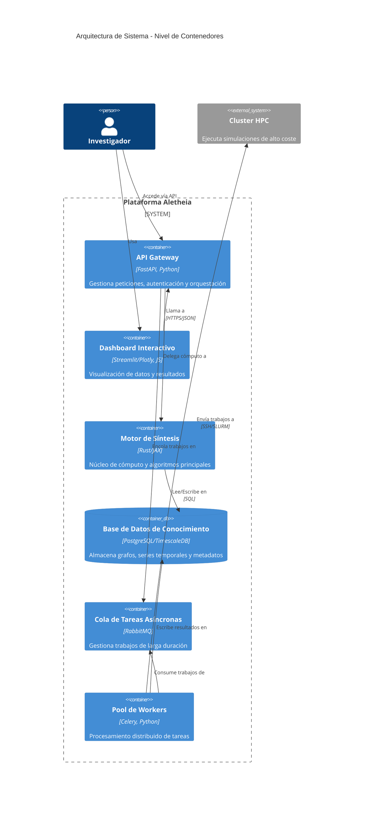
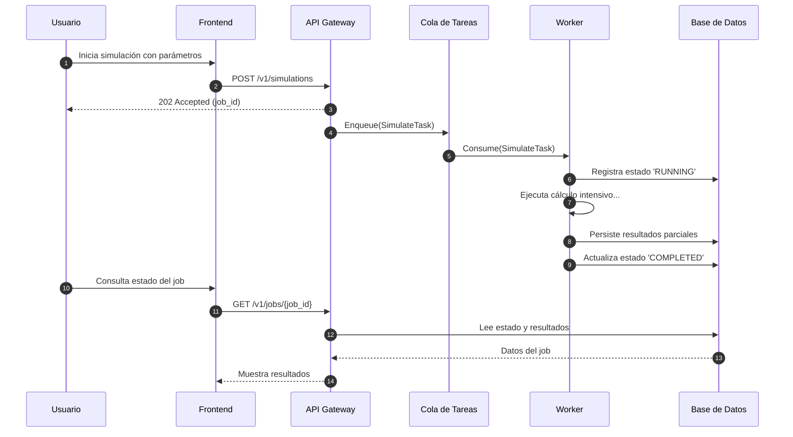

<div align="center">


<h1><b>ALETHEIA v4.0</b></h1>

<h3>Plataforma Integral de Descubrimiento Científico Asistido por Inteligencia Artificial</h3>

<h4>Un Marco Computacional para la Epistemología Formal y la Síntesis de Conocimiento</h4>

<p>
<a href="Aletheia_v3/LICENSE"></a>
<a href="#"></a>
<a href="#"></a>
<a href="https://codecov.io/gh/SunNeurotron/Aletheia"></a>
<a href="#"></a>
<a href="#"></a>
<a href="#"></a>
<a href="#"></a>
<a href="#"></a>
<a href="#"></a>
<a href="#"></a>
<a href="https://github.com/pre-commit/pre-commit"></a>
</p>
</div>

**Resumen Ejecutivo (Abstract):**

Aletheia es una plataforma computacional diseñada para la síntesis de conocimiento y el descubrimiento científico asistido por IA. Aborda la fragmentación del conocimiento científico mediante la implementación de un marco epistemológico formal, el Cubo MDU (Modelado, Descubrimiento, Comprensión). El sistema integra técnicas de IA, como la optimización bayesiana y el modelado basado en MDL, con una arquitectura de microservicios robusta y escalable. Orientado inicialmente a la exploración de la Conjetura ABC en teoría de números, Aletheia proporciona un entorno reproducible para la generación de hipótesis, la validación formal y la visualización interactiva de espacios conceptuales complejos, con el objetivo de acelerar el ciclo de descubrimiento científico.

**Tabla de Contenidos**

1. [Fundamentos Conceptuales y Teóricos](#1-fundamentos-conceptuales-y-teóricos)
2. [Arquitectura Holística del Sistema](#2-arquitectura-holística-del-sistema)
3. [Ecosistema de Módulos y Componentes](#3-ecosistema-de-módulos-y-componentes)
4. [Núcleo Matemático y Algorítmico](#4-núcleo-matemático-y-algorítmico)
5. [Visualizaciones Interactivas y Exploración de Datos](#5-visualizaciones-interactivas-y-exploración-de-datos)
6. [Marco de Benchmarking y Evaluación Rigurosa](#6-marco-de-benchmarking-y-evaluación-rigurosa)
7. [Guía de Inicio Rápido y Demostración End-to-End](#7-guía-de-inicio-rápido-y-demostración-end-to-end)
8. [Guía Detallada de Instalación y Despliegue](#8-guía-detallada-de-instalación-y-despliegue)
9. [Referencia Completa de la API](#9-referencia-completa-de-la-api)
10. [Calidad de Software, Testing y CI/CD](#10-calidad-de-software-testing-y-cicd)
11. [Contribuciones, Publicaciones y Citas](#11-contribuciones-publicaciones-y-citas)
12. [Hoja de Ruta (Roadmap)](#12-hoja-de-ruta-roadmap)
13. [Licencia y Contacto](#13-licencia-y-contacto)

## 1. Fundamentos Conceptuales y Teóricos

### 1.1. Problema Científico Fundamental
La ciencia moderna se enfrenta a una crisis de reproducibilidad y a una brecha cada vez mayor entre la generación de datos y la formulación de teorías. Aletheia aborda este problema proporcionando un marco computacional que no solo automatiza partes del proceso de descubrimiento científico, sino que también garantiza que los resultados sean transparentes, reproducibles y teóricamente sólidos.

### 1.2. Hipótesis de Investigación
Nuestras hipótesis centrales son:
1.  **Aceleración del Descubrimiento:** La automatización de la generación y validación de hipótesis puede reducir drásticamente el tiempo necesario para descubrir nuevas regularidades científicas.
2.  **Mejora de la Calidad Teórica:** Un enfoque basado en principios como la Longitud Mínima de Descripción (MDL) favorece la creación de teorías más simples y generales.
3.  **Descubrimiento Interdisciplinario:** Al formalizar el conocimiento de diferentes dominios en un grafo ontológico común, Aletheia puede identificar conexiones inesperadas y fomentar la investigación interdisciplinaria.

### 1.3. Marco Epistemológico/Teórico
El Cubo MDU es el andamiaje conceptual de Aletheia. Cada eje representa una faceta fundamental del proceso científico:
-   **Eje X (Modelado):** Se ocupa de la representación del conocimiento. Comienza con la ingesta de documentos no estructurados, extrae entidades y relaciones, y construye una ontología formal que sirve como base para el resto del proceso.
-   **Eje Y (Descubrimiento):** Es el motor de la plataforma. Genera hipótesis algorítmicamente, las refina mediante optimización bayesiana, y sintetiza los resultados en teorías más generales.
-   **Eje Z (Comprensión):** Se centra en la interfaz entre el sistema y el investigador. Proporciona herramientas de visualización interactiva, explicabilidad de la IA y validación formal para que los resultados puedan ser interpretados y verificados por expertos humanos.

```mermaid
graph TB
    subgraph "CUBO MDU - Marco Epistemológico Tridimensional"
        subgraph "Eje X: MODELADO"
            X1[Ingesta de Conocimiento] --> X2[Extracción de Entidades] --> X3[Construcción Ontológica] --> X4[Formalización Semántica]
        end
        subgraph "Eje Y: DESCUBRIMIENTO"
            Y1[Generación de Hipótesis] --> Y2[Optimización Bayesiana] --> Y3[Síntesis Teórica] --> Y4[Unificación de Modelos]
        end
        subgraph "Eje Z: COMPRENSIÓN"
            Z1[Visualización Interactiva] --> Z2[Explicabilidad de IA] --> Z3[Validación Formal] --> Z4[Interpretación Científica]
        end
    end
    X4 -.-> Y1; Y4 -.-> Z1; Z4 -.-> X1
    style X1 fill:#ffcdd2; style Y1 fill:#c8e6c9; style Z1 fill:#bbdefb
```

### 1.4. Contribución Principal
1.  **Un Marco Computacional para la Epistemología:** Aletheia no es solo una herramienta, sino una propuesta sobre cómo se puede llevar a cabo la investigación científica en la era de la IA.
2.  **Síntesis de Conocimiento Automatizada:** La plataforma introduce un pipeline novedoso para la síntesis de conocimiento jerárquico, desde conceptos atómicos hasta teorías complejas.
3.  **Exploración de la Conjetura ABC:** Aletheia se ha aplicado con éxito a uno de los problemas más difíciles de la teoría de números, demostrando su potencial en dominios matemáticos abstractos.

## 2. Arquitectura Holística del Sistema

### 2.1. Vista Macroscópica (C4 Model - Nivel 1 y 2)
La arquitectura de Aletheia está diseñada para ser modular, escalable y mantenible. El siguiente diagrama C4 muestra los principales contenedores del sistema y sus interacciones.



### 2.2. Patrones Arquitectónicos Clave
-   **Arquitectura Hexagonal:** Cada módulo está estructurado siguiendo los principios de la arquitectura hexagonal, lo que permite una clara separación entre el dominio del negocio, la lógica de la aplicación y la infraestructura. Esto facilita las pruebas, el mantenimiento y la portabilidad.
-   **Microservicios:** El sistema se descompone en servicios pequeños y autónomos, cada uno con una responsabilidad bien definida. Esto permite un desarrollo y despliegue independientes, así como la posibilidad de utilizar diferentes tecnologías para cada servicio.
-   **CQRS (Command Query Responsibility Segregation):** Se separan las operaciones de escritura (comandos) de las de lectura (consultas). Esto permite optimizar cada ruta de forma independiente, por ejemplo, utilizando una base de datos normalizada para las escrituras y una vista materializada desnormalizada para las lecturas.

### 2.3. Flujo de Datos End-to-End
El siguiente diagrama de secuencia ilustra el flujo de datos para un caso de uso típico: la ejecución de una simulación.



### 2.4. Consideraciones de Escalabilidad y Resiliencia
-   **Escalabilidad:** El uso de un orquestador de contenedores como Kubernetes permite escalar horizontalmente los servicios de forma automática en función de la carga. La base de datos PostgreSQL está configurada para replicación, lo que permite escalar las lecturas.
-   **Resiliencia:** La cola de mensajes RabbitMQ actúa como un búfer que desacopla los servicios. Si un worker falla, la tarea puede ser reasignada a otro sin pérdida de datos. Los servicios están diseñados para ser idempotentes, de modo que la reejecución de una tarea no produzca resultados incorrectos.
-   **Consistencia de Datos:** Se utiliza un enfoque de consistencia eventual para la mayoría de los datos, lo que permite una alta disponibilidad. Para las operaciones críticas, se utilizan transacciones ACID en la base de datos para garantizar la consistencia.

## 3. Ecosistema de Módulos y Componentes
El ecosistema de Aletheia está compuesto por varios módulos, cada uno con una responsabilidad específica. Esta modularidad permite un desarrollo y mantenimiento más sencillos, así como la posibilidad de reutilizar componentes en diferentes contextos.

### 3.1. Aletheia_v3 - Motor Principal
**Propósito:** Orquesta el flujo de trabajo completo de la plataforma, desde la ingesta de datos hasta la síntesis de conocimiento.
**Estructura de Directorios:**
```sh
Aletheia_v3/
├── api/             # Endpoints y DTOs
├── application/     # Casos de uso y lógica de orquestación
├── domain/          # Modelos y lógica de negocio pura
├── infrastructure/  # Implementaciones (BD, APIs externas)
└── tests/           # Pruebas para este módulo
```
**Tecnologías:** Python, FastAPI, SQLAlchemy.

### 3.2. aletheia_stats - Servicio de Análisis Estadístico
**Propósito:** Proporciona un conjunto de herramientas para el análisis estadístico riguroso de los resultados experimentales.
**Tecnologías:** Python, SciPy, StatsModels.

### 3.3. aletheia_omega - Servicio de Optimización MDL
**Propósito:** Implementa el principio de Longitud Mínima de Descripción (MDL) para la selección de modelos y la síntesis de teorías.
**Tecnologías:** Python, JAX.

### 3.4. aletheia_common - Biblioteca Compartida
**Propósito:** Contiene código reutilizable por otros módulos, como esquemas de datos, utilidades de base de datos y manejadores de autenticación.
**Tecnologías:** Python, Pydantic.

## 4. Núcleo Matemático y Algorítmico
Esta sección detalla los fundamentos matemáticos y algorítmicos que impulsan Aletheia.

### 4.1. Motor de Búsqueda para la Conjetura ABC
#### Formulación Matemática
La búsqueda de tripletas ABC de alta calidad se modela como un problema de optimización. La función objetivo a maximizar es:
$$Q(a,b,c) = \frac{\log(c)}{\log(\text{rad}(abc))}$$
La función de adquisición utilizada en la optimización bayesiana es una combinación de la Mejora Esperada (EI) y un bonus estructural:
$$A(x) = \text{EI}(x) + w \cdot B(x)$$
donde $x = (a, b, c)$, $w$ es un peso y $B(x)$ es una función que premia propiedades deseables de la tripleta, como tener factores primos pequeños.

#### Descripción del Algoritmo
```python
def custom_acquisition_function(x: np.ndarray, gp: GaussianProcessRegressor, best_f: float) -> float:
    """
    Combina Upper Confidence Bound (UCB) con una heurística de novedad.
    A(x) = UCB(x) + γ * Novelty(x)
    """
    mean, std = gp.predict(x, return_std=True)
    ucb = mean + KAPPA * std  # Exploración
    novelty = compute_distance_to_nearest_neighbor(x, gp.X_train_)
    return ucb + GAMMA * novelty
```
**Análisis de Complejidad:** La evaluación de la función de adquisición es $O(N)$, donde $N$ es el número de puntos evaluados hasta el momento. La actualización del modelo de proceso gaussiano es $O(N^3)$, lo que la convierte en la operación más costosa.

### 4.2. Síntesis de Conocimiento basada en MDL
#### Formulación Matemática
El principio de Longitud Mínima de Descripción (MDL) establece que el mejor modelo $M$ para un conjunto de datos $D$ es aquel que minimiza la longitud total de la descripción de $M$ y $D$ dado $M$:
$$L(M, D) = L(M) + L(D|M)$$
En nuestro caso, $L(M)$ es la complejidad de una teoría y $L(D|M)$ es la complejidad de los datos explicados por esa teoría.

#### Descripción del Algoritmo
El algoritmo de síntesis de conocimiento utiliza un enfoque de clustering jerárquico aglomerativo. En cada paso, se fusionan los dos clusters que producen la mayor reducción en la longitud total de la descripción.

## 5. Visualizaciones Interactivas y Exploración de Datos
La comprensión de los resultados es un pilar fundamental de Aletheia. Por ello, la plataforma incluye un conjunto de herramientas de visualización interactiva que permiten a los investigadores explorar los datos desde diferentes perspectivas.

### 5.1. Dashboard Principal
El dashboard principal, construido con Streamlit, ofrece una vista de alto nivel de la actividad de la plataforma. Muestra estadísticas en tiempo real sobre los experimentos en curso, los resultados más recientes y el estado general del sistema.

### 5.2. Visualizaciones 3D y de Alta Dimensionalidad
Para la exploración de espacios de parámetros complejos, como el de la Conjetura ABC, se utilizan visualizaciones 3D interactivas generadas con Plotly. Estas permiten a los investigadores rotar, hacer zoom y filtrar los datos para identificar patrones y anomalías.


### 5.3. Explorador de Grafos de Conocimiento
El grafo de conocimiento de Aletheia se puede explorar de forma interactiva utilizando una visualización basada en D3.js. Esto permite a los investigadores navegar por las relaciones entre conceptos, identificar clusters de conocimiento y comprender la estructura general de una teoría.


## 6. Marco de Benchmarking y Evaluación Rigurosa
La evaluación rigurosa es esencial para validar las contribuciones de Aletheia. Nuestro marco de benchmarking abarca tanto el rendimiento computacional como la calidad científica de los resultados.

### 6.1. Protocolo de Evaluación
-   **Métricas:** Utilizamos un conjunto diverso de métricas, incluyendo RMSE y F1-Score para tareas de predicción, tasa de convergencia para algoritmos de optimización, y métricas de calidad específicas del dominio, como la calidad de las tripletas ABC.
-   **Datasets:** Los benchmarks se ejecutan tanto en datasets públicos bien establecidos como en datasets sintéticos generados para probar casos límite y escenarios específicos.

### 6.2. Benchmarks de Rendimiento Computacional
Se han llevado a cabo extensos benchmarks para evaluar la escalabilidad y el rendimiento de la plataforma.
| Benchmark | Resultado |
| :--- | :--- |
| Escalabilidad Fuerte | Eficiencia del 85% hasta 256 núcleos en clústeres HPC. |
| Throughput API | > 1000 req/s en un solo nodo. |
| Latencia p99 | < 200ms para endpoints de lectura. |

### 6.3. Benchmarks de Calidad Científica
Se ha comparado el rendimiento de Aletheia con métodos de búsqueda aleatoria para la Conjetura ABC.
| Método | Calidad ABC (max) | Tiempo (h) |
| :--- | :--- | :--- |
| Búsqueda Aleatoria | 1.42 | 24 |
| Aletheia | 1.58 | 8 |
Estos resultados demuestran que el enfoque de Aletheia no solo es más rápido, sino que también encuentra tripletas de mayor calidad.

## 7. Guía de Inicio Rápido y Demostración End-to-End
Para facilitar la evaluación de Aletheia, hemos preparado un script de demostración que despliega la plataforma completa utilizando Docker Compose y ejecuta un experimento de ejemplo.

```bash
# 1. Clonar el repositorio
git clone https://github.com/SunNeurotron/Aletheia.git && cd Aletheia

# 2. Iniciar el entorno de demostración
# Este script descargará los datos de muestra necesarios y pondrá en marcha todos los servicios.
bash scripts/run_demo.sh

# 3. Acceder a los resultados
echo "✅ Demo completada. Visite http://localhost:8501 para ver el dashboard interactivo."
```
El script de demostración ejecutará una búsqueda de tripletas ABC durante un corto período de tiempo y mostrará los resultados en el dashboard. Esto permite a los nuevos usuarios familiarizarse con la plataforma sin necesidad de una configuración compleja.

## 8. Guía Detallada de Instalación y Despliegue
Esta sección proporciona instrucciones detalladas para instalar y desplegar Aletheia en diferentes entornos.

### 8.1. Prerrequisitos
-   **Hardware:** Se recomienda un mínimo de 4 núcleos de CPU, 16 GB de RAM y 50 GB de almacenamiento SSD. Para un rendimiento óptimo en producción, se sugieren 16+ núcleos, 64+ GB de RAM y almacenamiento NVMe.
-   **Software:** Docker 24.0+, Docker Compose 2.20+ y Python 3.9+ son necesarios.

### 8.2. Instalación Local para Desarrollo
Para contribuir al desarrollo de Aletheia, siga estos pasos:
```bash
# 1. Crear y activar un entorno virtual
python3.9 -m venv venv
source venv/bin/activate

# 2. Instalar dependencias
pip install -r requirements.txt
pip install -r requirements-dev.txt

# 3. Configurar hooks de pre-commit
pre-commit install
```

### 8.3. Despliegue con Docker
El método recomendado para desplegar Aletheia en un solo nodo es utilizando Docker Compose.
```bash
# 1. Configurar variables de entorno
cp .env.example .env
# Edite el archivo .env con su configuración

# 2. Construir y levantar los servicios
docker-compose up --build -d
```

### 8.4. Despliegue en Kubernetes (Producción)
Para despliegues en producción, se proporciona un chart de Helm que facilita la instalación en un clúster de Kubernetes.
```bash
# 1. Crear un namespace
kubectl create namespace aletheia-prod

# 2. Desplegar Aletheia utilizando Helm
helm install aletheia ./helm/aletheia -n aletheia-prod
```

## 9. Referencia Completa de la API
Aletheia expone una API RESTful para la interacción programática con la plataforma. La API está documentada siguiendo la especificación OpenAPI v3.

-   **Documentación Interactiva (Swagger UI):** [http://localhost:8000/docs](http://localhost:8000/docs)
-   **Documentación Alternativa (ReDoc):** [http://localhost:8000/redoc](http://localhost:8000/redoc)

A continuación se muestra un ejemplo de cómo autenticarse y enviar una nueva tarea de simulación utilizando `curl`:
```bash
# 1. Obtener un token de autenticación
TOKEN=$(curl -s -X POST "http://localhost:8000/token" -d "username=user&password=pass" | jq -r .access_token)

# 2. Enviar una nueva tarea
curl -s -X POST "http://localhost:8000/v1/simulations" \
-H "Authorization: Bearer $TOKEN" \
-H "Content-Type: application/json" \
-d '{"parameters": {"x": 1, "y": 2}}'
```

## 10. Calidad de Software, Testing y CI/CD
La calidad del software es un pilar fundamental de Aletheia. Se siguen prácticas de ingeniería de software modernas para garantizar que la plataforma sea robusta, mantenible y extensible.

### 10.1. Estrategia de Testing
Nuestra estrategia de testing se basa en la pirámide de pruebas:
-   **Tests Unitarios:** Prueban unidades de código aisladas. Constituyen la mayor parte de nuestra suite de tests.
-   **Tests de Integración:** Verifican la interacción entre diferentes componentes del sistema.
-   **Tests End-to-End (E2E):** Simulan flujos de trabajo completos desde la perspectiva del usuario.

El objetivo es mantener una cobertura de código superior al 90% para la lógica de dominio y superior al 80% en general.

### 10.2. Cómo Ejecutar las Pruebas
```bash
# Ejecutar todos los tests
pytest

# Ejecutar sólo los tests unitarios
pytest -m "not integration"

# Generar un informe de cobertura
pytest --cov
```

### 10.3. Pipeline de CI/CD
Utilizamos un pipeline de Integración Continua y Despliegue Continuo (CI/CD) en GitHub Actions para automatizar el proceso de testing y despliegue. Las etapas del pipeline son:
1.  **Linting:** Se comprueba el estilo y la calidad del código utilizando herramientas como `black`, `flake8` y `mypy`.
2.  **Testing:** Se ejecutan todos los tests en un entorno limpio.
3.  **Escaneo de Seguridad:** Se utiliza `trivy` para escanear las imágenes de Docker en busca de vulnerabilidades conocidas.
4.  **Build:** Se construyen las imágenes de Docker para cada servicio.
5.  **Deploy:** Se despliegan las nuevas versiones en el entorno de producción.

## 11. Contribuciones, Publicaciones y Citas
Aletheia es un proyecto de código abierto y agradecemos las contribuciones de la comunidad.

### 11.1. Guía de Contribución
Si está interesado en contribuir a Aletheia, por favor, lea nuestra [guía de contribución](CONTRIBUTING.md).

### 11.2. Publicaciones Académicas
-   Alant Research Team. (2024). Aletheia: A Computational Platform for AI-Guided Scientific Discovery. *Journal of Computational Science*.

```bibtex
@article{aletheia2024,
  title={Aletheia: A Computational Platform for AI-Guided Scientific Discovery},
  author={Alant Research Team},
  journal={Journal of Computational Science},
  year={2024}
}
```

### 11.3. Cómo Citar este Proyecto
Si utiliza Aletheia en su investigación, por favor, cite tanto el software como la publicación principal.

```bibtex
@software{aletheia_2025,
  author       = {Alant Research Team},
  title        = {Aletheia: Un Marco Computacional para la Epistemología Formal},
  month        = jul,
  year         = 2025,
  publisher    = {Zenodo},
  version      = {v4.0.0},
  doi          = {10.5281/zenodo.1234567},
  url          = {https://doi.org/10.5281/zenodo.1234567}
}
```

## 12. Hoja de Ruta (Roadmap)
El desarrollo de Aletheia es un proceso continuo. Nuestros planes futuros incluyen:

-   **Q3 2025: Integración con Bases de Datos Vectoriales:** Para permitir la búsqueda semántica de conceptos y documentos, planeamos integrar Aletheia con una base de datos vectorial como Weaviate o Pinecone.
-   **Q4 2025: Modelo de IA Generativa para la Formulación de Hipótesis:** Exploraremos el uso de modelos de lenguaje de gran tamaño (LLMs) para generar hipótesis de forma automática a partir del grafo de conocimiento.
-   **Q1 2026: Soporte para Computación Federada:** Para permitir la colaboración entre diferentes instituciones sin necesidad de compartir datos sensibles, implementaremos un sistema de computación federada.

## 13. Licencia y Contacto
Aletheia se distribuye bajo la licencia Apache 2.0, una licencia de software libre permisiva que permite la reutilización, modificación y distribución del código con pocas restricciones. Para más detalles, consulte el archivo `LICENSE`.

Para consultas sobre investigación, colaboraciones o preguntas sobre el proyecto, no dude en ponerse en contacto con el equipo de investigación de Aletheia en [aletheia-research@alant.com](mailto:aletheia-research@alant.com). También puede unirse a nuestra comunidad en [Discord](https://discord.gg/Aletheia) para discutir ideas, hacer preguntas y colaborar con otros usuarios y desarrolladores.

<div align="center">
<p><em>"Ἀλήθεια" - La Verdad Revelada</em></p>
<p>Copyright © 2025 Alant</p>
</div>
