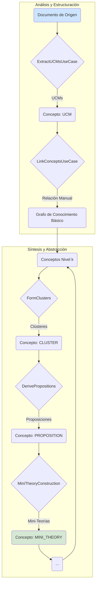
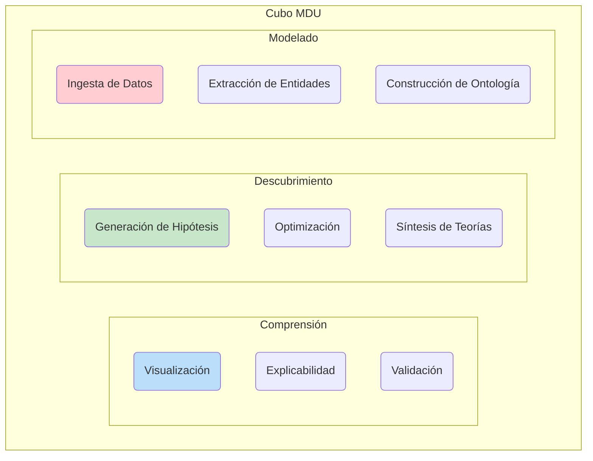
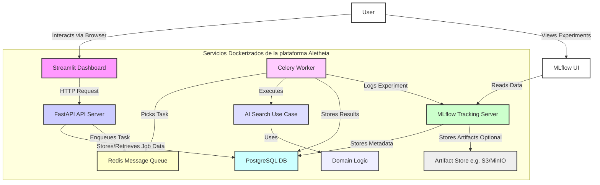

<div align="center">

(https://github.com/SunNeurotron/Aletheia/issues/102)
<h1>Aletheia v4.0</h1>
<p><strong>Plataforma de Descubrimiento Científico Guiado por IA</strong></p>
<p>Descubriendo las fronteras de la ciencia y las matemáticas con inteligencia artificial.</p>

<p>
<a href="Aletheia_v3/LICENSE"></a>
<a href="#"></a>
<a href="#"></a>
<a href="#"></a>
<a href="#"></a>
<a href="#"></a>
<a href="#"></a>
</p>
</div>


**Aletheia** es una plataforma de software diseñada para la investigación y el descubrimiento en ciencias formales, con un enfoque principal en la matemática pura y la física teórica. Su propósito es servir como un laboratorio computacional para la **epistemología asistida por IA**, donde las estructuras del conocimiento científico pueden ser representadas, sintetizadas y exploradas sistemáticamente.

La plataforma implementa el paradigma de **Modelado, Descubrimiento y Comprensión (MDU)**, materializado a través de dos ejes operativos principales:
1.  **Eje X (Análisis y Ontología):** La ingesta y estructuración del conocimiento existente a partir de fuentes no estructuradas (como textos académicos) en un grafo de conocimiento formal.
2.  **Eje Y (Síntesis y Abstracción):** La generación de nuevo conocimiento mediante la abstracción jerárquica de conceptos, la formulación de proposiciones, la construcción de teorías y la unificación de modelos.

Inicialmente concebida para investigar la **Conjetura ABC** en teoría de números, la arquitectura de Aletheia ha evolucionado para convertirse en un sistema generalizable para la investigación en cualquier dominio que pueda ser formalizado. Para detalles sobre la evolución del proyecto y versiones anteriores, consulta el archivo CHANGELOG.md.

## Fundamentos Teóricos

La plataforma integra conceptos de teoría de números, optimización, teoría de grafos y procesamiento de lenguaje natural.

### La Conjetura ABC

El problema que inspiró el motor matemático de Aletheia es la Conjetura ABC, una de las conjeturas más profundas de la teoría de números. Relaciona los factores primos de dos números enteros con los de su suma.

Dada una tripleta de enteros positivos $(a, b, c)$ que son coprimos, tales que $a + b = c$. El **radical** de un entero $n$, denotado como $\text{rad}(n)$, es el producto de sus factores primos distintos.
$$
\text{rad}(n) = \prod_{p|n, p \in \text{Primos}} p
$$
La conjetura establece que para todo $\varepsilon > 0$, existe una constante $K_\varepsilon$ tal que para todas las tripletas $(a, b, c)$ que cumplen las condiciones, se verifica la siguiente desigualdad:
$$
c < K_\varepsilon \cdot (\text{rad}(abc))^{1+\varepsilon}
$$
Aletheia busca tripletas "excepcionales" o "de alta calidad", aquellas donde $c$ es inusualmente grande en comparación con $\text{rad}(abc)$, poniendo a prueba los límites de la conjetura.

### Heurística de Optimización Estructural

Para guiar la búsqueda de tripletas ABC interesantes, Aletheia emplea una función de adquisición personalizada en su motor de optimización bayesiana. La función `get_structural_bonus` introduce un sesgo heurístico que favorece a los enteros con una estructura multiplicativa simple (potencias de primos pequeños), que se postula tienen más probabilidades de formar parte de tripletas de alta calidad.

El bono ($B$) se calcula de la siguiente manera:
$$
B(v) =
\begin{cases}
S \cdot M & \text{si } v = p^k \text{ para } p \in P_{\text{pequeños}} \\
S \cdot e^{-\lambda \cdot d_{\text{rel}}(v)} & \text{si } v \text{ está "cerca" de una potencia de primo}
\end{cases}
$$
Donde:
- $v$ es el valor entero evaluado.
- $S$ es el factor de escala del bono (`bonus_scale_factor`).
- $M$ es el multiplicador por coincidencia exacta (`exact_match_multiplier`).
- $\lambda$ es el factor de penalización por proximidad (`proximity_penalty_factor`).
- $d_{\text{rel}}(v) = \min_{p,k} \frac{|v - p^k|}{p^k}$ es la distancia relativa mínima a la potencia de un primo más cercana.

## Flujo de Conocimiento: Ejes X-Y

El núcleo de Aletheia opera a través de un flujo de trabajo dual que transforma datos no estructurados en modelos teóricos unificados.



## El Cubo MDU (Modelado, Descubrimiento, Comprensión)

El Cubo MDU es un modelo conceptual que enmarca el proceso de investigación de Aletheia. Cada eje representa una dimensión fundamental del descubrimiento.



🚀 Características Principales

Esta versión integra funcionalidades desarrolladas a lo largo de varias fases, transformando las capacidades de la plataforma.

🧠 Núcleo de Grafo de Conocimiento y Visualización

Entidades de Conocimiento: Modelos de dominio ScientificConcept y DirectedRelationship que forman la columna vertebral del grafo.

Almacenamiento Persistente: Repositorios basados en SQLAlchemy para persistir conceptos y relaciones en una base de datos PostgreSQL, con esquema gestionado por migraciones de Alembic.

Eje X - Ingesta y Ontología:

IngestDocumentUseCase: Ingesta texto, crea conceptos DOCUMENT_SOURCE y dispara la extracción de UCMs.

ExtractUCMsUseCase: Extrae Unidades Conceptuales Mínimas (UCM) usando regex y análisis de palabras clave.

LinkConceptsUseCase: Permite la creación manual de relaciones entre conceptos.

Eje Y - Síntesis de Conocimiento:

Pipeline completo (FormClusters, DerivePropositions, MiniTheoryConstruction, etc.) que toma conceptos de un nivel y los sintetiza en un nivel superior de abstracción (CLUSTER, PROPOSICIÓN, MINI_THEORY).

Dashboard de Conocimiento Interactivo (mdu_dashboard.py):

Un nuevo dashboard en Streamlit para visualizar el grafo de conocimiento.

Explorador de grafo completo con filtros, visor de jerarquías y estadísticas clave.

🧮 Motor Matemático de Alto Rendimiento

Integración con PARI/GP: El núcleo matemático (core/domain.py) utiliza cypari2 para aritmética de alta precisión y factorización de primos, aumentando drásticamente el rendimiento y la exactitud.

Cálculos Optimizados: Caching (lru_cache) para reducir cálculos redundantes de radicales.

🌐 Computación Distribuida y Escalabilidad

Listo para Kubernetes: Configuraciones robustas en el directorio kubernetes/ para un despliegue orquestado y escalable.

Gestión Avanzada de Celery: Enrutamiento de tareas a colas especializadas (ej. math_heavy) y diseños conceptuales para autoescalado con KEDA.

Estrategias de Escalabilidad de BD: Ejemplos en infrastructure/db_optimizations.sql para particionamiento de tablas e indexación avanzada en PostgreSQL.

Adaptación a HPC: Documentación en docs/HPC_ADAPTATION.md con ejemplos de scripts para SLURM y código mpi4py.

🧩 IA Avanzada y Arquitectura de Plugins

Heurísticas de Adquisición Personalizadas: La función get_structural_bonus en core/custom_acquisitions.py guía la optimización bayesiana hacia números con estructuras potencialmente más simples.

Arquitectura de Plugins: Un sistema flexible para extender la plataforma con nuevas estrategias de búsqueda, evaluadores de calidad o post-procesadores de datos.

Conceptos de Integración con Dask: Exploración en docs/DASK_INTEGRATION.md para usar Dask en el procesamiento de datos a gran escala.

🎨 Experiencia de Usuario y Colaboración

Visualizaciones Avanzadas: Gráficos de dispersión 3D en el dashboard (dashboard/dashboard.py) para una mejor exploración de los resultados.

Modelo de Datos Colaborativo: Esquema de base de datos y API extendidos para soportar múltiples investigadores, atribuciones de descubrimiento y conjeturas derivadas.

Seguridad Refinada (Diseño Conceptual): Estrategias para Control de Acceso Basado en Roles (RBAC) y autorización granular de API mediante scopes de OAuth2.

🏗️ Diagrama de Arquitectura del Sistema


(GitHub y otros visores modernos renderizan este diagrama automáticamente. Si no lo ves, puedes copiar el código en un editor de Mermaid.)

🛠️ Cómo Ejecutar la Plataforma
📋 Prerrequisitos

Docker Engine (última versión recomendada)

Docker Compose (última versión recomendada)

🚀 Pasos de Ejecución

1️⃣ Clona el Repositorio:
```bash
git clone https://github.com/alanturingai/aletheia-v4.git # Reemplaza con la URL real del repositorio
cd aletheia-v4 # O el nombre del directorio raíz del proyecto
```

2️⃣ Revisa la Documentación (Recomendado):
Antes de lanzar la plataforma, te sugerimos leer la [Guía de Uso End-to-End](Aletheia_v3/docs/END_TO_END_USE_CASE.md) para entender el flujo de trabajo completo.

3️⃣ Construye e Inicia los Servicios:
Desde el directorio que contiene `docker-compose.yml` (ej. `Aletheia_v3/`), ejecuta:
```bash
docker-compose up --build
```
La primera vez puede tardar varios minutos. Los inicios posteriores serán mucho más rápidos.

4️⃣ Accede a los Servicios:
Una vez que los contenedores estén en ejecución, accede a las interfaces desde tu navegador:

🔬 Dashboard (Conjetura ABC): http://localhost:8501

💡 Dashboard (Grafo de Conocimiento): http://localhost:8502

📄 Documentación de la API (Swagger): http://localhost:8000/docs

📈 UI de Experimentos (MLflow): http://localhost:5000

5️⃣ Ejecuta las Pruebas (Opcional):
Abre una nueva terminal y ejecuta las pruebas dentro del contenedor de la API:
```bash
docker-compose exec api pytest tests/
```

6️⃣ Detén la Plataforma:
Para detener todos los servicios, presiona Ctrl+C en la terminal donde se ejecuta docker-compose y luego:
```bash
docker-compose down
```
Los datos de PostgreSQL persistirán gracias a los volúmenes de Docker.

🗃️ Migraciones de Base de Datos (Alembic)

Este proyecto utiliza Alembic para gestionar las migraciones del esquema de la base de datos.

Aplicación Automática: Al iniciar con docker-compose up, el servicio alembic_migrate aplicará automáticamente las migraciones pendientes antes de que la API y los workers arranquen.

Generación de Nuevas Migraciones: Si modificas los modelos en infrastructure/models.py, debes generar un nuevo script de migración. Ejecuta el siguiente comando dentro del entorno de desarrollo apropiado:
```bash
# Navega al directorio que contiene alembic.ini (ej. Aletheia_v3/)
alembic revision -m "descripcion_corta_de_los_cambios" --autogenerate
```
Importante: Revisa siempre los scripts autogenerados antes de confirmarlos en el repositorio.

📚 Documentación Avanzada y Conceptos de Diseño

Para un entendimiento más profundo de la plataforma, consulta los siguientes documentos en el directorio `Aletheia_v3/docs/` (a menos que se indique lo contrario):

*   [Guía de Uso End-to-End](Aletheia_v3/docs/END_TO_END_USE_CASE.md)
*   Arquitectura de Plugins y Extensibilidad (`Aletheia_v3/plugins/README.md` y `Aletheia_v3/plugins/plugin_interfaces.py`)
*   [Adaptación a Entornos HPC](Aletheia_v3/docs/HPC_ADAPTATION.md)
*   [Integración con Dask para Procesamiento Distribuido](Aletheia_v3/docs/DASK_INTEGRATION.md)
*   [Escalado de Celery Workers y Optimización Bayesiana Paralela](Aletheia_v3/docs/celery_scaling_and_parallel_bayes_opt.md)
*   Configuraciones de Kubernetes (`Aletheia_v3/kubernetes/README.md`)
*   Optimizaciones de Base de Datos (`Aletheia_v3/infrastructure/db_optimizations.sql`)
*   [Control de Acceso (RBAC) para MLflow](Aletheia_v3/docs/RBAC_MLFLOW.md)
*   [Scopes de API para Autorización Granular](Aletheia_v3/docs/API_SCOPES.md)

⚖️ Licencia y Descargo de Responsabilidad

Este proyecto está licenciado bajo la Licencia Apache 2.0. Copyright © 2025 Alant.
Consulta los archivos `Aletheia_v3/LICENSE` y `NOTICE` (en la raíz del proyecto) para más detalles.
Por favor, revisa también el archivo `Aletheia_v3/DISCLAIMER.md` para conocer las limitaciones y responsabilidades importantes asociadas con el uso de este software.

<div align="center">
<p>Autor: Alant | Año: 2025</p>
</div>
