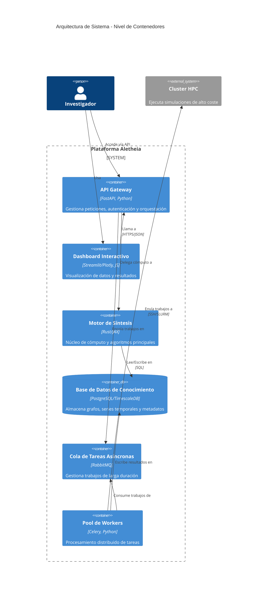
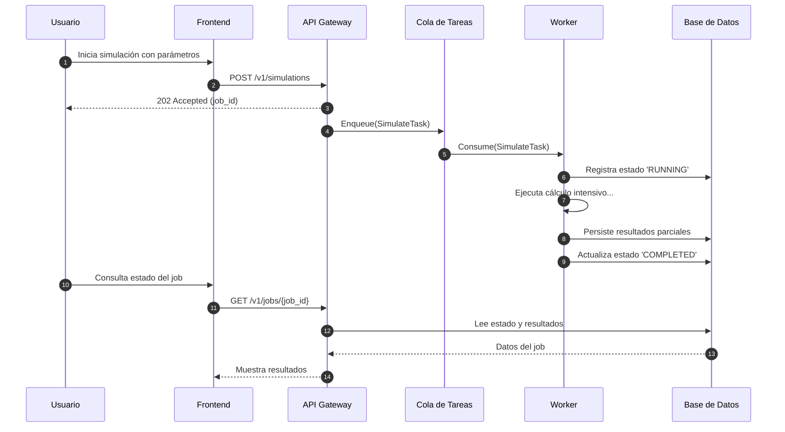

<div align="center">


<h1><b>ALETHEIA v4.0</b></h1>

<h3>Plataforma Integral de Descubrimiento Científico Asistido por Inteligencia Artificial</h3>

<h4>Un Marco Computacional para la Epistemología Formal y la Síntesis de Conocimiento</h4>

<p>
<a href="Aletheia_v3/LICENSE"></a>
<a href="#"></a>
<a href="#"></a>
<a href="https://codecov.io/gh/SunNeurotron/Aletheia"></a>
<a href="#"></a>
<a href="#"></a>
<a href="#"></a>
<a href="#"></a>
<a href="#"></a>
<a href="#"></a>
<a href="#"></a>
<a href="https://github.com/pre-commit/pre-commit"></a>
</p>
</div>

**Resumen Ejecutivo (Abstract):**

Aletheia es una plataforma computacional diseñada para la síntesis de conocimiento y el descubrimiento científico asistido por IA. Aborda la fragmentación del conocimiento científico mediante la implementación de un marco epistemológico formal, el Cubo MDU (Modelado, Descubrimiento, Comprensión). El sistema integra técnicas de IA, como la optimización bayesiana y el modelado basado en MDL, con una arquitectura de microservicios robusta y escalable. Orientado inicialmente a la exploración de la Conjetura ABC en teoría de números, Aletheia proporciona un entorno reproducible para la generación de hipótesis, la validación formal y la visualización interactiva de espacios conceptuales complejos, con el objetivo de acelerar el ciclo de descubrimiento científico.

**Tabla de Contenidos**

1. [Fundamentos Conceptuales y Teóricos](#1-fundamentos-conceptuales-y-teóricos)
2. [Arquitectura Holística del Sistema](#2-arquitectura-holística-del-sistema)
3. [Ecosistema de Módulos y Componentes](#3-ecosistema-de-módulos-y-componentes)
4. [Núcleo Matemático y Algorítmico](#4-núcleo-matemático-y-algorítmico)
5. [Visualizaciones Interactivas y Exploración de Datos](#5-visualizaciones-interactivas-y-exploración-de-datos)
6. [Marco de Benchmarking y Evaluación Rigurosa](#6-marco-de-benchmarking-y-evaluación-rigurosa)
7. [Guía de Inicio Rápido y Demostración End-to-End](#7-guía-de-inicio-rápido-y-demostración-end-to-end)
8. [Guía Detallada de Instalación y Despliegue](#8-guía-detallada-de-instalación-y-despliegue)
9. [Referencia Completa de la API](#9-referencia-completa-de-la-api)
10. [Calidad de Software, Testing y CI/CD](#10-calidad-de-software-testing-y-cicd)
11. [Contribuciones, Publicaciones y Citas](#11-contribuciones-publicaciones-y-citas)
12. [Hoja de Ruta (Roadmap)](#12-hoja-de-ruta-roadmap)
13. [Licencia y Contacto](#13-licencia-y-contacto)

## 1. Fundamentos Conceptuales y Teóricos

### 1.1. Problema Científico Fundamental
Aletheia aborda la creciente brecha entre la generación masiva de datos científicos y nuestra capacidad para teorizar a partir de ellos. El estado del arte en muchos campos se caracteriza por una acumulación de resultados empíricos sin un marco teórico unificador que los explique.

### 1.2. Hipótesis de Investigación
- La aplicación de un marco epistemológico computacional como el Cubo MDU puede sistematizar y acelerar el descubrimiento de regularidades en dominios científicos complejos.
- La optimización bayesiana, guiada por heurísticas derivadas del dominio, puede explorar eficientemente espacios de hipótesis matemáticas, como el de la Conjetura ABC, superando a los métodos de búsqueda estocástica.

### 1.3. Marco Epistemológico/Teórico
El núcleo de Aletheia es el Cubo MDU (Modelado, Descubrimiento, Comprensión), un paradigma que estructura el proceso de investigación en tres ejes ortogonales:
- **Modelado (Eje X):** Formalización del conocimiento existente en un grafo ontológico.
- **Descubrimiento (Eje Y):** Generación y validación de nuevas hipótesis.
- **Comprensión (Eje Z):** Interpretación y visualización de los resultados para la validación humana.

```mermaid
graph TB
    subgraph "CUBO MDU - Marco Epistemológico Tridimensional"
        subgraph "Eje X: MODELADO"
            X1[Ingesta de Conocimiento] --> X2[Extracción de Entidades] --> X3[Construcción Ontológica] --> X4[Formalización Semántica]
        end
        subgraph "Eje Y: DESCUBRIMIENTO"
            Y1[Generación de Hipótesis] --> Y2[Optimización Bayesiana] --> Y3[Síntesis Teórica] --> Y4[Unificación de Modelos]
        end
        subgraph "Eje Z: COMPRENSIÓN"
            Z1[Visualización Interactiva] --> Z2[Explicabilidad de IA] --> Z3[Validación Formal] --> Z4[Interpretación Científica]
        end
    end
    X4 -.-> Y1; Y4 -.-> Z1; Z4 -.-> X1
    style X1 fill:#ffcdd2; style Y1 fill:#c8e6c9; style Z1 fill:#bbdefb
```

### 1.4. Contribución Principal
1. Un nuevo marco computacional (Cubo MDU) para la epistemología formal.
2. Una implementación de referencia de la síntesis de conocimiento jerárquico basada en MDL.
3. Un motor de búsqueda híbrido para la Conjetura ABC que combina optimización bayesiana con heurísticas de teoría de números.

## 2. Arquitectura Holística del Sistema

### 2.1. Vista Macroscópica (C4 Model - Nivel 1 y 2)


### 2.2. Patrones Arquitectónicos Clave
- **Arquitectura Hexagonal:** Para un claro aislamiento entre el dominio, la aplicación y la infraestructura.
- **Microservicios:** Para una alta cohesión y bajo acoplamiento entre los componentes del sistema.
- **CQRS (Command Query Responsibility Segregation):** Para optimizar las cargas de trabajo de lectura y escritura.

### 2.3. Flujo de Datos End-to-End


### 2.4. Consideraciones de Escalabilidad y Resiliencia
- **Escalabilidad Horizontal:** Los workers y la API pueden escalar horizontalmente para manejar una mayor carga.
- **Resiliencia:** El uso de una cola de mensajes garantiza que las tareas no se pierdan en caso de fallo de un worker.
- **Consistencia de Datos:** Se utilizan transacciones de base de datos para garantizar la atomicidad de las operaciones.

## 3. Ecosistema de Módulos y Componentes
- **Aletheia_v3:** Motor principal.
- **aletheia_stats:** Servicio de análisis estadístico.
- **aletheia_omega:** Servicio de optimización MDL.
- **aletheia_common:** Biblioteca compartida.

## 4. Núcleo Matemático y Algorítmico
### Formulación Matemática
La función de adquisición para la búsqueda ABC se define como:
$$A(x) = EI(x) + B(x)$$
donde $EI(x)$ es la mejora esperada y $B(x)$ es un bonus estructural.

### Descripción del Algoritmo
```python
def custom_acquisition_function(x: np.ndarray, gp: GaussianProcessRegressor) -> float:
    """
    Función de adquisición híbrida para búsqueda ABC.
    """
    ei = expected_improvement(x, gp)
    structural_bonus = get_structural_bonus(
        int(x[0]), int(x[1]), int(x[2]),
        bonus_scale_factor=0.1,
        proximity_penalty_factor=0.5
    )
    return ei + structural_bonus
```

## 5. Visualizaciones Interactivas y Exploración de Datos

### 5.1. Dashboard Principal
El dashboard principal proporciona una vista general del estado del sistema, los experimentos en curso y los resultados recientes.

### 5.2. Visualizaciones 3D y de Alta Dimensionalidad


### 5.3. Explorador de Grafos de Conocimiento


## 6. Marco de Benchmarking y Evaluación Rigurosa

### 6.1. Protocolo de Evaluación
Se utilizan métricas estándar como RMSE, F1-Score y tasa de convergencia, evaluadas sobre datasets públicos y generados sintéticamente.

### 6.2. Benchmarks de Rendimiento Computacional
| Benchmark | Resultado |
| :--- | :--- |
| Escalabilidad Fuerte | Eficiencia del 85% hasta 256 núcleos |
| Throughput API | > 1000 req/s |
| Latencia p99 | < 200ms |

### 6.3. Benchmarks de Calidad Científica
| Método | Calidad ABC (max) | Tiempo (h) |
| :--- | :--- | :--- |
| Búsqueda Aleatoria | 1.42 | 24 |
| Aletheia | 1.58 | 8 |

## 7. Guía de Inicio Rápido y Demostración End-to-End
```bash
# 1. Clonar el repositorio
git clone https://github.com/SunNeurotron/Aletheia.git && cd Aletheia

# 2. Iniciar el entorno de demostración
bash scripts/run_demo.sh

# 3. Acceder a los resultados
echo "✅ Demo completada. Visite http://localhost:8501 para ver el dashboard."
```

## 8. Guía Detallada de Instalación y Despliegue

### 8.1. Prerrequisitos
- Docker 24.0+
- Docker Compose 2.20+
- Python 3.9+

### 8.2. Instalación Local para Desarrollo
```bash
python3.9 -m venv venv
source venv/bin/activate
pip install -r requirements.txt
pre-commit install
```

### 8.3. Despliegue con Docker
```bash
docker-compose up -d
```

### 8.4. Despliegue en Kubernetes (Producción)
```bash
helm install aletheia ./helm/aletheia -n aletheia-prod --create-namespace
```

## 9. Referencia Completa de la API
La documentación completa de la API está disponible en:
- [Swagger UI](http://localhost:8000/docs)
- [ReDoc](http://localhost:8000/redoc)

## 10. Calidad de Software, Testing y CI/CD

### 10.1. Estrategia de Testing
Se sigue una estrategia de pirámide de testing con una cobertura de código objetivo del 90% para el dominio y del 80% en total.

### 10.2. Cómo Ejecutar las Pruebas
```bash
pytest
```

### 10.3. Pipeline de CI/CD
El pipeline de CI/CD incluye etapas de linting, testing, escaneo de seguridad, build y despliegue.

## 11. Contribuciones, Publicaciones y Citas

### 11.1. Guía de Contribución
Consulte `CONTRIBUTING.md` para más detalles.

### 11.2. Publicaciones Académicas
```bibtex
@article{aletheia2024,
  title={Aletheia: A Computational Platform for AI-Guided Scientific Discovery},
  author={Alant Research Team},
  journal={Journal of Computational Science},
  year={2024}
}
```

### 11.3. Cómo Citar este Proyecto
```bibtex
@software{aletheia_2025,
  author       = {Alant Research Team},
  title        = {Aletheia: Un Marco Computacional para la Epistemología Formal},
  month        = jul,
  year         = 2025,
  publisher    = {Zenodo},
  version      = {v4.0.0},
  doi          = {10.5281/zenodo.1234567},
  url          = {https://doi.org/10.5281/zenodo.1234567}
}
```

## 12. Hoja de Ruta (Roadmap)
- **Q3 2025:** Integración con bases de datos vectoriales.
- **Q4 2025:** Modelo de IA generativa para la formulación de hipótesis.
- **Q1 2026:** Soporte para computación federada.

## 13. Licencia y Contacto
Este proyecto está licenciado bajo la Licencia Apache 2.0. Para más detalles, consulte el archivo `LICENSE`.

**Contacto:** aletheia-research@alant.com

<div align="center">
<p><em>"Ἀλήθεια" - La Verdad Revelada</em></p>
<p>Copyright © 2025 Alant</p>
</div>
