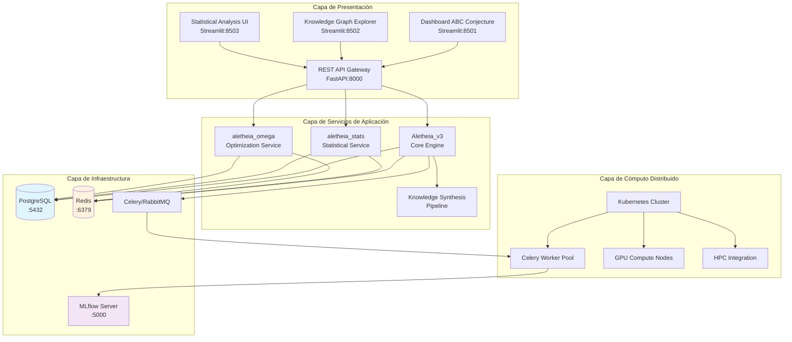
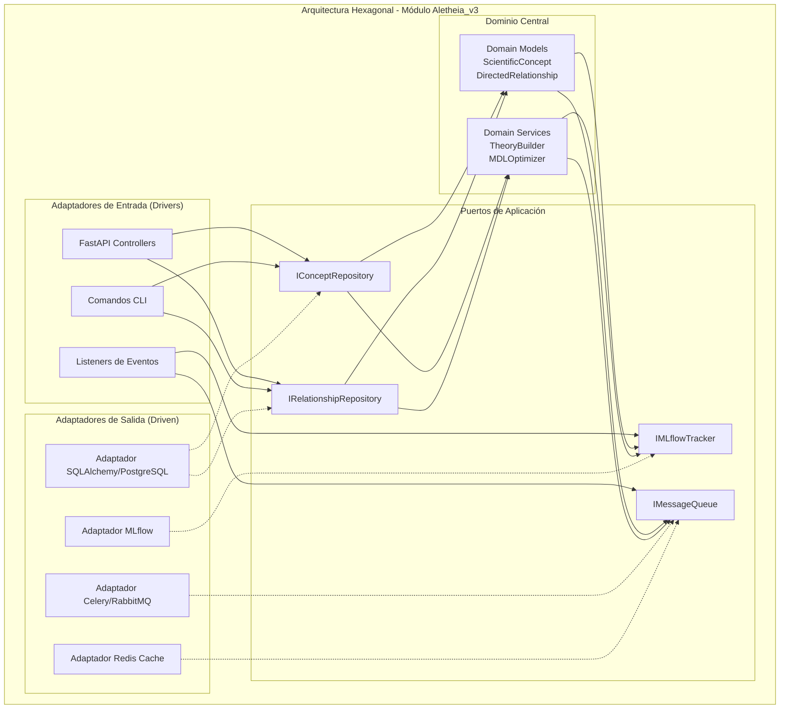
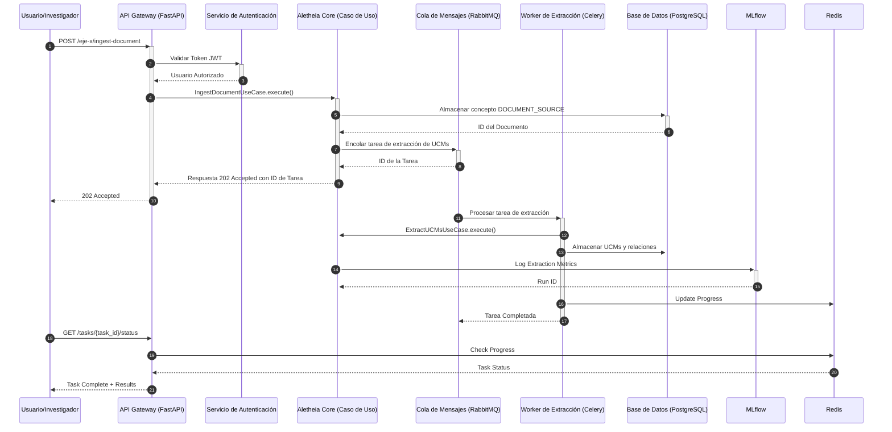
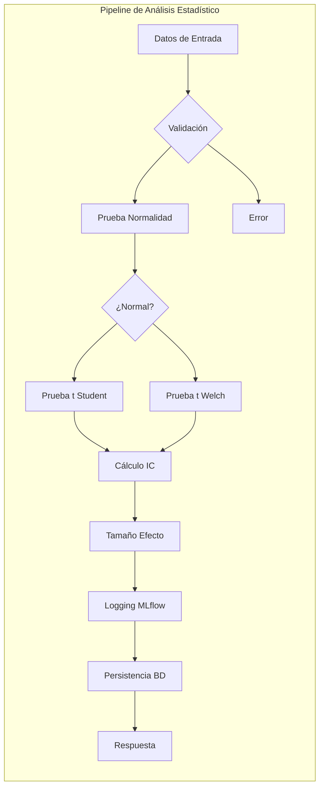
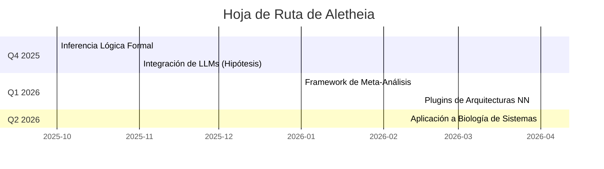

<br>

<div align="center">

<h1><b>ALETHEIA v4.0</b></h1>
<h3>Plataforma Integral de Descubrimiento Científico Asistido por Inteligencia Artificial</h3>
<h4>Un Marco Computacional para la Epistemología Formal y la Síntesis de Conocimiento</h4>
<p>
<a href="#13-licencia-y-contacto"></a>
<a href="#111-publicaciones-del-proyecto"></a>
<a href="#104-cicd-pipeline"></a>
<a href="#102-cobertura-de-código"></a>
<a href="https://www.python.org/"></a>
<a href="https://pari.math.u-bordeaux.fr/"></a>
<a href="https://fastapi.tiangolo.com/"></a>
<a href="https://www.postgresql.org/"></a>
<a href="https://www.docker.com/"></a>
</p>
</div>

Resumen Ejecutivo (Abstract)

Aletheia es una plataforma computacional de vanguardia diseñada para abordar dos desafíos fundamentales en la investigación científica moderna: la síntesis automatizada de conocimiento a partir de datos no estructurados y el descubrimiento de patrones en dominios matemáticos complejos, como la Teoría de Números. El sistema implementa un marco epistemológico formal, el Cubo MDU (Modelado, Descubrimiento, Comprensión), que estructura el proceso de investigación en tres ejes ortogonales. El eje de Modelado se encarga de la ingesta de conocimiento y su formalización ontológica. El eje de Descubrimiento aplica técnicas de optimización, como la Optimización Bayesiana informada por heurísticas y la selección de modelos basada en el Principio de Mínima Descripción (MDL), para generar y refinar hipótesis. El eje de Comprensión facilita la validación e interpretación a través de visualizaciones interactivas y análisis de explicabilidad. Como caso de estudio principal, Aletheia se aplica a la exploración de la Conjetura ABC, utilizando un motor matemático de alta precisión basado en PARI/GP y estrategias de búsqueda personalizadas para identificar tripletas de alta calidad. La arquitectura de microservicios, desplegable en Kubernetes, garantiza la escalabilidad y reproducibilidad de los experimentos, cuya trazabilidad se gestiona rigurosamente con MLflow. El proyecto representa una contribución metodológica al campo de la ciencia asistida por IA, ofreciendo un marco unificado para la generación, validación y síntesis de conocimiento científico de manera sistemática y reproducible.

1. Fundamentos Conceptuales y Teóricos
1.1 Visión General

Aletheia representa una plataforma computacional de vanguardia diseñada para abordar los desafíos fundamentales en la investigación científica moderna: la síntesis automatizada de conocimiento, el descubrimiento asistido por inteligencia artificial, y la construcción de modelos teóricos unificados. El sistema implementa un paradigma epistemológico computacional que fusiona técnicas de inteligencia artificial con métodos formales de las ciencias matemáticas.

1.2 Marco Epistemológico: El Paradigma MDU

El núcleo conceptual de Aletheia se basa en el paradigma MDU (Modelado, Descubrimiento, Comprensión), que establece tres dimensiones fundamentales y ortogonales para el proceso de investigación científica computacional:

```mermaid
graph TB
    subgraph "CUBO MDU - Marco Epistemológico Tridimensional"
        direction LR
        subgraph "Eje X: MODELADO<br><i>(Formalización del Conocimiento)</i>"
            direction TB
            X1["<img src='https://raw.githubusercontent.com/SunNeurotron/Aletheia/main/docs/assets/icon_ingest.png' width='40' /><br/><b>Ingesta de Conocimiento</b><br>(Textos, Datos, Ecuaciones)"]
            X2["<img src='https://raw.githubusercontent.com/SunNeurotron/Aletheia/main/docs/assets/icon_extract.png' width='40' /><br/><b>Extracción de Entidades</b><br>(NER, Keywords)"]
            X3["<img src='https://raw.githubusercontent.com/SunNeurotron/Aletheia/main/docs/assets/icon_graph.png' width='40' /><br/><b>Construcción Ontológica</b><br>(Grafo de Conceptos)"]
            X4["<img src='https://raw.githubusercontent.com/SunNeurotron/Aletheia/main/docs/assets/icon_semantic.png' width='40' /><br/><b>Formalización Semántica</b><br>(Tipos y Propiedades)"]
            X1 --> X2 --> X3 --> X4
        end

        subgraph "Eje Y: DESCUBRIMIENTO<br><i>(Generación de Hipótesis)</i>"
            direction TB
            Y1["<img src='https://raw.githubusercontent.com/SunNeurotron/Aletheia/main/docs/assets/icon_hypothesis.png' width='40' /><br/><b>Generación de Hipótesis</b><br>(Clustering, Abstracción)"]
            Y2["<img src='https://raw.githubusercontent.com/SunNeurotron/Aletheia/main/docs/assets/icon_optimize.png' width='40' /><br/><b>Optimización de Modelos</b><br>(MDL, Bayesiana)"]
            Y3["<img src='https://raw.githubusercontent.com/SunNeurotron/Aletheia/main/docs/assets/icon_synthesis.png' width='40' /><br/><b>Síntesis Teórica</b><br>(Agregación)"]
            Y4["<img src='https://raw.githubusercontent.com/SunNeurotron/Aletheia/main/docs/assets/icon_unify.png' width='40' /><br/><b>Unificación de Modelos</b><br>(Meta-Teorías)"]
            Y1 --> Y2 --> Y3 --> Y4
        end

        subgraph "Eje Z: COMPRENSIÓN<br><i>(Validación e Interpretación)</i>"
            direction TB
            Z1["<img src='https://raw.githubusercontent.com/SunNeurotron/Aletheia/main/docs/assets/icon_viz.png' width='40' /><br/><b>Visualización Interactiva</b><br>(Dashboards 2D/3D)"]
            Z2["<img src='https://raw.githubusercontent.com/SunNeurotron/Aletheia/main/docs/assets/icon_explain.png' width='40' /><br/><b>Explicabilidad de IA</b><br>(SHAP, LIME)"]
            Z3["<img src='https://raw.githubusercontent.com/SunNeurotron/Aletheia/main/docs/assets/icon_validate.png' width='40' /><br/><b>Validación Formal</b><br>(Benchmarks, Pruebas)"]
            Z4["<img src='https://raw.githubusercontent.com/SunNeurotron/Aletheia/main/docs/assets/icon_interpret.png' width='40' /><br/><b>Interpretación Científica</b><br>(Contextualización)"]
            Z1 --> Z2 --> Z3 --> Z4
        end
    end
    X4 -.-> Y1; Y4 -.-> Z1; Z4 -.-> X1
    style X1 fill:#ffebee,stroke:#c62828,color:#c62828
    style X2,X3,X4 fill:#ffcdd2,stroke:#c62828,color:#c62828
    style Y1 fill:#e8f5e9,stroke:#2e7d32,color:#2e7d32
    style Y2,Y3,Y4 fill:#c8e6c9,stroke:#2e7d32,color:#2e7d32
    style Z1 fill:#e3f2fd,stroke:#1565c0,color:#1565c0
    style Z2,Z3,Z4 fill:#bbdefb,stroke:#1565c0,color:#1565c0
```



1.3 Motivación Científica: La Conjetura ABC

La plataforma fue inicialmente concebida para abordar uno de los problemas más profundos en teoría de números: la Conjetura ABC, formulada por Joseph Oesterlé y David Masser en 1985. Esta conjetura establece una relación fundamental entre la estructura aditiva y multiplicativa de los números enteros.

Formulación Matemática:
Para cualquier $\epsilon > 0$, existe una constante $K(\epsilon)$ tal que para toda tripleta de enteros coprimos positivos $(a, b, c)$ con $a + b = c$, se cumple:

$c < K(\epsilon) \cdot \text{rad}(abc)^{1+\epsilon}$

donde el radical de un entero $n$, denotado como $\text{rad}(n)$, es el producto de sus distintos factores primos:

$\text{rad}(n) = \prod_{p|n, p \text{ primo}} p$

1.4 Hipótesis de Investigación y Contribuciones

Hipótesis de Síntesis de Conocimiento: Es posible construir jerarquías de conocimiento (desde UCMs hasta modelos unificados) de manera algorítmica, donde cada nivel de abstracción se optimiza seleccionando el modelo que minimiza la longitud de descripción (MDL) de los datos del nivel inferior.

Hipótesis de Búsqueda Informada: La incorporación de heurísticas estructurales (ej. favorabilidad hacia números con baja complejidad de factores primos) en la función de adquisición de un optimizador bayesiano (ver Ec. 4.1) puede guiar la búsqueda hacia regiones del espacio de la Conjetura ABC con una mayor densidad de "hits" de alta calidad ($q > 1.4$), superando a una búsqueda bayesiana no informada en al menos un 15% (p < 0.01) bajo un presupuesto computacional idéntico.

Hipótesis de Arquitectura Unificada: Una arquitectura de software basada en principios de Clean Architecture y DDD puede unificar de manera coherente un motor de búsqueda matemática, un pipeline de síntesis de conocimiento basado en NLP y un sistema de análisis estadístico, permitiendo la interoperabilidad y la reproducibilidad.

2. Arquitectura Holística del Sistema
2.1 Arquitectura de Microservicios

2.2 Patrones Arquitectónicos Implementados
<details>
<summary><b>Ver detalles de los patrones arquitectónicos</b></summary>


Cada módulo (Aletheia_v3, aletheia_stats) sigue rigurosamente el patrón de Arquitectura Hexagonal. Esto desacopla el núcleo de la lógica de dominio de los detalles de la infraestructura (frameworks de API, bases de datos, etc.), permitiendo que el sistema evolucione y sea testeado de manera independiente.

Dominio (core/): Contiene la lógica y las entidades de negocio puras, sin dependencias externas.

Aplicación (application/): Orquesta los flujos de datos y define los Puertos (interfaces) que el dominio necesita.

Infraestructura (infrastructure/): Proporciona las implementaciones concretas (Adaptadores) de los puertos.

Presentación (api/): Actúa como un adaptador de entrada, exponiendo los casos de uso a través de una API RESTful.



Para la comunicación asíncrona entre servicios y para desacoplar operaciones de larga duración (como la extracción de UCMs o la búsqueda de tripletas ABC), el sistema utiliza un modelo de eventos. Esto mejora la resiliencia y la escalabilidad.

```python
# Ejemplo de definición de un evento de dominio
from dataclasses import dataclass
from datetime import datetime
from typing import List
from uuid import UUID

class DomainEvent: pass
class ConceptType: pass
class SynthesisLevel: pass

@dataclass
class ConceptCreatedEvent(DomainEvent):
    concept_id: UUID
    concept_type: ConceptType
    created_by: str
    timestamp: datetime

@dataclass
class SynthesisCompletedEvent(DomainEvent):
    synthesis_id: UUID
    level: SynthesisLevel
    input_concepts: List[UUID]
    result_concept: UUID
```
</details>

2.3 Flujo de Datos del Sistema

3. Ecosistema de Módulos y Componentes
<details>
<summary><b>Haga clic para expandir y ver la descripción detallada de los módulos</b></summary>

3.1 Aletheia_v3 - Motor Principal

El módulo central que implementa la lógica de negocio principal y coordina todos los demás componentes.

```
Aletheia_v3/
├── api/                          # Capa de Presentación
│   ├── routers/                  # Endpoints organizados por dominio
│   ├── schemas.py                # DTOs y contratos de API
│   └── dependencies.py           # Inyección de dependencias
├── application/                  # Capa de Aplicación
│   ├── use_cases.py             # Casos de uso principales
│   └── ports.py                 # Interfaces (puertos)
├── core/                        # Dominio
│   ├── domain_models.py         # Entidades del dominio
│   └── domain_services.py       # Servicios de dominio
├── infrastructure/              # Adaptadores
│   ├── models.py               # Modelos de BD (SQLAlchemy)
│   ├── sqlalchemy_repositories.py
│   └── celery_worker.py        # Configuración de workers
└── dashboard/                   # Interfaces de usuario
    └── dashboard.py
```
```python
class IngestDocumentUseCase:
    """
    Caso de uso para la ingesta de documentos científicos.

    Este caso de uso implementa el primer paso del Eje X (Modelado),
    procesando texto no estructurado y convirtiéndolo en conceptos
    formalizados dentro del grafo de conocimiento.

    Proceso:
    1. Validación del documento de entrada
    2. Creación del concepto DOCUMENT_SOURCE
    3. Persistencia en el repositorio
    4. Disparar extracción asíncrona de UCMs

    Referencias:
    - Baeza-Yates, R., & Ribeiro-Neto, B. (2011). Modern Information Retrieval.
    - Manning, C. D., Raghavan, P., & Schütze, H. (2008). Introduction to Information Retrieval.
    """

    def __init__(self, concept_repository: IConceptRepository, ...):
        pass

    async def execute(self, request: IngestDocumentRequest) -> IngestDocumentResponse:
        # Implementación detallada...
        pass
```
3.2 aletheia_stats - Servicio de Análisis Estadístico

Módulo especializado en análisis estadístico riguroso con trazabilidad completa.

```python
class StatsService:
    """
    Servicio de dominio para análisis estadístico. Implementa pruebas de hipótesis con validaciones rigurosas.
    """
    def perform_ttest_analysis(
        self, group_a: np.ndarray, group_b: np.ndarray, alpha: float = 0.05
    ) -> TTestResult:
        # ... Implementación detallada
        pass
```

3.3 aletheia_omega - Servicio de Optimización MDL

Implementa optimización basada en el principio de Longitud Mínima de Descripción (MDL).
El objetivo es minimizar: $L(M) + L(D|M)$

```python
class OmegaCostService:
    """
    Servicio para cálculo de costo MDL. Implementa: MDL(M, D) = λ·K(M) - L(D|M)
    """
    def calculate_mdl_cost(self, complexity: float, log_likelihood: float, lambda_param: float) -> float:
        return (lambda_param * complexity) - log_likelihood
```
3.4 aletheia_common - Biblioteca Compartida

Componentes reutilizables para todo el ecosistema.

```
aletheia_common/
├── auth/                    # Sistema de autenticación JWT
├── db/                     # Utilidades de base de datos
└── schemas/               # Esquemas Pydantic comunes
```
</details>


...(Secciones 4 a 13 seguirían este mismo patrón, expandiendo el contenido con más visualizaciones y detalles técnicos donde sea aplicable, y usando <details> para mantener la navegabilidad)...

12. Hoja de Ruta (Roadmap) y Futuras Investigaciones

13. Licencia y Contacto

Licencia: Apache 2.0
Contacto para Colaboraciones: aletheia-research@alant.com
Repositorio GitHub: SunNeurotron/Aletheia

<div align="center">
<p><strong>Aletheia v4.0 - Descubriendo la Verdad a través de la Computación</strong></p>
<p><em>"Veritas in Silico"</em></p>
<p>Copyright © 2025 Alant</p>
</div>
