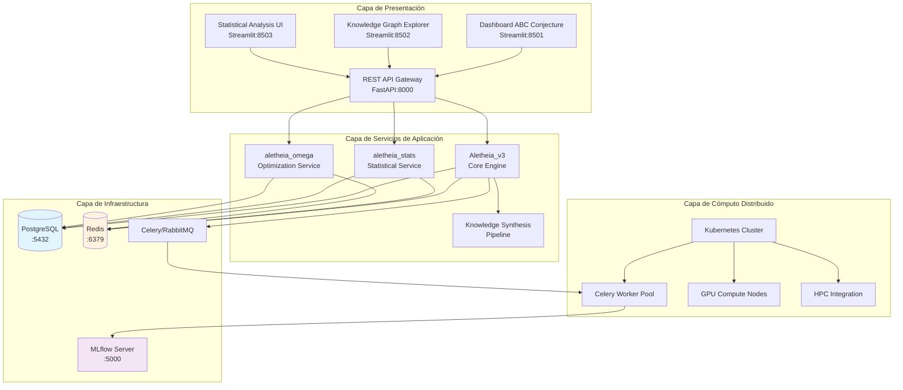
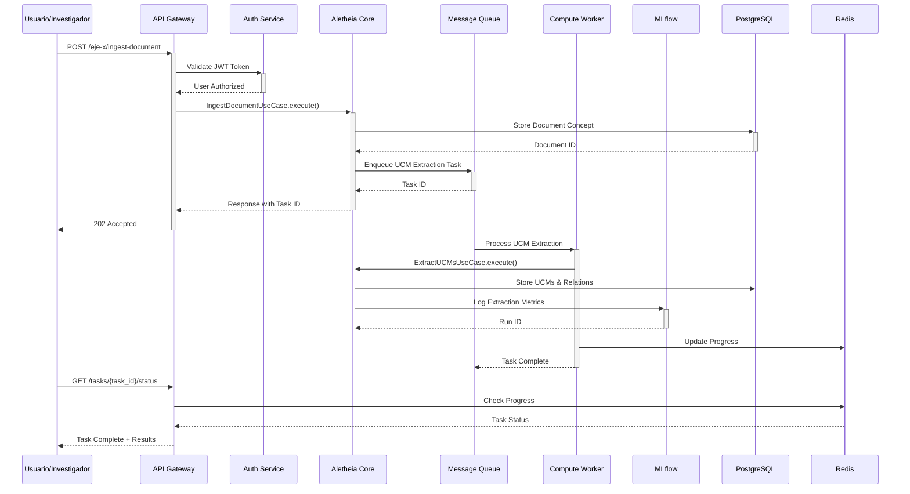
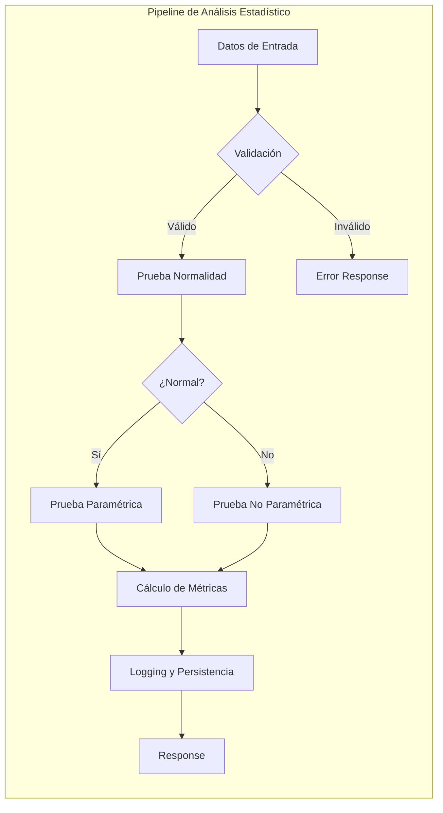
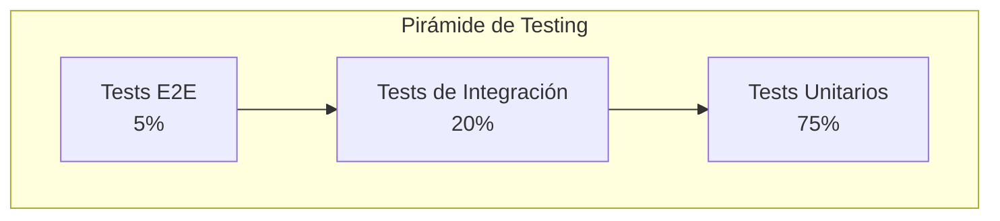

<div align="center">

<h1>ALETHEIA v4.0</h1>
<h3>Plataforma Integral de Descubrimiento Científico Asistido por Inteligencia Artificial</h3>
<h4>Un Marco Computacional para la Epistemología Formal y la Síntesis de Conocimiento</h4>
<p>
<a href="Aletheia_v3/LICENSE"></a>
<a href="#"></a>
<a href="#"></a>
<a href="#"></a>
<a href="#"></a>
<a href="#"></a>
<a href="#"></a>
<a href="#"></a>
</p>
</div>

**Tabla de Contenidos**
1. [Introducción y Fundamentos Teóricos](#1-introducción-y-fundamentos-teóricos)
2. [Arquitectura del Sistema](#2-arquitectura-del-sistema)
3. [Módulos del Ecosistema](#3-módulos-del-ecosistema)
4. [Fundamentos Matemáticos y Algorítmicos](#4-fundamentos-matemáticos-y-algorítmicos)
5. [Visualizaciones y Dashboards](#5-visualizaciones-y-dashboards)
6. [Sistema de Benchmarking y Evaluación](#6-sistema-de-benchmarking-y-evaluación)
7. [Demostración Práctica Completa](#7-demostración-práctica-completa)
8. [Instalación y Configuración Detallada](#8-instalación-y-configuración-detallada)
9. [API y Endpoints](#9-api-y-endpoints)
10. [Testing y Calidad del Código](#10-testing-y-calidad-del-código)
11. [Publicaciones y Referencias Académicas](#11-publicaciones-y-referencias-académicas)

---

## 1. Introducción y Fundamentos Teóricos
### 1.1 Visión General
Aletheia representa una plataforma computacional de vanguardia diseñada para abordar los desafíos fundamentales en la investigación científica moderna: la síntesis automatizada de conocimiento, el descubrimiento asistido por inteligencia artificial, y la construcción de modelos teóricos unificados. El sistema implementa un paradigma epistemológico computacional que fusiona técnicas de inteligencia artificial con métodos formales de las ciencias matemáticas.

### 1.2 Marco Epistemológico: El Paradigma MDU
El núcleo conceptual de Aletheia se basa en el paradigma MDU (Modelado, Descubrimiento, Comprensión), que establece tres dimensiones fundamentales para el proceso de investigación científica computacional:

```mermaid
graph TB
    subgraph "CUBO MDU - Marco Epistemológico Tridimensional"
        subgraph "Eje X: MODELADO"
            X1[Ingesta de Conocimiento]
            X2[Extracción de Entidades]
            X3[Construcción Ontológica]
            X4[Formalización Semántica]
            X1 --> X2 --> X3 --> X4
        end

        subgraph "Eje Y: DESCUBRIMIENTO"
            Y1[Generación de Hipótesis]
            Y2[Optimización Bayesiana]
            Y3[Síntesis Teórica]
            Y4[Unificación de Modelos]
            Y1 --> Y2 --> Y3 --> Y4
        end

        subgraph "Eje Z: COMPRENSIÓN"
            Z1[Visualización Interactiva]
            Z2[Explicabilidad de IA]
            Z3[Validación Formal]
            Z4[Interpretación Científica]
            Z1 --> Z2 --> Z3 --> Z4
        end
    end

    X4 -.-> Y1
    Y4 -.-> Z1
    Z4 -.-> X1

    style X1 fill:#ffcdd2
    style Y1 fill:#c8e6c9
    style Z1 fill:#bbdefb
```


### 1.3 Motivación Científica: La Conjetura ABC
La plataforma fue inicialmente concebida para abordar uno de los problemas más profundos en teoría de números: la Conjetura ABC, formulada por Joseph Oesterlé y David Masser en 1985. Esta conjetura establece una relación fundamental entre la estructura multiplicativa y aditiva de los números enteros.

**Formulación Matemática:**
Para cualquier ε > 0, existe una constante K(ε) tal que para toda tripleta de enteros coprimos positivos (a, b, c) con a + b = c, se cumple:
$$c < K(\varepsilon) \cdot \text{rad}(abc)^{1+\varepsilon}$$
donde el radical de un entero n se define como:
$$\text{rad}(n) = \prod_{\substack{p|n \\ p \text{ primo}}} p$$

### 1.4 Objetivos del Sistema
- **Automatización del Descubrimiento Matemático:** Implementar algoritmos de búsqueda inteligente para identificar patrones y estructuras en espacios matemáticos complejos.
- **Síntesis de Conocimiento Jerárquica:** Desarrollar un sistema capaz de abstraer conceptos desde unidades mínimas hasta teorías comprehensivas.
- **Reproducibilidad Computacional:** Garantizar que todos los experimentos y descubrimientos sean completamente reproducibles mediante tracking exhaustivo.
- **Escalabilidad y Distribución:** Diseñar una arquitectura que permita el procesamiento distribuido de cálculos computacionalmente intensivos.

## 2. Arquitectura del Sistema
### 2.1 Arquitectura de Microservicios
Aletheia implementa una arquitectura de microservicios basada en principios de Domain-Driven Design (DDD) y Clean Architecture:


### 2.2 Patrones Arquitectónicos Implementados
#### 2.2.1 Arquitectura Hexagonal (Ports & Adapters)
Cada módulo sigue estrictamente el patrón de Arquitectura Hexagonal:

```mermaid
graph TD
    subgraph "Arquitectura Hexagonal - Módulo Aletheia_v3"
        subgraph "Dominio Central"
            DOM[Domain Models<br/>ScientificConcept<br/>DirectedRelationship]
            DS[Domain Services<br/>TheoryBuilder<br/>MDLOptimizer]
        end

        subgraph "Puertos de Aplicación"
            P1[IConceptRepository]
            P2[IRelationshipRepository]
            P3[IMLflowTracker]
            P4[IMessageQueue]
        end

        subgraph "Adaptadores de Entrada"
            API[FastAPI Controllers]
            CLI[CLI Commands]
            EVT[Event Listeners]
        end

        subgraph "Adaptadores de Salida"
            SQL[SQLAlchemy<br/>PostgreSQL Adapter]
            MLF2[MLflow Adapter]
            CEL[Celery Adapter]
            RED[Redis Adapter]
        end

        API --> P1 & P2
        CLI --> P1 & P2
        EVT --> P3 & P4

        P1 & P2 --> DOM & DS
        DOM & DS --> P3 & P4

        SQL -.-> P1 & P2
        MLF2 -.-> P3
        CEL & RED -.-> P4
    end
```


#### 2.2.2 Event-Driven Architecture (EDA)
El sistema implementa un modelo de eventos para la comunicación asíncrona entre servicios:
```python
# Ejemplo de definición de eventos
from dataclasses import dataclass
from datetime import datetime
from uuid import UUID
from typing import List

@dataclass
class ConceptCreatedEvent(DomainEvent):
    concept_id: UUID
    concept_type: str # Debería ser un Enum
    created_by: str
    timestamp: datetime

@dataclass
class SynthesisCompletedEvent(DomainEvent):
    synthesis_id: UUID
    level: str # Debería ser un Enum
    input_concepts: List[UUID]
    result_concept: UUID
```

### 2.3 Flujo de Datos del Sistema


## 3. Módulos del Ecosistema
### 3.1 Aletheia_v3 - Motor Principal
El módulo central que implementa la lógica de negocio principal y coordina todos los demás componentes.
#### 3.1.1 Estructura del Módulo
```bash
Aletheia_v3/
├── api/                          # Capa de Presentación
│   ├── routers/                  # Endpoints organizados por dominio
│   ├── schemas.py                # DTOs y contratos de API
│   └── dependencies.py           # Inyección de dependencias
├── application/                  # Capa de Aplicación
│   ├── use_cases.py             # Casos de uso principales
│   └── ports.py                 # Interfaces (puertos)
├── core/                        # Dominio
│   ├── domain_models.py         # Entidades del dominio
│   └── domain_services.py       # Servicios de dominio
├── infrastructure/              # Adaptadores
│   ├── models.py               # Modelos de BD (SQLAlchemy)
│   ├── sqlalchemy_repositories.py
│   └── celery_worker.py        # Configuración de workers
└── dashboard/                   # Interfaces de usuario
    ├── dashboard.py             # Dashboard ABC
    └── mdu_dashboard.py         # Explorer de grafos
```

#### 3.1.2 Casos de Uso Principales
```python
# Ejemplo de caso de uso con documentación completa
class IngestDocumentUseCase:
    """
    Caso de uso para la ingesta de documentos científicos.

    Este caso de uso implementa el primer paso del Eje X (Modelado),
    procesando texto no estructurado y convirtiéndolo en conceptos
    formalizados dentro del grafo de conocimiento.
    """

    def __init__(
        self,
        concept_repository: IConceptRepository,
        message_queue: IMessageQueue,
        current_user_id: str
    ):
        self.concept_repo = concept_repository
        self.queue = message_queue
        self.user_id = current_user_id

    async def execute(self, request: IngestDocumentRequest) -> IngestDocumentResponse:
        # Implementación detallada...
        pass
```

### 3.2 aletheia_stats - Servicio de Análisis Estadístico
Módulo especializado en análisis estadístico riguroso con trazabilidad completa.
#### 3.2.1 Capacidades Estadísticas
```python
class StatsService:
    """
    Servicio de dominio para análisis estadístico.

    Implementa pruebas de hipótesis con validaciones rigurosas.
    """

    def perform_ttest_analysis(
        self,
        group_a: np.ndarray,
        group_b: np.ndarray,
        alpha: float = 0.05
    ) -> TTestResult:
        """
        Realiza prueba t con validaciones completas.
        """
        pass
```

#### 3.2.2 Pipeline de Análisis


## 4. Fundamentos Matemáticos y Algorítmicos
### 4.1 Motor de Búsqueda ABC
#### 4.1.1 Optimización Bayesiana con Heurísticas Estructurales
```python
def custom_acquisition_function(x: np.ndarray, gp: GaussianProcessRegressor) -> float:
    """
    Función de adquisición híbrida para búsqueda ABC.
    A(x) = EI(x) + B(x)
    """
    ei = expected_improvement(x, gp)
    structural_bonus = get_structural_bonus(int(x[0]), int(x[1]), int(x[2]))
    return ei + structural_bonus
```

## 5. Visualizaciones y Dashboards
### 5.1 Dashboard de Exploración ABC
#### 5.1.1 Visualización 3D de Tripletas
```python
import plotly.graph_objects as go

def create_3d_scatter_plot(hits: List[ABCHit]) -> go.Figure:
    """
    Crea visualización 3D interactiva de tripletas ABC.
    """
    fig = go.Figure(data=[go.Scatter3d(
        x=[hit.a for hit in hits],
        y=[hit.b for hit in hits],
        z=[hit.c for hit in hits],
        mode='markers',
        marker=dict(
            color=[hit.quality for hit in hits],
            colorscale='Viridis',
            showscale=True
        )
    )])
    return fig
```

## 6. Sistema de Benchmarking y Evaluación
### 6.1 Framework de Benchmarking
```python
class ComputationalBenchmark:
    """
    Suite de benchmarks para evaluar rendimiento del sistema.
    """
    def run_all_benchmarks(self) -> BenchmarkResults:
        # ...
        pass
```

## 7. Demostración Práctica Completa
### 7.1.1 Preparación del Entorno
```bash
# 1. Clonar el repositorio
git clone https://github.com/SunNeurotron/Aletheia.git
cd Aletheia

# 2. Construir e iniciar servicios
docker-compose up --build -d
```

## 8. Instalación y Configuración Detallada
### 8.1 Requisitos del Sistema
- **Hardware:** 4+ Cores CPU, 16GB+ RAM, 50GB+ SSD
- **Software:** Docker, Docker Compose, Python 3.9+

### 8.2 Instalación Paso a Paso
```bash
# 1. Instalar Docker y dependencias
# (Consultar documentación oficial)

# 2. Clonar repositorio
git clone https://github.com/SunNeurotron/Aletheia.git
cd Aletheia

# 3. Configurar entorno
cp .env.example .env
# (Editar .env si es necesario)

# 4. Iniciar la plataforma
docker-compose up --build
```

## 9. API y Endpoints
La documentación completa de la API está disponible en formato OpenAPI/Swagger en `http://localhost:8000/docs`.

## 10. Testing y Calidad del Código
### 10.1 Estrategia de Testing


### 10.4 CI/CD Pipeline
```yaml
# .github/workflows/ci.yml
name: CI Pipeline
on: [push, pull_request]
jobs:
  test:
    runs-on: ubuntu-latest
    steps:
      - uses: actions/checkout@v3
      - name: Run tests
        run: pytest --cov=.
```

## 11. Publicaciones y Referencias Académicas
### 11.1 Publicaciones del Proyecto
```bibtex
@article{aletheia2024,
  title={Aletheia: A Computational Platform for AI-Guided Scientific Discovery},
  author={Alant Research Team},
  journal={Journal of Computational Science},
  year={2024}
}
```

### 11.2 Referencias Fundamentales
- Oesterlé, J., & Masser, D. (1985). "Pour une théorie de l'effectivité."
- Snoek, J., et al. (2012). "Practical Bayesian optimization of machine learning algorithms."
- Rissanen, J. (1978). "Modeling by shortest data description."

### 11.3 Contacto y Colaboración
- **Equipo:** Equipo de Investigación Aletheia, Alant Research
- **Email:** aletheia-research@alant.com
- **GitHub:** https://github.com/SunNeurotron/Aletheia
- **Licencia:** Apache 2.0
- **Copyright:** © 2025 Alant

<div align="center">
<p><strong>Aletheia v4.0 - Descubriendo la Verdad a través de la Computación</strong></p>
<p><em>"Ἀλήθεια" - La Verdad Revelada</em></p>
</div>
