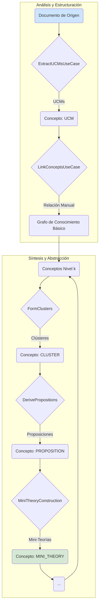
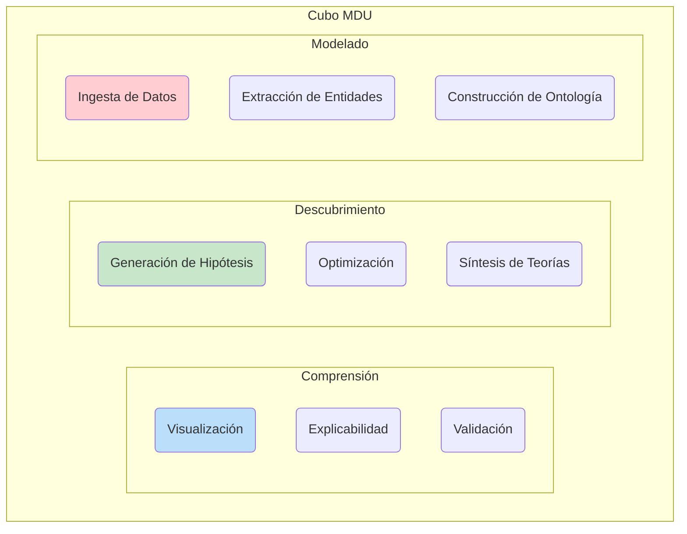

<div align="center">

(https://github.com/SunNeurotron/Aletheia/issues/102)
<h1>Aletheia v4.0</h1>
<p><strong>Plataforma de Descubrimiento Científico Guiado por IA</strong></p>
<p>Una infraestructura computacional para la epistemología y el descubrimiento en ciencias formales.</p>

<p>
<a href="Aletheia_v3/LICENSE"></a>
<a href="#"></a>
<a href="#"></a>
<a href="#"></a>
<a href="#"></a>
<a href="#"></a>
<a href="#"></a>
</p>
</div>

## Introducción

**Aletheia** es una plataforma de software diseñada para la investigación y el descubrimiento en ciencias formales, con un enfoque principal en la matemática pura y la física teórica. Su propósito es servir como un laboratorio computacional para la **epistemología asistida por IA**, donde las estructuras del conocimiento científico pueden ser representadas, sintetizadas y exploradas sistemáticamente.

La plataforma implementa el paradigma de **Modelado, Descubrimiento y Comprensión (MDU)**, materializado a través de dos ejes operativos principales:
1.  **Eje X (Análisis y Ontología):** La ingesta y estructuración del conocimiento existente a partir de fuentes no estructuradas (como textos académicos) en un grafo de conocimiento formal.
2.  **Eje Y (Síntesis y Abstracción):** La generación de nuevo conocimiento mediante la abstracción jerárquica de conceptos, la formulación de proposiciones, la construcción de teorías y la unificación de modelos.

Inicialmente concebida para investigar la **Conjetura ABC** en teoría de números, la arquitectura de Aletheia ha evolucionado para convertirse en un sistema generalizable para la investigación en cualquier dominio que pueda ser formalizado.

## Fundamentos Teóricos

La plataforma integra conceptos de teoría de números, optimización, teoría de grafos y procesamiento de lenguaje natural.

### La Conjetura ABC

El problema que inspiró el motor matemático de Aletheia es la Conjetura ABC, una de las conjeturas más profundas de la teoría de números. Relaciona los factores primos de dos números enteros con los de su suma.

Dada una tripleta de enteros positivos $(a, b, c)$ que son coprimos, tales que $a + b = c$. El **radical** de un entero $n$, denotado como $\text{rad}(n)$, es el producto de sus factores primos distintos.
$$
\text{rad}(n) = \prod_{p|n, p \in \text{Primos}} p
$$
La conjetura establece que para todo $\varepsilon > 0$, existe una constante $K_\varepsilon$ tal que para todas las tripletas $(a, b, c)$ que cumplen las condiciones, se verifica la siguiente desigualdad:
$$
c < K_\varepsilon \cdot (\text{rad}(abc))^{1+\varepsilon}
$$
Aletheia busca tripletas "excepcionales" o "de alta calidad", aquellas donde $c$ es inusualmente grande en comparación con $\text{rad}(abc)$, poniendo a prueba los límites de la conjetura.

### Heurística de Optimización Estructural

Para guiar la búsqueda de tripletas ABC interesantes, Aletheia emplea una función de adquisición personalizada en su motor de optimización bayesiana. La función `get_structural_bonus` introduce un sesgo heurístico que favorece a los enteros con una estructura multiplicativa simple (potencias de primos pequeños), que se postula tienen más probabilidades de formar parte de tripletas de alta calidad.

El bono ($B$) se calcula de la siguiente manera:
$$
B(v) =
\begin{cases}
S \cdot M & \text{si } v = p^k \text{ para } p \in P_{\text{pequeños}} \\
S \cdot e^{-\lambda \cdot d_{\text{rel}}(v)} & \text{si } v \text{ está "cerca" de una potencia de primo}
\end{cases}
$$
Donde:
- $v$ es el valor entero evaluado.
- $S$ es el factor de escala del bono (`bonus_scale_factor`).
- $M$ es el multiplicador por coincidencia exacta (`exact_match_multiplier`).
- $\lambda$ es el factor de penalización por proximidad (`proximity_penalty_factor`).
- $d_{\text{rel}}(v) = \min_{p,k} \frac{|v - p^k|}{p^k}$ es la distancia relativa mínima a la potencia de un primo más cercana.

## Flujo de Conocimiento: Ejes X-Y

El núcleo de Aletheia opera a través de un flujo de trabajo dual que transforma datos no estructurados en modelos teóricos unificados.



## El Cubo MDU (Modelado, Descubrimiento, Comprensión)

El Cubo MDU es un modelo conceptual que enmarca el proceso de investigación de Aletheia. Cada eje representa una dimensión fundamental del descubrimiento.



## Arquitectura del Sistema

La plataforma está diseñada como un sistema distribuido y desacoplado, orquestado a través de contenedores Docker.

```mermaid
flowchart TD
 subgraph subGraph0["Plataforma Aletheia (Entorno Docker)"]
        API["FastAPI Server (API RESTful)"]
        Dashboard["Streamlit Dashboards (UI)"]
        DB["PostgreSQL (Almacén Persistente)"]
        MQ["Redis (Cola de Mensajes)"]
        Worker["Celery Worker (Procesamiento Asíncrono)"]
        MLflowServer["MLflow (Tracking de Experimentos)"]

        subgraph Worker Internals
            direction LR
            AISearch["Lógica de Búsqueda y Síntesis"]
            DomainLogic["Lógica de Dominio (Matemáticas, Grafos)"]
        end
  end

    User["Usuario (Investigador)"] -- HTTP via Browser --> Dashboard
    Dashboard -- Peticiones API --> API
    API -- Almacena/Recupera Metadatos --> DB
    API -- Encola Tareas (e.g., Análisis) --> MQ
    Worker -- Consume Tareas --> MQ
    Worker -- Ejecuta --> AISearch
    AISearch -- Utiliza --> DomainLogic
    Worker -- Persiste Resultados --> DB
    Worker -- Registra Experimentos --> MLflowServer
    MLflowServer -- Metadatos --> DB

    User -- Explora Experimentos --> MLflowUI["MLflow UI"]
    MLflowUI -- Lee Datos --> MLflowServer

    style User fill:#fff,stroke:#333,stroke-width:2px
    style Dashboard fill:#f9f,stroke:#333,stroke-width:2px
    style API fill:#ccf,stroke:#333,stroke-width:2px
    style DB fill:#cff,stroke:#333,stroke-width:2px
    style MQ fill:#ffc,stroke:#333,stroke-width:2px
    style Worker fill:#fcf,stroke:#333,stroke-width:2px
    style MLflowServer fill:#cfc,stroke:#333,stroke-width:2px
```

## Cómo Ejecutar la Plataforma

### Prerrequisitos
- Docker Engine
- Docker Compose

### Pasos de Ejecución

1.  **Clonar el Repositorio:**
    ```bash
    git clone https://github.com/SunNeurotron/Aletheia.git
    cd Aletheia
    ```
2.  **Construir e Iniciar los Servicios:**
    Desde el directorio `Aletheia_v3/`, que contiene el `docker-compose.yml`, ejecute:
    ```bash
    docker-compose up --build
    ```
3.  **Acceder a los Servicios:**
    -   **Dashboard (Conjetura ABC):** `http://localhost:8501`
    -   **Dashboard (Grafo de Conocimiento):** `http://localhost:8502`
    -   **API (Swagger UI):** `http://localhost:8000/docs`
    -   **MLflow UI:** `http://localhost:5000`

4.  **Ejecutar Pruebas (Opcional):**
    ```bash
    docker-compose exec api pytest tests/
    ```

5.  **Detener la Plataforma:**
    Presione `Ctrl+C` y luego:
    ```bash
    docker-compose down
    ```

## Documentación Avanzada

Para un entendimiento más profundo, consulte la documentación específica:

-   **Guía de Uso End-to-End:** `Aletheia_v3/docs/END_TO_END_USE_CASE.md`
-   **Arquitectura de Plugins:** `Aletheia_v3/plugins/README.md`
-   **Adaptación a HPC:** `Aletheia_v3/docs/HPC_ADAPTATION.md`
-   **Escalado y Computación Distribuida:** `Aletheia_v3/docs/celery_scaling_and_parallel_bayes_opt.md`
-   **Despliegue en Kubernetes:** `Aletheia_v3/kubernetes/README.md`

## Licencia y Descargo de Responsabilidad

Distribuido bajo la Licencia Apache 2.0. Vea `LICENSE` y `NOTICE`.
Consulte `Aletheia_v3/DISCLAIMER.md` para entender las limitaciones del software.

<div align="center">
<p>Autor: Alant | Año: 2025</p>
</div>
