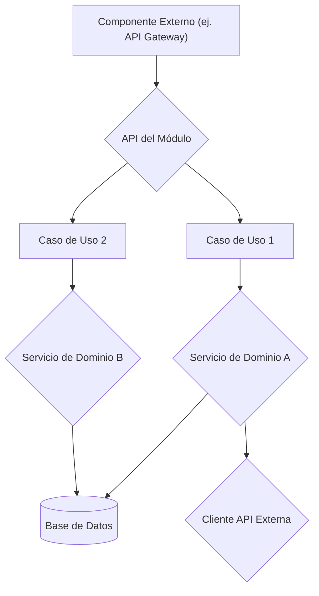

# Arquitectura de [Module Name]

Este documento describe la arquitectura interna del módulo `[Module Name]`.

## Principios de Diseño

-   **Modularidad**: ...
-   **Acoplamiento Bajo / Cohesión Alta**: ...
-   **Testeabilidad**: ...
-   **Adhesión al MDU Core Principles**: Referencia a `../../MDU_CORE_PRINCIPLES.md`.

## Diagrama de Componentes (Ejemplo)

## Capas

### 1. Capa de Presentación (`module_name/presentation/`)
   - Responsabilidades: ...
   - Tecnologías: FastAPI, Pydantic, etc.
   - Componentes Clave: ...

### 2. Capa de Aplicación (`module_name/application/`)
   - Responsabilidades: ...
   - Componentes Clave: Casos de Uso.

### 3. Capa de Dominio (`module_name/domain/`)
   - Responsabilidades: ...
   - Componentes Clave: Entidades, Servicios de Dominio.

### 4. Capa de Infraestructura (`module_name/infrastructure/`)
   - Responsabilidades: ...
   - Tecnologías: SQLAlchemy, MLflow Client, etc.
   - Componentes Clave: Repositorios, Trackers.

## Flujos de Datos Clave

Describir 1-2 flujos de datos importantes a través del módulo.

## Decisiones de Diseño

Mencionar decisiones arquitectónicas clave y sus justificaciones.
Por ejemplo, elección de una base de datos NoSQL vs SQL, uso de un broker de mensajes, etc.

## Interacción con Otros Módulos/Servicios de Aletheia

Cómo este módulo interactúa (o planea interactuar) con:
-   El núcleo de Aletheia.
-   Otros módulos derivados.
-   Servicios compartidos (DB, MLflow, Redis, Auth) proporcionados por `aletheia_common` o el `docker-compose.yml` principal.
