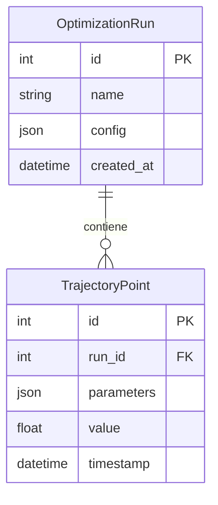

# Módulo `aletheia_omega`: Servicio de Trayectorias de Optimización

`aletheia_omega` es un microservicio especializado del ecosistema Aletheia, diseñado para gestionar y persistir los resultados de **ejecuciones de optimización y sus trayectorias**. Su función principal es registrar las series de parámetros y resultados generados por algoritmos de búsqueda, como la optimización bayesiana, permitiendo el análisis post-hoc y la reproducibilidad.

## Modelo de Datos

El núcleo de `aletheia_omega` se centra en dos entidades principales: `OptimizationRun` y `TrajectoryPoint`.



-   **OptimizationRun**: Almacena metadatos sobre una ejecución de optimización.
-   **TrajectoryPoint**: Registra un punto de datos individual evaluado durante la ejecución.

## Arquitectura y API

El servicio sigue una arquitectura limpia y expone sus funcionalidades a través de una API RESTful con los siguientes endpoints principales:

-   `POST /runs`: Crea una nueva ejecución de optimización.
-   `GET /runs/{run_id}`: Obtiene los detalles de una ejecución y su trayectoria.
-   `POST /runs/{run_id}/trajectories`: Añade un nuevo punto de trayectoria a una ejecución.

## Configuración y Ejecución

1.  **Variables de Entorno**: Configure `DATABASE_URL` y `JWT_SECRET_KEY` en un archivo `.env` (ver `.env.example`).
2.  **Base de Datos**: El servicio requiere su propia base de datos. Las migraciones de Alembic deben aplicarse (`alembic upgrade head`).
3.  **Ejecución (Docker)**:
    ```bash
    # Construir la imagen
    docker build -t aletheia-omega .
    # Ejecutar el contenedor
    docker run -p 8001:8000 --env-file .env aletheia-omega
    ```
    La API estará disponible en `http://localhost:8001/docs`.

## Desarrollo y Pruebas
-   **Instalación Local**: `pip install -r requirements.txt` en un entorno virtual.
-   **Pruebas**: `pytest aletheia_omega/tests/` (requiere una BD de prueba).
-   **Calidad de Código**: `pre-commit run --all-files` desde la raíz del proyecto.

---
*Nota: Este README se ha completado basándose en la estructura del código y puede requerir ajustes del equipo de desarrollo.*
