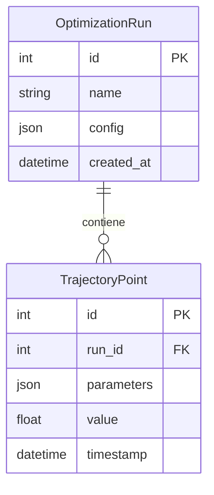

# Módulo `aletheia_omega`: Servicio de Trayectorias de Optimización

`aletheia_omega` es un microservicio especializado dentro del ecosistema Aletheia, diseñado para gestionar y persistir los resultados de **ejecuciones de optimización y sus trayectorias**. Su función principal es registrar las series de parámetros y resultados generados por algoritmos de búsqueda, como la optimización bayesiana, permitiendo el análisis post-hoc y la reproducibilidad.

## Modelo de Datos

El núcleo de `aletheia_omega` se centra en dos entidades principales: `OptimizationRun` y `TrajectoryPoint`. Una "ejecución" (`Run`) representa un proceso de optimización completo, y cada "punto de trayectoria" (`TrajectoryPoint`) es un paso dentro de esa ejecución.

<details>
<summary>Modelo de Datos</summary>


</details>

-   **OptimizationRun**: Almacena metadatos sobre una ejecución de optimización, incluyendo su configuración (hiperparámetros del optimizador, espacio de búsqueda, etc.).
-   **TrajectoryPoint**: Registra un punto de datos individual evaluado durante la ejecución, incluyendo los parámetros de entrada y el valor de la función objetivo resultante.

## Arquitectura

El servicio sigue una arquitectura limpia (Dominio, Aplicación, Infraestructura, Presentación) y expone sus funcionalidades a través de una API RESTful construida con FastAPI.

-   **`domain/`**: Contiene las entidades (`OptimizationRun`, `TrajectoryPoint`) y la lógica de negocio.
-   **`application/`**: Orquesta los casos de uso, como `CreateOptimizationRun` o `AddTrajectoryPoint`.
-   **`infrastructure/`**: Implementa la persistencia de datos usando SQLAlchemy y gestiona las migraciones con Alembic.
-   **`presentation/`**: Define los endpoints de la API, los esquemas Pydantic y las dependencias.

## API Endpoints Principales

La API proporciona métodos para crear y consultar ejecuciones de optimización.

-   `POST /runs`: Crea una nueva ejecución de optimización.
    -   **Request Body**: `{ "name": "string", "config": {} }`
    -   **Response**: `{ "id": int, "name": "string", ... }`
-   `GET /runs/{run_id}`: Obtiene los detalles de una ejecución específica, incluyendo todos sus puntos de trayectoria.
    -   **Response**: `{ "id": int, ..., "trajectories": [...] }`
-   `POST /runs/{run_id}/trajectories`: Añade un nuevo punto de trayectoria a una ejecución existente.
    -   **Request Body**: `{ "parameters": {}, "value": float }`
    -   **Response**: `{ "id": int, ... }`

## Configuración y Ejecución

1.  **Variables de Entorno**: Cree un archivo `.env` basado en `.env.example` y configure las siguientes variables:
    -   `DATABASE_URL`: Cadena de conexión a la base de datos PostgreSQL.
    -   `JWT_SECRET_KEY`: Clave secreta para la validación de tokens (si se requiere autenticación).

2.  **Base de Datos**:
    Este servicio requiere su propia base de datos. Las migraciones se gestionan con Alembic. Para aplicar la última migración:
    ```bash
    # Asegúrese de que alembic.ini esté configurado y DATABASE_URL sea accesible
    alembic upgrade head
    ```

3.  **Ejecución (Docker)**:
    La forma más sencilla de ejecutar el servicio es a través de Docker.
    ```bash
    # Construir la imagen
    docker build -t aletheia-omega .

    # Ejecutar el contenedor
    docker run -p 8001:8000 --env-file .env aletheia-omega
    ```
    La API estará disponible en `http://localhost:8001` y la documentación de Swagger en `http://localhost:8001/docs`.

## Desarrollo y Pruebas

-   **Instalación Local**:
    ```bash
    python -m venv venv
    source venv/bin/activate
    pip install -r requirements.txt
    ```
-   **Pruebas**:
    Las pruebas de integración requieren una base de datos de prueba.
    ```bash
    # Desde la raíz del proyecto
    pytest aletheia_omega/tests/
    ```
-   **Calidad de Código**: Ejecutar `pre-commit run --all-files` desde la raíz del proyecto.

**NOTA:** Este README se ha completado basándose en la estructura del código. Puede requerir ajustes adicionales del equipo de desarrollo para reflejar detalles de implementación específicos.
