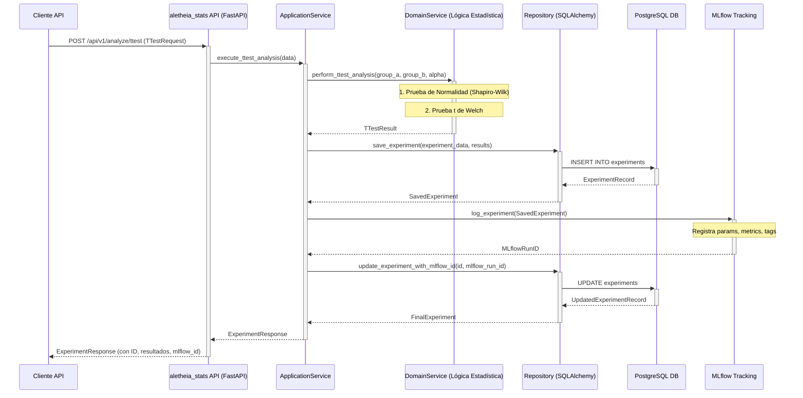

# Módulo `aletheia_stats`: Servicio de Análisis Estadístico

`aletheia_stats` es un microservicio del ecosistema Aletheia, dedicado a la ejecución de análisis estadísticos rigurosos. Se adhiere al **Marco de Desarrollo Unificado (MDU)**, enfatizando la calidad de producción, la trazabilidad y una arquitectura científica clara.

## Propósito y Alcance

Este servicio proporciona una API para realizar pruebas de hipótesis estadísticas, comenzando con la **prueba t de Student para muestras independientes**. Está diseñado para:
-   Validar hipótesis con rigor estadístico (ej., pruebas de normalidad previas).
-   Garantizar la reproducibilidad mediante el seguimiento de parámetros y semillas.
-   Integrarse con MLflow para un registro detallado de cada análisis como un experimento.
-   Operar como un componente autónomo y desplegable mediante Docker.

## Flujo de Análisis Estadístico

El siguiente diagrama ilustra el flujo de procesamiento para una solicitud de análisis de prueba t:



## Arquitectura del Módulo

El módulo sigue una arquitectura limpia, dividida en:
-   **`presentation`**: Endpoints de la API (FastAPI), esquemas Pydantic.
-   **`application`**: Casos de uso que orquestan la lógica.
-   **`domain`**: Lógica de negocio central (entidades, servicios de dominio como `StatsService`).
-   **`infrastructure`**: Implementaciones de persistencia (SQLAlchemy), integración con MLflow (`MLflowTracker`).
-   **`alembic`**: Gestión de migraciones de base de datos.

## API Endpoints Clave

La API (`/api/v1`) requiere autenticación JWT (tokens emitidos por el servicio de identidad principal de Aletheia).

-   **`POST /analyze/ttest`**:
    -   Realiza un análisis de prueba t.
    -   **Rol Requerido**: `analyst`.
    -   **Request Body**: `TTestRequest` (datos de los grupos, `experiment_name`, `alpha`).
    -   **Response**: `ExperimentResponse` (resultados, metadatos, `mlflow_run_id`).
-   **`GET /experiments/{experiment_id}`**: Obtiene un experimento.
    -   **Rol Requerido**: `viewer` o `analyst`.
-   **`GET /experiments`**: Lista experimentos (paginado).
    -   **Rol Requerido**: `viewer` o `analyst`.

(Consulte `aletheia_stats/presentation/schemas.py` y la documentación de Swagger en `/docs` para detalles).

## Lógica Científica

1.  **Prueba de Normalidad (Shapiro-Wilk)**: Se aplica a cada grupo de datos antes de la prueba t. Los resultados se informan, pero la prueba t se realiza independientemente (se usa Welch, que es robusta a violaciones de normalidad con N moderado).
2.  **Prueba t de Welch**: Para dos muestras independientes, no asume varianzas iguales. Calcula el estadístico t, p-valor, y el intervalo de confianza para la diferencia de medias.

(Ecuaciones detalladas y referencias en `docs/equations.md`).

## Trazabilidad con MLflow

Cada análisis es un experimento en MLflow, registrando:
-   **Parámetros**: `alpha`, tamaño de muestra, etc.
-   **Métricas**: Estadístico t, p-valor, medias, varianzas, p-valores de Shapiro-Wilk.
-   **Etiquetas**: `experiment_db_id`, estado.

## Configuración y Ejecución

1.  **Variables de Entorno**: Copie `.env.example` a `.env` y configure `DATABASE_URL`, `MLFLOW_TRACKING_URI`, `JWT_SECRET_KEY`.
2.  **Ejecución (Docker Compose)**:
    Desde el directorio `aletheia_stats/`:
    ```bash
    docker-compose up --build -d
    ```
    Esto inicia la API, una base de datos PostgreSQL dedicada, un servidor MLflow y aplica migraciones de Alembic automáticamente.
3.  **API Access**: `http://localhost:<PORT>/docs` (ver puerto configurado en `.env` y `docker-compose.yml`).

## Desarrollo

-   **Entorno Virtual**:
    ```bash
    # Desde aletheia_stats/
    python -m venv venv_stats
    source venv_stats/bin/activate
    pip install -r requirements.txt
    ```
-   **Pruebas**:
    ```bash
    # Desde aletheia_stats/
    pytest
    ```
-   **Calidad de Código**: Ejecutar `pre-commit run --all-files` desde la raíz del proyecto.

## Documentación Adicional
-   **Arquitectura Detallada**: `docs/architecture.md`
-   **Formulario Matemático**: `docs/equations.md`
