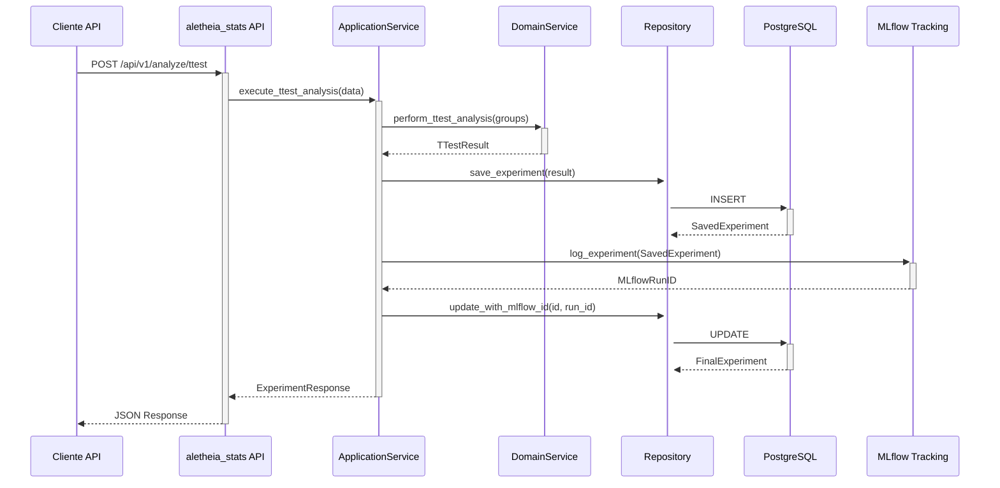

# Módulo `aletheia_stats`: Servicio de Análisis Estadístico

`aletheia_stats` es un microservicio del ecosistema Aletheia, dedicado a la ejecución de análisis estadísticos rigurosos y trazables.

## Propósito y Alcance
Este servicio proporciona una API para realizar pruebas de hipótesis, garantizando:
- **Rigor Científico**: Validación de precondiciones (ej. normalidad) y uso de métodos robustos.
- **Trazabilidad**: Integración completa con MLflow para cada análisis.
- **Calidad de Producción**: Código modular, probado y desplegable de forma independiente.

## Flujo de Análisis Estadístico
El siguiente diagrama ilustra el flujo de procesamiento para una solicitud de análisis.

## Lógica Científica
El núcleo del análisis reside en el `StatsService`:
1.  **Prueba de Normalidad (Shapiro-Wilk)**: Se aplica a cada grupo de datos como precondición.
2.  **Prueba t de Welch**: Se utiliza para comparar las medias de dos muestras independientes sin asumir varianzas iguales.

(Consulte `docs/equations.md` para las fórmulas detalladas).

## API y Trazabilidad
- La API (`/api/v1`) expone endpoints para ejecutar análisis y consultar resultados.
- Requiere autenticación JWT.
- Cada ejecución se registra en MLflow, almacenando parámetros, métricas y artefactos.

## Configuración y Ejecución
- **Dependencias**: `docker-compose`, `docker`.
- **Configuración**: Copie `.env.example` a `.env` y configure las variables (`DATABASE_URL`, etc.).
- **Ejecución**: Desde `aletheia_stats/`, ejecute `docker-compose up --build -d`.
- **API Docs**: `http://localhost:<PORT>/docs`.

(Para más detalles sobre la estructura de directorios, desarrollo y contribuciones, consulte las secciones correspondientes en el `README.md` original del módulo).
