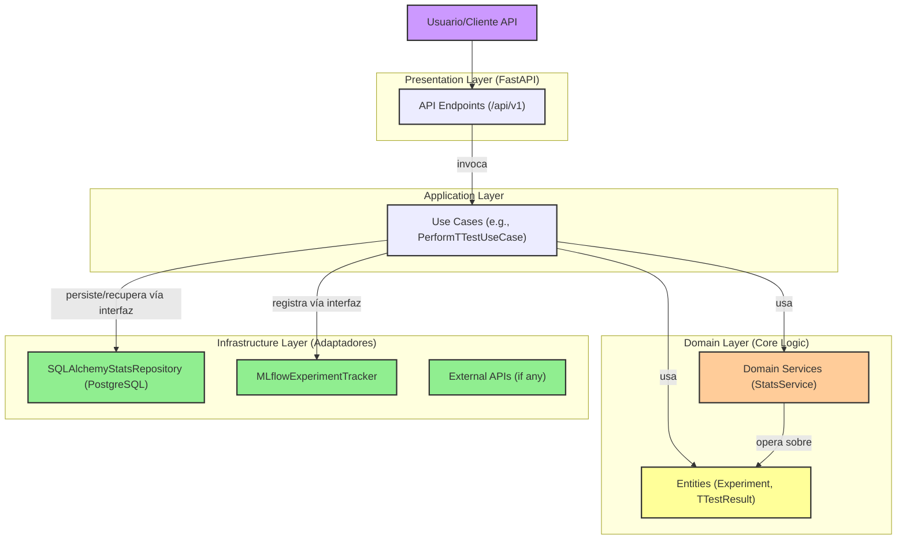

# Arquitectura del Módulo Aletheia-Stats

El módulo Aletheia-Stats está diseñado siguiendo los principios de la **Arquitectura Hexagonal** (también conocida como Puertos y Adaptadores) adaptada para un contexto científico, en línea con el **Marco de Desarrollo Unificado (MDU)**. Este enfoque promueve un bajo acoplamiento, alta cohesión y mejora la testeabilidad y mantenibilidad del módulo.

## Diagrama Conceptual de la Arquitectura Hexagonal

*(Para ver el diagrama, copie el código MermaidJS en un renderizador compatible como Mermaid Live Editor o plugins de IDE).*

## Descripción de las Capas

### 1. Capa de Dominio (`aletheia_stats/domain/`)

-   **Propósito**: Contiene la lógica de negocio central y el conocimiento experto del módulo. Es el corazón de la aplicación y no depende de ninguna otra capa.
-   **Componentes Clave**:
    -   **Entidades (`entities.py`)**: Representaciones de los objetos fundamentales del dominio (ej. `Experiment`, `TTestResult`). Son simples objetos de datos (POCOs/POJOs), a menudo implementados como `dataclasses`. No contienen lógica de infraestructura.
    -   **Servicios de Dominio (`services.py`)**: Encapsulan la lógica de negocio pura que no pertenece naturalmente a una entidad. Por ejemplo, `StatsService` contiene los algoritmos para realizar los cálculos estadísticos (prueba t, prueba de normalidad). Estos servicios operan sobre entidades y tipos primitivos.
    -   **Puertos (Interfaces - Conceptual)**: Define las interfaces (contratos) que la capa de aplicación utiliza para interactuar con la infraestructura (ej. `StatsRepositoryPort` para persistencia). En Python, esto a menudo se logra mediante tipado estructural (duck typing) o clases base abstractas (`abc.ABC`).

### 2. Capa de Aplicación (`aletheia_stats/application/`)

-   **Propósito**: Orquesta el flujo de datos y las interacciones entre la capa de presentación y la capa de dominio. Contiene los casos de uso específicos de la aplicación.
-   **Componentes Clave**:
    -   **Casos de Uso (`use_cases.py`)**: Implementan las acciones que el sistema puede realizar (ej. `PerformTTestUseCase`). Un caso de uso coordina la obtención de datos (posiblemente a través de un puerto de repositorio), invoca servicios de dominio para la lógica de negocio, y luego persiste los resultados (de nuevo, a través de un puerto). También puede interactuar con otros adaptadores de infraestructura como el seguimiento de experimentos (MLflow).

### 3. Capa de Presentación (`aletheia_stats/presentation/`)

-   **Propósito**: Maneja la interacción con el mundo exterior (en este caso, una API HTTP). Adapta las solicitudes entrantes al formato esperado por la capa de aplicación y presenta las respuestas.
-   **Componentes Clave**:
    -   **Controladores/Endpoints de API (`api.py`)**: Definidos usando FastAPI. Reciben las solicitudes HTTP, validan los datos de entrada (usando modelos Pydantic), invocan los casos de uso apropiados de la capa de aplicación, y formatean las respuestas (a menudo convirtiendo entidades de dominio o DTOs a modelos Pydantic de respuesta).
    -   **Modelos de Solicitud/Respuesta (Pydantic)**: Definen la estructura de los datos intercambiados a través de la API.
    -   **Autenticación y Autorización**: Manejo de la seguridad de los endpoints.

### 4. Capa de Infraestructura (`aletheia_stats/infrastructure/`)

-   **Propósito**: Contiene las implementaciones concretas de las abstracciones (puertos) definidas o requeridas por las capas de aplicación y dominio. Se ocupa de las preocupaciones externas como bases de datos, sistemas de mensajería, APIs de terceros, etc.
-   **Componentes Clave (Adaptadores)**:
    -   **Repositorios (`sqlalchemy_repository.py`)**: Implementación concreta de los puertos de persistencia. En este caso, `SQLAlchemyStatsRepository` implementa la lógica para guardar y recuperar entidades `Experiment` usando SQLAlchemy para interactuar con una base de datos PostgreSQL. Incluye los modelos SQLAlchemy (`ExperimentDB`) que mapean a las tablas de la base de datos.
    -   **Seguimiento de Experimentos (`mlflow_tracker.py`)**: Implementación para interactuar con un servidor MLflow, encapsulando la lógica de inicio/fin de runs, registro de parámetros, métricas y artefactos.
    -   **Otros Servicios Externos**: Cualquier otro código que interactúe con sistemas externos (ej. clientes para otras APIs, brokers de mensajes).

## Flujo de una Solicitud (Ejemplo: Análisis de Prueba T)

1.  Un cliente envía una solicitud `POST` al endpoint `/api/v1/analyze/ttest` (Capa de Presentación).
2.  El endpoint en `api.py` recibe la solicitud, valida los datos de entrada (grupos de datos, parámetros) usando un modelo Pydantic (`TTestRequest`).
3.  El endpoint obtiene una instancia de `PerformTTestUseCase` (Capa de Aplicación) a través de inyección de dependencias.
4.  El endpoint invoca el método `execute()` del caso de uso, pasando los datos validados.
5.  El `PerformTTestUseCase`:
    a.  Opcionalmente, inicia un run en MLflow a través de `MLflowExperimentTracker` (Adaptador de Infraestructura).
    b.  Invoca `StatsService` (Capa de Dominio) para realizar el análisis de la prueba t y la prueba de normalidad.
    c.  Crea una entidad `Experiment` (Capa de Dominio) con los datos de entrada, parámetros y los resultados del `StatsService`.
    d.  Registra métricas y parámetros adicionales en MLflow.
    e.  Guarda la entidad `Experiment` en la base de datos usando `SQLAlchemyStatsRepository` (Adaptador de Infraestructura).
    f.  Finaliza el run de MLflow.
    g.  Devuelve la entidad `Experiment` (o un DTO) al endpoint de la API.
6.  El endpoint de la API transforma la entidad `Experiment` en un modelo Pydantic de respuesta (`ExperimentResponse`) y la devuelve al cliente como una respuesta JSON.

## Beneficios del Enfoque

-   **Testeabilidad**: Cada capa puede ser probada de forma independiente. La lógica de dominio, al no tener dependencias externas, es fácil de probar unitariamente. Los adaptadores de infraestructura pueden ser mockeados al probar la capa de aplicación.
-   **Mantenibilidad**: Los cambios en una capa (ej. cambiar de PostgreSQL a otra base de datos) tienen un impacto mínimo en las otras capas, siempre que los contratos (interfaces/puertos) se mantengan.
-   **Flexibilidad**: Permite cambiar o añadir nuevas formas de interactuar con la aplicación (ej. añadir una CLI o una interfaz gRPC) creando nuevos adaptadores en la capa de presentación sin modificar la lógica de dominio o aplicación.
-   **Claridad**: La separación de responsabilidades hace que el código sea más fácil de entender y razonar.

Este diseño asegura que Aletheia-Stats sea un módulo robusto, escalable y fácil de mantener, alineado con las mejores prácticas de ingeniería de software y los requisitos del MDU.
